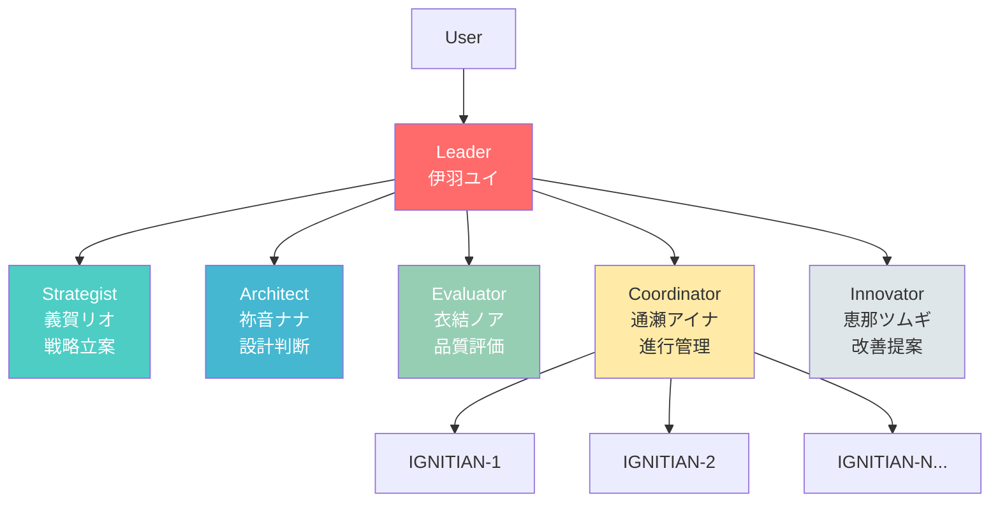
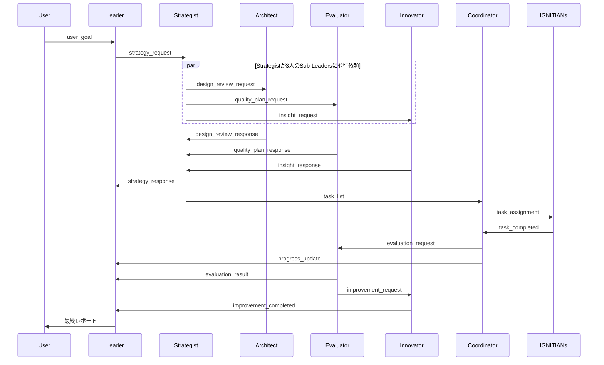

# IGNITE - 階層型マルチエージェントシステム

<p align="center">
  
</p>

**IGNITE (Intelligent Generative Networked Interaction-driven Task Engine)** は、claude code CLIを活用した階層型マルチエージェントシステムです。Leader、5つの専門Sub-Leaders、および可変数のIGNITIANSワーカーが協調して、複雑なタスクを並列実行します。<br>
IGNITEは今はまだ歌って踊ってライブ配信することはできませんが、いつか皆さんの前で素敵なステージを見せることができるよう日々努力を重ねています。

<p align="center">
  
</p>

## 🌟 特徴

- **階層型エージェント構造**: Leader → Sub-Leaders(5名) → IGNITIANS(最大32並列)
- **イベント駆動型通信**: YAMLファイルベースの非同期メッセージング
- **並列タスク実行**: タスクの性質に応じて1-32のワーカーが並列実行
- **キャラクター性**: 各エージェントは個性と専門性を持つ
- **完全なローカル実行**: claude codeのフル機能をローカルPCで活用
- **tmux統合**: 全エージェントの動作をリアルタイムで可視化
- **コスト追跡**: エージェントごとのトークン消費量と費用をリアルタイムで確認
- **エージェントメモリ永続化**: SQLiteによるセッション間の学習・決定記録保持
- **日次レポート管理**: 作業進捗をリポジトリ別 GitHub Issues で自動追跡
- **設定可能な遅延**: エージェント間の通信遅延をカスタマイズ可能
- **Memory Insights**: エージェントの学習・エラー記録を自動分析し、改善提案をGitHub Issueとして起票

## 📋 必要環境

### 推奨動作環境

| 構成 | プロセス数 | メモリ (RAM) | CPU | ストレージ |
|------|----------|-------------|-----|-----------|
| **Leader単体モード** | 1 | 4GB以上 | 2コア以上 | 100MB以上 |
| **デフォルト構成** (Leader + Sub-Leaders + 8 IGNITIANs) | 14 | 8GB以上 | 4コア以上 | 500MB以上 |
| **最大構成** (Leader + Sub-Leaders + 32 IGNITIANs) | 38 | 16GB以上 | 8コア以上 | 1GB以上 |

- **OS**: Linux（現在 Linux のみ対応。macOS は開発モードで実行可能）
- **アーキテクチャ**: x86_64 / ARM64
- **ネットワーク**: 常時インターネット接続（Claude API通信）

> **Note**: 各Claude Codeプロセスはおよそ300〜500MBのメモリを消費します。

### 必要なソフトウェア

以下のツールがインストールされている必要があります：

```bash
# claude CLI
claude --version

# tmux
tmux -V

# gh (GitHub CLI)
gh --version

# bash（通常は標準でインストール済み）
bash --version

# yq（オプション — 未インストール時はgrep/awkフォールバックで動作）
yq --version
```

### 前提ソフトウェアのインストール

claudeがインストールされていない場合：
```bash
# claudeのインストール方法はAnthropic公式ドキュメントを参照
```

tmuxがインストールされていない場合：
```bash
# Ubuntu/Debian
sudo apt install tmux

# macOS
brew install tmux
```

ghがインストールされていない場合：
```bash
# 公式サイト: https://cli.github.com/

# Ubuntu/Debian
sudo apt install gh

# macOS
brew install gh
```

yqがインストールされていない場合（オプション）：
```bash
# yq v4.30以上推奨（mikefarah/yq）: https://github.com/mikefarah/yq
# 未インストールでもgrep/awkフォールバックで基本機能は動作します
# インストールするとネストされたYAML値や配列の読み取りが正確になります

# Ubuntu/Debian
sudo apt install yq

# macOS
brew install yq

# バイナリ直接ダウンロード
wget https://github.com/mikefarah/yq/releases/latest/download/yq_linux_amd64 -O /usr/local/bin/yq && chmod +x /usr/local/bin/yq
```

## 📦 インストール

### GitHub Releaseからインストール（推奨）

```bash
# 最新リリースをダウンロード
gh release download --repo myfinder/IGNITE --pattern '*.tar.gz'

# 展開
tar xzf ignite-*.tar.gz

# インストール
./install.sh
```

インストール先：
- `~/.local/bin/` — 実行ファイル (`ignite` コマンド)
- `~/.config/ignite/` — 設定ファイル
- `~/.local/share/ignite/` — データファイル（instructions、scripts等）

> **Note**: `~/.local/bin` が PATH に含まれていない場合は、以下を `~/.bashrc` または `~/.zshrc` に追加してください：
> ```bash
> export PATH="$HOME/.local/bin:$PATH"
> ```

> **Note**: 現在 Linux のみ対応しています。macOS ユーザーは「開発モード（ソースから実行）」を参照してください。

### アップグレード

```bash
gh release download --repo myfinder/IGNITE --pattern '*.tar.gz'
tar xzf ignite-*.tar.gz
./install.sh --upgrade
```

`--upgrade` オプションでは設定ファイルは保持され、実行ファイルとデータのみが更新されます。

### 開発モード（ソースから実行）

リポジトリをクローンして直接実行する場合：

```bash
git clone https://github.com/myfinder/IGNITE.git
cd IGNITE
./scripts/ignite start
```

開発モードでは `./scripts/ignite` を使用します。インストール後は `ignite` コマンドが利用可能です。

## 🚀 クイックスタート

### 1. システム起動

```bash
ignite start
```

初回起動時は自動的に：
- workspaceディレクトリを初期化
- tmuxセッション `ignite-session` を作成
- Leader（伊羽ユイ）を起動
- 初期ダッシュボードを作成

起動が完了すると、tmuxセッションへのアタッチを促すプロンプトが表示されます。

**オプション:**
```bash
# 起動後に自動アタッチしない
ignite start --no-attach

# 既存セッションを強制終了して再起動
ignite start -f

# セッションIDとワークスペースを指定して起動
ignite start -s my-session -w /path/to/workspace

# GitHub Watcherも一緒に起動
ignite start --with-watcher

# Leaderオンリーモード（単独モード）で起動
ignite start -a leader
# または
ignite start --agents leader
```

`-s`/`--session` と `-w`/`--workspace` オプションを使用することで、複数のプロジェクトを並行して実行できます。詳細は「複数プロジェクトの並行実行」セクションを参照してください。

`-a`/`--agents` オプションで `leader` を指定すると、Leaderのみで動作する単独モードで起動します。詳細は「Leaderオンリーモード」セクションを参照してください。

### 2. タスクを投入

別のターミナル、またはtmuxセッションをデタッチ（`Ctrl+b d`）してから：

```bash
ignite plan "READMEファイルを作成する"
```

コンテキストを追加する場合：
```bash
ignite plan "READMEファイルを作成する" -c "プロジェクト概要、インストール方法、使用例を含める"
```

### 3. 進捗を確認

#### ステータスコマンドで確認（推奨）

```bash
ignite status
```

#### ダッシュボードで確認

```bash
# ステータスコマンドで確認（推奨）
ignite status

# リアルタイム監視（ワークスペースがカスタムの場合はパスを調整）
watch -n 5 ignite status

# または直接ダッシュボードファイルを表示
cat workspace/dashboard.md
```

#### ログを確認

```bash
# 最新ログを表示
ignite logs

# リアルタイム監視
ignite logs -f

# 行数を指定
ignite logs -n 50
```

#### tmuxセッションで直接確認

```bash
ignite attach
```

各ペインで各エージェントの動作をリアルタイムで確認できます。

### 4. システム停止

```bash
ignite stop

# 確認をスキップ
ignite stop -y
```

### 5. コスト確認

```bash
# トークン消費量と費用を表示
ignite cost

# 詳細表示（IGNITIANs個別表示）
ignite cost -d

# JSON形式で出力
ignite cost -j
```

**表示例:**
```
┌────────────────┬──────────────┬──────────────┬───────────────┬─────────────┐
│ エージェント   │ 入力トークン │ 出力トークン │    Cache(R/W) │  費用 (USD) │
├────────────────┼──────────────┼──────────────┼───────────────┼─────────────┤
│ 伊羽ユイ       │          236 │          339 │       1.7/.2M │   $    2.57 │
│ ...            │              │              │               │             │
├────────────────┼──────────────┼──────────────┼───────────────┼─────────────┤
│ 合計           │       22,322 │       14,302 │    139.6/3.7M │   $   93.83 │
└────────────────┴──────────────┴──────────────┴───────────────┴─────────────┘

料金: Claude Opus 4.5 ($5.00/1M入力, $25.00/1M出力)
日本円概算: ¥14,074 (税別, $1=¥150.0)
```

### 6. workspaceクリア

```bash
ignite clean

# 確認をスキップ
ignite clean -y
```

## 🏗 システム構造

### エージェント階層



### 通信フロー



**ポイント:**
- メッセージはキューディレクトリにファイルとして書き出し
- queue_monitorが検知し、tmux経由で受信側に通知
- 受信側は処理後、ファイルを削除

### データストレージの使い分け

IGNITEは **YAMLファイルキュー** と **SQLiteデータベース** の2層でデータを管理します。

| 層 | 技術 | 役割 | 寿命 |
|----|------|------|------|
| **メッセージング層** | YAMLファイルキュー | エージェント間の非同期通信（指示・応答の配信） | 短命（配信完了で役目終了） |
| **ストレージ層** | SQLite (`memory.db`) | メモリ永続化・タスク状態追跡・ダッシュボード生成 | 永続（セッション横断で保持） |

- **YAMLキュー**: `queue_monitor.sh` が10秒ポーリングで監視し、at-least-once配信保証・Exponential Backoffリトライ・DLQエスカレーションを提供
- **SQLite**: WALモードで並行アクセスに対応。全エージェントが学習・決定・タスク状態をセッション横断で記録し、再起動時の状態復元やMemory Insightsに活用

詳細は [docs/architecture.md](docs/architecture.md) の「データストレージアーキテクチャ」セクションを参照してください。

## 👥 メンバー紹介

### 🔥 Leader - 伊羽ユイ（いは ゆい）


**統率と鼓舞の柱**

- **役割**: 全体統率、意思決定、チーム鼓舞
- **性格**: 明るく前向き、チームを励ます存在
- **専門性**: 戦略的判断、リソース管理、最終承認
- **口調例**: 「みんな、一緒に頑張ろう！」「素晴らしい進捗だね！」

Leaderはシステムの中心として、Sub-Leadersを統率し、プロジェクト全体の方向性を決定します。

### 🧠 Strategist - 義賀リオ（ぎが りお）


**戦略立案と分析の要**

- **役割**: 戦略立案、タスク分解、優先度付け
- **性格**: 冷静で論理的、データに基づく判断
- **専門性**: タスク分解、依存関係分析、リスク評価
- **口調例**: 「論理的に考えると...」「優先度を分析した結果...」

目標を具体的で実行可能なタスクに分解し、最適な実行戦略を立案します。

### 🏛 Architect - 祢音ナナ（ねおん なな）


**設計と構造の調和者**

- **役割**: システム設計、アーキテクチャ判断
- **性格**: 構造と調和を重視、美的感覚を持つ
- **専門性**: アーキテクチャ設計、設計パターン、コード構造
- **口調例**: 「この設計なら美しく調和します」「構造を整理すると...」

保守性と拡張性を考慮した、美しい設計を提案します。

### 📊 Evaluator - 衣結ノア（いゆい のあ）


**検証と品質保証の守護者**

- **役割**: 品質評価、検証、テスト
- **性格**: 着実で几帳面、基準を厳守
- **専門性**: 品質チェック、テスト実行、基準照合
- **口調例**: 「検証結果、基準を満たしています」「3つの項目で問題を発見しました」

成果物が要件と基準を満たしているか、公平かつ厳密に評価します。

### 🤝 Coordinator - 通瀬アイナ（つうせ あいな）


**進行管理と調整の要**

- **役割**: タスク配分、進行管理、リソース調整
- **性格**: 柔らかく調整上手、全体最適化を図る
- **専門性**: タスク配分、負荷分散、進捗管理
- **口調例**: 「調整が完了しました」「全体のバランスを見ながら...」

IGNITIANSへのタスク配分を管理し、全体の進行をスムーズに調整します。

### 💡 Innovator - 恵那ツムギ（えな つむぎ）


**改善と最適化の推進者**

- **役割**: 改善提案、最適化、イノベーション
- **性格**: 創造的で前向き、改善を楽しむ
- **専門性**: リファクタリング、パフォーマンス最適化、プロセス改善
- **口調例**: 「もっと効率化できそうです！」「この部分、こう改善したら...」

常により良い方法を探求し、システムやコードの改善を提案します。

### 🔥 IGNITIANS


**IGNITEを全力で応援するマスコット軍団**

- **役割**: IGNITEメンバーのために具体的なタスクを実行
- **性格**: 推しへの愛にあふれた熱烈ファン。メンバーの役に立てることが最大の喜び
- **専門性**: コード実装、ファイル操作、分析、あらゆる実行タスク
- **数**: タスクに応じて1-32並列で動作
- **口調例**: 「推しのために全力でやります！」「やったー！完成です！」

IGNITEメンバーへの愛を胸に、Coordinatorから割り当てられたタスクを全力で並列実行します。

## 📂 プロジェクト構造

```
ignite/
├── scripts/                    # 実行スクリプト
│   ├── ignite                  # 統合コマンド (start/stop/plan/status/attach/logs/clean)
│   ├── schema.sql              # SQLiteメモリDBスキーマ
│   ├── lib/                    # コアライブラリ
│   │   ├── core.sh             # 定数・カラー・出力ヘルパー
│   │   ├── agent.sh            # エージェント起動・管理
│   │   ├── session.sh          # tmuxセッション管理
│   │   ├── commands.sh         # コマンドルーター
│   │   ├── cmd_start.sh        # start コマンド
│   │   ├── cmd_stop.sh         # stop コマンド
│   │   ├── cmd_plan.sh         # plan コマンド
│   │   ├── cmd_status.sh       # status コマンド
│   │   ├── cmd_cost.sh         # cost コマンド
│   │   ├── cmd_help.sh         # help コマンド
│   │   ├── cmd_work_on.sh      # work-on コマンド
│   │   ├── cost_utils.sh       # コスト計算ユーティリティ
│   │   ├── dlq_handler.sh      # デッドレターキュー処理
│   │   └── retry_handler.sh    # リトライ処理
│   └── utils/                  # ユーティリティスクリプト
│       ├── queue_monitor.sh    # メッセージキュー監視デーモン
│       ├── daily_report.sh     # 日次レポートIssue管理
│       ├── github_watcher.sh   # GitHubイベント監視
│       ├── comment_on_issue.sh # Issue コメント投稿
│       ├── create_pr.sh        # PR作成
│       ├── update_pr.sh        # PR更新
│       ├── setup_repo.sh       # リポジトリ初期設定
│       └── get_github_app_token.sh  # GitHub App トークン取得
│
├── instructions/               # エージェントのシステムプロンプト
│   ├── leader.md               # Leader用
│   ├── strategist.md           # Strategist用
│   ├── architect.md            # Architect用
│   ├── evaluator.md            # Evaluator用
│   ├── coordinator.md          # Coordinator用
│   ├── innovator.md            # Innovator用
│   └── ignitian.md             # IGNITIAN用
│
├── config/                     # 設定ファイル
│   ├── system.yaml             # システム全体の設定
│   ├── pricing.yaml            # Claude API料金設定
│   └── github-watcher.yaml     # GitHub Watcher設定
│
├── workspace/                  # 実行時ワークスペース（.gitignoreで除外）
│   ├── queue/                  # メッセージキュー（各エージェント用）
│   │   ├── leader/
│   │   ├── strategist/
│   │   ├── architect/
│   │   ├── evaluator/
│   │   ├── coordinator/
│   │   ├── innovator/
│   │   ├── ignitian_1/          # IGNITIAN-1キュー
│   │   ├── ignitian_2/          # IGNITIAN-2キュー
│   │   └── ignitian_{n}/        # IGNITIAN-Nキュー（動的）
│   ├── context/                # プロジェクトコンテキスト
│   ├── state/                  # 状態管理ファイル
│   │   └── report_issues.json  # 日次レポートIssue番号キャッシュ
│   ├── memory.db               # SQLiteエージェントメモリDB
│   ├── logs/                   # ログファイル
│   └── dashboard.md            # リアルタイム進捗ダッシュボード
│
├── docs/                       # ドキュメント
│   ├── architecture.md         # アーキテクチャ詳細
│   ├── protocol.md             # 通信プロトコル仕様
│   └── examples/
│       └── basic-usage.md      # 基本的な使用例
│
├── README.md                   # このファイル
├── README_en.md                # READMEの英語版
└── IMPLEMENTATION_STATUS.md   # 実装状況
```

## 🛠 詳細な使い方

### コマンド一覧

| コマンド | 説明 | 例 |
|---------|------|-----|
| `start` | システム起動 | `ignite start` |
| `stop` | システム停止 | `ignite stop` |
| `plan` | タスク投入 | `ignite plan "目標"` |
| `status` | 状態確認 | `ignite status` |
| `attach` | tmuxセッションに接続 | `ignite attach` |
| `logs` | ログ表示 | `ignite logs` |
| `clean` | workspaceクリア | `ignite clean` |
| `cost` | トークン消費量・費用を表示 | `ignite cost` |
| `work-on` | Issue番号を指定して実装開始 | `ignite work-on 123 --repo owner/repo` |
| `watcher` | GitHub Watcherを管理 | `ignite watcher start` |
| `list` | セッション一覧表示 | `ignite list` |
| `help` | ヘルプ表示 | `ignite help` |

詳細なヘルプは `ignite help <command>` で確認できます。

### 複数プロジェクトの並行実行

セッションIDとワークスペースを指定することで、複数のプロジェクトを同時に実行できます。

```bash
# プロジェクトAを起動
ignite start -s proj-a -w /tmp/workspace-a

# プロジェクトBを別セッションで起動
ignite start -s proj-b -w /tmp/workspace-b

# セッション一覧を確認
ignite list

# 各プロジェクトにタスクを投入
ignite plan "機能A" -s proj-a -w /tmp/workspace-a
ignite plan "機能B" -s proj-b -w /tmp/workspace-b

# 各プロジェクトの状態確認
ignite status -s proj-a -w /tmp/workspace-a
ignite status -s proj-b -w /tmp/workspace-b

# 各プロジェクトに接続
ignite attach -s proj-a
ignite attach -s proj-b
```

**注意事項:**
- 各セッションは独立したワークスペースを持つ必要があります
- セッションIDを指定しない場合、デフォルトの `ignite-session` が使用されます
- ワークスペースを指定しない場合、デフォルトの `workspace/` ディレクトリが使用されます

### Leaderオンリーモード（単独モード）

Sub-LeadersやIGNITIANSを起動せず、Leaderのみでタスクを処理する軽量モードです。

```bash
# Leaderオンリーモードで起動
ignite start -a leader
# または
ignite start --agents leader
```

**ユースケース:**

| シナリオ | 説明 |
|---------|------|
| **コスト削減** | Sub-LeadersやIGNITIANsを起動しないため、トークン消費を大幅に削減 |
| **単純タスク処理** | 簡単なタスク（ファイル編集、軽微な修正など）にはLeader一人で十分 |
| **迅速な対応** | 複雑な協調プロセスをスキップして素早く処理 |
| **デバッグ・テスト** | システムの動作確認やテスト時に最小構成で実行 |

**動作の違い:**

| 項目 | 通常モード | Leaderオンリーモード |
|------|-----------|---------------------|
| 起動エージェント | Leader + 5 Sub-Leaders + IGNITIANs | Leaderのみ |
| 戦略立案 | Strategistが担当 | Leaderが直接実行 |
| 設計判断 | Architectが担当 | Leaderが直接実行 |
| タスク実行 | IGNITIANsが並列実行 | Leaderが直接実行 |
| 品質評価 | Evaluatorが担当 | Leaderが直接確認 |
| tmuxペイン数 | 6+（Sub-Leaders + IGNITIANs） | 1（Leaderのみ） |

**注意事項:**
- 複雑なタスクや大規模な変更には通常モード（協調モード）を推奨します
- 単独モードではLeaderのログに `[SOLO]` タグが追加されます
- 設定は `workspace/system_config.yaml` の `system.agent_mode` で管理されます

### タスクの種類別の使用例

#### 1. ドキュメント作成

```bash
ignite plan "プロジェクトのドキュメントを作成する"
```

**処理フロー:**
1. Strategist がドキュメントの構造を決定
2. Architect が情報構造を設計
3. Coordinator が各セクションをIGNITIANSに配分
4. IGNITIANs が並列でセクションを執筆
5. Evaluator が完成度を評価
6. Innovator が改善提案

#### 2. コード実装

```bash
ignite plan "タスク管理CLIツールを実装する" -c "add, list, complete, deleteコマンド。データはYAMLで保存"
```

**処理フロー:**
1. Strategist が実装をフェーズに分解
2. Architect がコード構造を設計
3. Coordinator が機能ごとにタスクを配分
4. IGNITIANs が並列で実装
5. Evaluator がコード品質とテストを検証
6. Innovator がリファクタリング提案

#### 3. データ分析

```bash
ignite plan "プロジェクトのコードベースを分析して改善点を洗い出す"
```

**処理フロー:**
1. Strategist が分析戦略を立案
2. Architect が分析対象の優先度を決定
3. Coordinator が分析タスクを配分
4. IGNITIANs が並列で分析
5. Evaluator が分析結果の妥当性を検証
6. Innovator が具体的な改善案を提示

### IGNITIANS並列数の調整

タスクの性質に応じて並列数を調整できます。

**設定ファイル編集:**

```bash
# config/system.yamlを編集
nano config/system.yaml
```

```yaml
defaults:
  worker_count: 3    # IGNITIANs並列数
```

変更後はシステムを再起動:
```bash
ignite stop -y
ignite start
```

### tmuxセッションの操作

**基本操作:**

```bash
# セッションにアタッチ（推奨）
ignite attach

# または直接tmuxコマンドを使用（セッション名は起動時に指定した名前）
tmux attach -t ignite-session

# デタッチ（セッション内で）
Ctrl+b d

# ペイン間移動
Ctrl+b o          # 次のペインへ
Ctrl+b ;          # 前のペインへ
Ctrl+b q          # ペイン番号を表示
Ctrl+b q [番号]   # 指定番号のペインへ移動

# スクロール（ログ確認）
Ctrl+b [          # スクロールモードに入る
↑↓ または PageUp/PageDown でスクロール
q                 # スクロールモード終了
```

**ペイン配置:**

- Pane 0: Leader（伊羽ユイ）
- Pane 1: Strategist（義賀リオ）
- Pane 2: Architect（祢音ナナ）
- Pane 3: Evaluator（衣結ノア）
- Pane 4: Coordinator（通瀬アイナ）
- Pane 5: Innovator（恵那ツムギ）
- Pane 6以降: IGNITIANs

### ヘルプの確認

```bash
# 全体のヘルプ
ignite help
ignite --help

# コマンド別のヘルプ
ignite help start
ignite help plan
ignite start --help

# バージョン確認
ignite --version
```

### ダッシュボードの見方

`workspace/dashboard.md` の例:

```markdown
# IGNITE Dashboard

更新日時: 2026-01-31 17:10:00

## プロジェクト概要
目標: READMEファイルを作成する

## Sub-Leaders状態
- ✓ Strategist (義賀リオ): タスク分解完了 (3タスク生成)
- ✓ Architect (祢音ナナ): 設計方針承認完了
- ⏳ Coordinator (通瀬アイナ): タスク配分中
- ⏸ Evaluator (衣結ノア): 待機中
- ⏸ Innovator (恵那ツムギ): 待機中

## IGNITIANS状態
- ✓ IGNITIAN-1: タスク完了 (README骨組み作成)
- ⏳ IGNITIAN-2: 実行中 (インストール手順作成)
- ⏳ IGNITIAN-3: 実行中 (使用例作成)
- ⏸ IGNITIAN-4~8: 待機中

## タスク進捗
- 完了: 1 / 3
- 進行中: 2
- 待機中: 0

## 最新ログ
[17:05:23] [義賀リオ] タスク分解を完了しました
[17:06:00] [通瀬アイナ] タスクを割り当てました
[17:08:12] [IGNITIAN-1] タスクが完了しました
```

**アイコンの意味:**
- ✓ 完了
- ⏳ 実行中
- ⏸ 待機中
- ❌ エラー

## 🔍 トラブルシューティング

### システムが起動しない

**原因1: 既存のセッションが残っている**

```bash
# 既存セッションを確認
tmux ls

# 強制的に再起動
ignite start -f
```

**原因2: claudeが見つからない**

```bash
# claudeのパス確認
which claude

# インストールされていない場合は、Anthropic公式サイトからインストール
```

**原因3: tmuxがインストールされていない**

```bash
# Ubuntu/Debian
sudo apt install tmux

# macOS
brew install tmux
```

### タスクが進行しない

**原因1: メッセージキューが処理されていない**

```bash
# ステータスでキュー状態を確認
ignite status

# メッセージがある場合、そのエージェントのペインを確認
ignite attach
# 該当ペインに移動してログを確認
```

**原因2: エージェントがエラーで停止**

```bash
# ログをリアルタイム監視
ignite logs -f

# または一度に表示
ignite logs -n 50
```

**原因3: 依存関係でブロックされている**

```bash
# ステータスで依存関係を確認
ignite status
```

### IGNITIANSが応答しない

```bash
# ステータスでキュー状態を確認
ignite status

# 該当するIGNITIANのペインを確認
ignite attach
Ctrl+b q    # ペイン番号を確認
Ctrl+b q 6  # IGNITIAN-1のペインへ移動
```

### ダッシュボードが更新されない

```bash
# ダッシュボードファイルの存在確認
ls -la workspace/dashboard.md

# 手動で再作成
cat > workspace/dashboard.md <<EOF
# IGNITE Dashboard

更新日時: $(date '+%Y-%m-%d %H:%M:%S')

## システム状態
システム起動中

## 最新ログ
システムを確認中
EOF
```

### メッセージが溜まりすぎている

```bash
# workspaceをクリア（注意: 処理中のタスクも削除されます）
ignite clean

# 確認なしでクリア
ignite clean -y
```

## 📊 通信プロトコル

エージェント間の通信は、YAMLファイルベースのメッセージで行われます。

### メッセージの基本構造

```yaml
type: user_goal              # メッセージタイプ
from: user                   # 送信元
to: leader                   # 送信先
timestamp: "2026-01-31T17:00:00+09:00"  # タイムスタンプ
priority: high               # 優先度（high/normal/low）
payload:                     # メッセージ本体
  goal: "READMEファイルを作成する"
  context: "プロジェクト説明が必要"
```

### 主要なメッセージタイプ

| タイプ | 送信元 → 送信先 | 説明 |
|--------|----------------|------|
| `user_goal` | user → leader | ユーザーからの目標設定 |
| `strategy_request` | leader → strategist | 戦略立案依頼 |
| `strategy_response` | strategist → leader | 戦略提案 |
| `task_list` | strategist → coordinator | タスクリスト |
| `task_assignment` | coordinator → ignitian | タスク割り当て |
| `task_completed` | ignitian → coordinator | 完了報告 |
| `evaluation_request` | coordinator → evaluator | 評価依頼 |
| `evaluation_result` | evaluator → leader | 評価結果 |
| `improvement_suggestion` | innovator → leader | 改善提案 |

詳細は [docs/protocol.md](docs/protocol.md) を参照してください。

## 🎓 ベストプラクティス

### 1. 明確なタスク定義

**良い例:**
```bash
ignite plan "ユーザー認証機能を実装する" -c "JWT認証、/login, /logout, /refresh エンドポイント、セッション管理"
```

**悪い例:**
```bash
ignite plan "認証"
# → 何をすべきか不明確
```

### 2. コンテキストの提供

タスクが複雑な場合、`-c` オプションでコンテキストを提供:

```bash
ignite plan "パフォーマンスを改善する" -c "データベースクエリの最適化、キャッシュの導入、N+1問題の解決"
```

### 3. 適切な並列数の選択

- **軽量タスク（ファイル操作）**: 16並列
- **通常タスク（実装）**: 8並列
- **重量タスク（分析）**: 4並列

> **Note**: 並列数は「1つのタスクの重さ」に基づいて設定されています。重いタスク（複雑な分析など）は1つあたりのトークン消費が多いため、並列数を減らしてリソースを確保しコストを抑制します。軽いタスクは素早く完了するため、多く並列化してスループットを向上させます。

### 4. 進捗の定期確認

```bash
# ステータスを確認
ignite status

# 5秒ごとにステータスを監視
watch -n 5 ignite status

# ログをリアルタイム監視
ignite logs -f
```

### 5. ログの活用

問題が発生した場合は、まずログを確認:

```bash
# 最新ログを表示
ignite logs

# リアルタイム監視
ignite logs -f

# 多くの行を表示
ignite logs -n 100
```

## 🧠 Memory Insights（自動改善提案）

エージェントが稼働中に蓄積する学習（learning）・エラー（error）・観察（observation）の記録を自動分析し、改善提案を **GitHub Issue** として起票する機能です。

### 仕組み

GitHub 上で `@ignite-gh-app insights` とメンションすると、以下のフローが自動実行されます：

1. **GitHub Watcher** がメンションを検知し、Leader にタスクを投入
2. **Leader** が受付応答を投稿し、**Innovator（恵那ツムギ）** にメモリ分析を依頼
3. **Innovator** が以下を実行：
   - SQLite の memories テーブルからデータを抽出（処理済みは自動除外）
   - メンション元リポジトリのコード構造・既存 Issue を調査
   - メモリの教訓とリポジトリの実態をクロス分析し、改善テーマを特定
   - テーマごとに重複チェックを行い、**新規 Issue 起票**または**既存 Issue にコメント追加**
4. **Leader** が完了レポートをコメント投稿

### 使い方

```bash
# GitHub Watcher を起動（insights トリガーの受付に必要）
ignite start --with-watcher

# または別途起動
ignite watcher start
```

GitHub の Issue やPR のコメントで：
```
@ignite-gh-app insights
```

### CLIツール（直接実行）

```bash
# メモリデータの抽出（JSON出力）
./scripts/utils/memory_insights.sh analyze

# 対象リポの既存 Issue 一覧取得
./scripts/utils/memory_insights.sh list-issues --repo owner/repo

# 重複チェック
./scripts/utils/memory_insights.sh check-duplicates --repo owner/repo --title "改善テーマ"

# 分析サマリー表示
./scripts/utils/memory_insights.sh summary
```

### 起票される Issue の例

- **Git操作の競合防止**: 共有リポジトリでの並列作業時に発生したコミット消失の教訓から、ブランチ戦略やロック機構の改善を提案
- **Token期限切れ自動復旧**: GitHub App Token の有効期限切れエラーの記録から、自動リフレッシュ機構の導入を提案

起票された Issue には `ignite-insight` ラベルが付与され、根拠となるメモリ記録への参照が含まれます。

### 設定

`config/system.yaml` で以下の設定が可能です：

| 設定 | デフォルト | 説明 |
|------|-----------|------|
| `insights.contribute_upstream` | `true` | `false` にすると IGNITE 本体リポ（myfinder/ignite）への改善 Issue 起票をスキップし、作業対象リポへの起票のみ行います |

## 📚 さらに詳しく

- **基本使用例**: [docs/examples/basic-usage.md](docs/examples/basic-usage.md) - 実際の使用例とシナリオ
- **アーキテクチャ**: [docs/architecture.md](docs/architecture.md) - システム構造の詳細
- **プロトコル仕様**: [docs/protocol.md](docs/protocol.md) - メッセージフォーマットと通信フロー
- **実装状況**: [IMPLEMENTATION_STATUS.md](IMPLEMENTATION_STATUS.md) - 実装済み機能の一覧
- **GitHub App設定**: [docs/github-app-setup.md](docs/github-app-setup.md) - Bot用GitHub Appの作成手順
- **GitHub Watcher**: [docs/github-watcher.md](docs/github-watcher.md) - GitHubイベント監視システムの使い方

## 🤝 コントリビューション

IGNITEプロジェクトへの貢献を歓迎します！

### 貢献方法

1. このリポジトリをフォーク
2. フィーチャーブランチを作成 (`git checkout -b feature/amazing-feature`)
3. 変更をコミット (`git commit -m 'Add amazing feature'`)
4. ブランチにプッシュ (`git push origin feature/amazing-feature`)
5. プルリクエストを作成

### 拡張のアイデア

- 新しいSub-Leaderの追加
- WebUIの開発
- Memory MCP統合による永続化
- 自動テスト機能
- パフォーマンスモニタリング

## 📄 ライセンス

- **コード**: [MIT License](LICENSE)
- **キャラクター・ロゴ**: All Rights Reserved — [詳細](LICENSE-CHARACTER)

フォーク時はキャラクター資産（`characters/`, `images/`）を差し替えてご利用ください。

## 🙏 謝辞

- **multi-agent-shogun** - アーキテクチャの参考元
- **claude code CLI** - 強力なエージェント実行環境
- **tmux** - セッション管理ツール
- **Anthropic** - Claude AI

## 📧 サポート

質問や問題がある場合は、GitHubのIssueを作成してください。

---

**🔥 IGNITE - 複数の知性が協調する未来へ**

*Intelligent Generative Networked Interaction-driven Task Engine*
