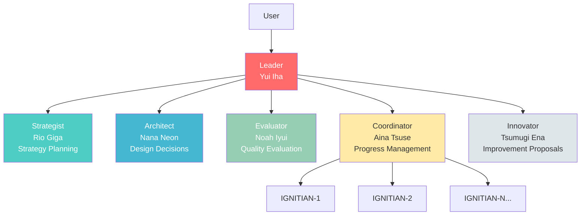
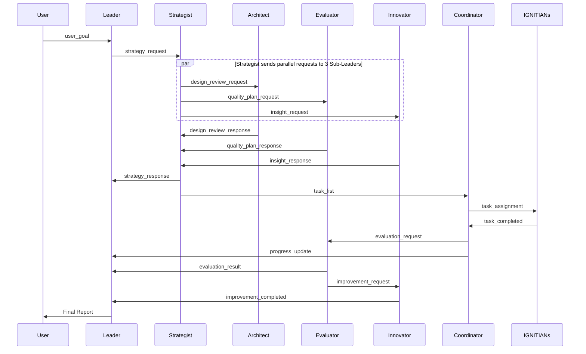

# IGNITE - Hierarchical Multi-Agent System

<p align="center">
  
</p>

**IGNITE (Intelligent Generative Networked Interaction-driven Task Engine)** is a hierarchical multi-agent system utilizing the claude code CLI. A Leader, five specialized Sub-Leaders, and a variable number of IGNITIANS workers collaborate to execute complex tasks in parallel.<br>
IGNITE may not be able to sing, dance, or go live streaming just yet, but they’re training hard every single day, aiming for the day they can shine on stage and put on a wonderful show for all their fans.

<p align="center">
  
</p>

## 🌟 Features

- **Hierarchical Agent Structure**: Leader → Sub-Leaders (5) → IGNITIANS (up to 32 parallel)
- **Event-Driven Communication**: Asynchronous messaging based on YAML files
- **Parallel Task Execution**: 1-32 workers execute in parallel depending on task nature
- **Character Personality**: Each agent has unique personality and expertise
- **Fully Local Execution**: Leverage full claude code capabilities on local PC
- **tmux Integration**: Real-time visualization of all agent activities
- **Cost Tracking**: Real-time token usage and cost monitoring per agent

## 📋 Requirements

The following tools must be installed:

```bash
# claude CLI
claude --version

# tmux
tmux -V

# bash (usually pre-installed)
bash --version
```

### Installation

If claude is not installed:
```bash
# See Anthropic official documentation for claude installation
```

If tmux is not installed:
```bash
# Ubuntu/Debian
sudo apt install tmux

# macOS
brew install tmux
```

## 🚀 Quick Start

### 1. Start the System

```bash
cd /path/to/ignite
./scripts/ignite start
```

On first startup, the system automatically:
- Initializes the workspace directory
- Creates tmux session `ignite-session`
- Launches Leader (Yui Iha)
- Creates initial dashboard

After startup completes, you'll be prompted to attach to the tmux session.

**Options:**
```bash
# Don't auto-attach after startup
./scripts/ignite start --no-attach

# Force restart by terminating existing session
./scripts/ignite start -f

# Start with custom session ID and workspace
./scripts/ignite start -s my-session -w /path/to/workspace
```

Using `-s`/`--session` and `-w`/`--workspace` options allows you to run multiple projects in parallel. See the "Running Multiple Projects in Parallel" section for details.

### 2. Submit a Task

From another terminal, or after detaching from tmux session (`Ctrl+b d`):

```bash
./scripts/ignite plan "Create a README file"
```

To add context:
```bash
./scripts/ignite plan "Create a README file" -c "Include project overview, installation instructions, and usage examples"
```

### 3. Check Progress

#### Via Status Command (Recommended)

```bash
./scripts/ignite status
```

#### Via Dashboard

```bash
# Check via status command (recommended)
./scripts/ignite status

# Real-time monitoring (adjust path if using custom workspace)
watch -n 5 ./scripts/ignite status

# Or display dashboard file directly
cat workspace/dashboard.md
```

#### View Logs

```bash
# Show recent logs
./scripts/ignite logs

# Real-time monitoring
./scripts/ignite logs -f

# Specify number of lines
./scripts/ignite logs -n 50
```

#### Direct tmux Session View

```bash
./scripts/ignite attach
```

You can monitor each agent's activity in real-time across panes.

### 4. Stop the System

```bash
./scripts/ignite stop

# Skip confirmation
./scripts/ignite stop -y
```

### 5. Check Costs

```bash
# Show token usage and costs
./scripts/ignite cost

# Detailed view (individual IGNITIANs)
./scripts/ignite cost -d

# JSON output
./scripts/ignite cost -j
```

### 6. Clear Workspace

```bash
./scripts/ignite clean

# Skip confirmation
./scripts/ignite clean -y
```

## 🏗 System Architecture

### Agent Hierarchy



### Communication Flow



**Key Points:**
- Messages are written as files to queue directories
- queue_monitor detects and notifies recipient via tmux
- Recipient deletes file after handling

## 👥 Team Members

### 🔥 Leader - Yui Iha (伊羽ユイ)


**Pillar of Leadership and Inspiration**

- **Role**: Overall command, decision-making, team motivation
- **Personality**: Bright and positive, encouraging presence for the team
- **Expertise**: Strategic judgment, resource management, final approval
- **Speech Style**: "Let's do our best together, everyone!" "Great progress!"

Leader serves as the system's center, directing Sub-Leaders and determining overall project direction.

### 🧠 Strategist - Rio Giga (義賀リオ)


**Key to Strategy and Analysis**

- **Role**: Strategy planning, task decomposition, prioritization
- **Personality**: Calm and logical, judgment based on data
- **Expertise**: Task decomposition, dependency analysis, risk assessment
- **Speech Style**: "Logically speaking..." "Based on priority analysis..."

Breaks down goals into concrete, actionable tasks and develops optimal execution strategies.

### 🏛 Architect - Nana Neon (祢音ナナ)


**Harmonizer of Design and Structure**

- **Role**: System design, architecture decisions
- **Personality**: Values structure and harmony, has aesthetic sensibility
- **Expertise**: Architecture design, design patterns, code structure
- **Speech Style**: "This design will achieve beautiful harmony" "Organizing the structure..."

Proposes elegant designs considering maintainability and extensibility.

### 📊 Evaluator - Noah Iyui (衣結ノア)


**Guardian of Verification and Quality Assurance**

- **Role**: Quality evaluation, verification, testing
- **Personality**: Steady and meticulous, adheres to standards
- **Expertise**: Quality checks, test execution, criteria verification
- **Speech Style**: "Verification complete, meets standards" "Found issues in 3 items"

Fairly and rigorously evaluates whether deliverables meet requirements and standards.

### 🤝 Coordinator - Aina Tsuse (通瀬アイナ)


**Key to Progress Management and Coordination**

- **Role**: Task distribution, progress management, resource coordination
- **Personality**: Gentle and skilled at coordination, aims for overall optimization
- **Expertise**: Task distribution, load balancing, progress management
- **Speech Style**: "Coordination complete" "Balancing the overall view..."

Manages task distribution to IGNITIANS and smoothly coordinates overall progress.

### 💡 Innovator - Tsumugi Ena (恵那ツムギ)


**Driver of Improvement and Optimization**

- **Role**: Improvement proposals, optimization, innovation
- **Personality**: Creative and positive, enjoys improving things
- **Expertise**: Refactoring, performance optimization, process improvement
- **Speech Style**: "We can make this more efficient!" "If we improve this part like this..."

Constantly explores better methods and proposes system and code improvements.

### 🔥 IGNITIANS


**Chibi Mascot Squad Supporting IGNITE with Full Power**

- **Role**: Execute concrete tasks for IGNITE members
- **Personality**: Passionate fans overflowing with love for their favorites. Greatest joy is being useful to members
- **Expertise**: Code implementation, file operations, analysis, all execution tasks
- **Count**: 1-32 operating in parallel depending on tasks
- **Speech Style**: "I'll give it my all for my favorites!" "Yay! It's done!"

With love for IGNITE members in their hearts, they execute tasks assigned by Coordinator with full parallel power.

## 📂 Project Structure

```
ignite/
├── scripts/                    # Execution scripts
│   ├── ignite                  # Unified command (start/stop/plan/status/attach/logs/clean)
│   └── utils/
│       └── send_message.sh     # Message sending utility
│
├── instructions/               # Agent system prompts
│   ├── leader.md               # For Leader
│   ├── strategist.md           # For Strategist
│   ├── architect.md            # For Architect
│   ├── evaluator.md            # For Evaluator
│   ├── coordinator.md          # For Coordinator
│   ├── innovator.md            # For Innovator
│   └── ignitian.md             # For IGNITIAN
│
├── config/                     # Configuration files
│   ├── system.yaml             # System-wide settings
│   ├── agents.yaml             # Individual agent settings
│   ├── ignitians.yaml          # IGNITIANS parallelism settings
│   └── pricing.yaml            # Claude API pricing settings
│
├── workspace/                  # Runtime workspace (excluded via .gitignore)
│   ├── queue/                  # Message queues (per agent)
│   │   ├── leader/
│   │   ├── strategist/
│   │   ├── architect/
│   │   ├── evaluator/
│   │   ├── coordinator/
│   │   ├── innovator/
│   │   ├── ignitian_1/          # IGNITIAN-1 queue
│   │   ├── ignitian_2/          # IGNITIAN-2 queue
│   │   └── ignitian_{n}/        # IGNITIAN-N queue (dynamic)
│   ├── context/                # Project context
│   ├── logs/                   # Log files
│   └── dashboard.md            # Real-time progress dashboard
│
├── docs/                       # Documentation
│   ├── architecture.md         # Architecture details
│   ├── protocol.md             # Communication protocol specification
│   └── examples/
│       └── basic-usage.md      # Basic usage examples
│
├── README.md                   # Japanese README
├── README_en.md                # This file
└── IMPLEMENTATION_STATUS.md    # Implementation status
```

## 🛠 Detailed Usage

### Command List

| Command | Description | Example |
|---------|-------------|---------|
| `start` | Start system | `./scripts/ignite start` |
| `stop` | Stop system | `./scripts/ignite stop` |
| `plan` | Submit task | `./scripts/ignite plan "goal"` |
| `status` | Check status | `./scripts/ignite status` |
| `attach` | Connect to tmux session | `./scripts/ignite attach` |
| `logs` | View logs | `./scripts/ignite logs` |
| `clean` | Clear workspace | `./scripts/ignite clean` |
| `cost` | Show token usage and costs | `./scripts/ignite cost` |
| `work-on` | Start implementation for Issue | `./scripts/ignite work-on 123 --repo owner/repo` |
| `watcher` | Manage GitHub Watcher | `./scripts/ignite watcher start` |
| `list` | List sessions | `./scripts/ignite list` |
| `help` | Show help | `./scripts/ignite help` |

For detailed help, use `./scripts/ignite help <command>`.

### Running Multiple Projects in Parallel

You can run multiple projects simultaneously by specifying session ID and workspace.

```bash
# Start project A
./scripts/ignite start -s proj-a -w /tmp/workspace-a

# Start project B in a separate session
./scripts/ignite start -s proj-b -w /tmp/workspace-b

# List all sessions
./scripts/ignite list

# Submit tasks to each project
./scripts/ignite plan "Feature A" -s proj-a -w /tmp/workspace-a
./scripts/ignite plan "Feature B" -s proj-b -w /tmp/workspace-b

# Check status of each project
./scripts/ignite status -s proj-a -w /tmp/workspace-a
./scripts/ignite status -s proj-b -w /tmp/workspace-b

# Attach to each project
./scripts/ignite attach -s proj-a
./scripts/ignite attach -s proj-b
```

**Notes:**
- Each session must have its own independent workspace
- If session ID is not specified, the default `ignite-session` is used
- If workspace is not specified, the default `workspace/` directory is used

### Usage Examples by Task Type

#### 1. Documentation Creation

```bash
./scripts/ignite plan "Create project documentation"
```

**Processing Flow:**
1. Strategist determines document structure
2. Architect designs information structure
3. Coordinator distributes sections to IGNITIANS
4. IGNITIANs write sections in parallel
5. Evaluator assesses completeness
6. Innovator suggests improvements

#### 2. Code Implementation

```bash
./scripts/ignite plan "Implement a task management CLI tool" -c "add, list, complete, delete commands. Store data in YAML"
```

**Processing Flow:**
1. Strategist breaks implementation into phases
2. Architect designs code structure
3. Coordinator distributes tasks by feature
4. IGNITIANs implement in parallel
5. Evaluator verifies code quality and tests
6. Innovator proposes refactoring

#### 3. Data Analysis

```bash
./scripts/ignite plan "Analyze the project codebase and identify improvements"
```

**Processing Flow:**
1. Strategist develops analysis strategy
2. Architect determines analysis priorities
3. Coordinator distributes analysis tasks
4. IGNITIANs analyze in parallel
5. Evaluator verifies analysis validity
6. Innovator presents specific improvement proposals

### Adjusting IGNITIANS Parallelism

You can adjust parallelism based on task nature.

**Edit Configuration File:**

```bash
# Edit config/ignitians.yaml
nano config/ignitians.yaml
```

```yaml
ignitians:
  default: 3    # Default

  presets:
    light: 16   # Light tasks (file operations, etc.)
    normal: 8   # Normal tasks (implementation, etc.)
    heavy: 4    # Heavy tasks (analysis, etc.)
```

Restart the system after changes:
```bash
./scripts/ignite stop -y
./scripts/ignite start
```

### tmux Session Operations

**Basic Operations:**

```bash
# Attach to session (recommended)
./scripts/ignite attach

# Or use tmux command directly (session name is the one specified at startup)
tmux attach -t ignite-session

# Detach (within session)
Ctrl+b d

# Navigate between panes
Ctrl+b o          # Next pane
Ctrl+b ;          # Previous pane
Ctrl+b q          # Display pane numbers
Ctrl+b q [number] # Go to specified pane

# Scroll (log review)
Ctrl+b [          # Enter scroll mode
↑↓ or PageUp/PageDown to scroll
q                 # Exit scroll mode
```

**Pane Layout:**

- Pane 0: Leader (Yui Iha)
- Pane 1: Strategist (Rio Giga)
- Pane 2: Architect (Nana Neon)
- Pane 3: Evaluator (Noah Iyui)
- Pane 4: Coordinator (Aina Tsuse)
- Pane 5: Innovator (Tsumugi Ena)
- Pane 6+: IGNITIANs

### Getting Help

```bash
# General help
./scripts/ignite help
./scripts/ignite --help

# Command-specific help
./scripts/ignite help start
./scripts/ignite help plan
./scripts/ignite start --help

# Version check
./scripts/ignite --version
```

### Understanding the Dashboard

Example of `workspace/dashboard.md`:

```markdown
# IGNITE Dashboard

Updated: 2026-01-31 17:10:00

## Project Overview
Goal: Create a README file

## Sub-Leaders Status
- ✓ Strategist (Rio Giga): Task decomposition complete (3 tasks generated)
- ✓ Architect (Nana Neon): Design policy approved
- ⏳ Coordinator (Aina Tsuse): Distributing tasks
- ⏸ Evaluator (Noah Iyui): Waiting
- ⏸ Innovator (Tsumugi Ena): Waiting

## IGNITIANS Status
- ✓ IGNITIAN-1: Task complete (README skeleton creation)
- ⏳ IGNITIAN-2: Running (Installation instructions)
- ⏳ IGNITIAN-3: Running (Usage examples)
- ⏸ IGNITIAN-4~8: Waiting

## Task Progress
- Complete: 1 / 3
- In Progress: 2
- Waiting: 0

## Recent Logs
[17:05:23] [Rio Giga] Task decomposition complete
[17:06:00] [Aina Tsuse] Tasks assigned
[17:08:12] [IGNITIAN-1] Task completed
```

**Icon Meanings:**
- ✓ Complete
- ⏳ Running
- ⏸ Waiting
- ❌ Error

## 🔍 Troubleshooting

### System Won't Start

**Cause 1: Existing session remains**

```bash
# Check existing sessions
tmux ls

# Force restart
./scripts/ignite start -f
```

**Cause 2: claude not found**

```bash
# Check claude path
which claude

# If not installed, install from Anthropic official site
```

**Cause 3: tmux not installed**

```bash
# Ubuntu/Debian
sudo apt install tmux

# macOS
brew install tmux
```

### Tasks Not Progressing

**Cause 1: Message queue not being processed**

```bash
# Check queue status
./scripts/ignite status

# If messages exist, check that agent's pane
./scripts/ignite attach
# Navigate to the relevant pane and check logs
```

**Cause 2: Agent stopped due to error**

```bash
# Real-time log monitoring
./scripts/ignite logs -f

# Or display at once
./scripts/ignite logs -n 50
```

**Cause 3: Blocked by dependencies**

```bash
# Check dependencies via status
./scripts/ignite status
```

### IGNITIANS Not Responding

```bash
# Check queue status
./scripts/ignite status

# Check the relevant IGNITIAN's pane
./scripts/ignite attach
Ctrl+b q    # Check pane numbers
Ctrl+b q 6  # Go to IGNITIAN-1's pane
```

### Dashboard Not Updating

```bash
# Verify dashboard file exists
ls -la workspace/dashboard.md

# Manually recreate
cat > workspace/dashboard.md <<EOF
# IGNITE Dashboard

Updated: $(date '+%Y-%m-%d %H:%M:%S')

## System Status
System starting up

## Recent Logs
Checking system
EOF
```

### Too Many Messages Queued

```bash
# Clear workspace (Warning: also deletes in-progress tasks)
./scripts/ignite clean

# Skip confirmation
./scripts/ignite clean -y
```

## 📊 Communication Protocol

Inter-agent communication uses YAML file-based messages.

### Basic Message Structure

```yaml
type: user_goal              # Message type
from: user                   # Sender
to: leader                   # Recipient
timestamp: "2026-01-31T17:00:00+09:00"  # Timestamp
priority: high               # Priority (high/normal/low)
payload:                     # Message body
  goal: "Create a README file"
  context: "Project description needed"
```

### Primary Message Types

| Type | From → To | Description |
|------|-----------|-------------|
| `user_goal` | user → leader | Goal setting from user |
| `strategy_request` | leader → strategist | Strategy planning request |
| `strategy_response` | strategist → leader | Strategy proposal |
| `task_list` | strategist → coordinator | Task list |
| `task_assignment` | coordinator → ignitian | Task assignment |
| `task_completed` | ignitian → coordinator | Completion report |
| `evaluation_request` | coordinator → evaluator | Evaluation request |
| `evaluation_result` | evaluator → leader | Evaluation results |
| `improvement_suggestion` | innovator → leader | Improvement proposal |

See [docs/protocol.md](docs/protocol.md) for details.

## 🎓 Best Practices

### 1. Clear Task Definition

**Good Example:**
```bash
./scripts/ignite plan "Implement user authentication feature" -c "JWT authentication, /login, /logout, /refresh endpoints, session management"
```

**Bad Example:**
```bash
./scripts/ignite plan "authentication"
# → Unclear what should be done
```

### 2. Provide Context

For complex tasks, provide context via the `-c` option:

```bash
./scripts/ignite plan "Improve performance" -c "Database query optimization, introduce caching, resolve N+1 problem"
```

### 3. Choose Appropriate Parallelism

- **Light tasks (file operations)**: 16 parallel
- **Normal tasks (implementation)**: 8 parallel
- **Heavy tasks (analysis)**: 4 parallel

> **Note**: Parallelism is based on "weight per task", not total project complexity. Heavy tasks (complex analysis, etc.) consume more tokens per task, so fewer workers are used to manage resources and control costs. Light tasks complete quickly, so more parallelism improves throughput.

Default parallelism is 3. Presets can be configured in `config/ignitians.yaml`.

### 4. Regular Progress Checks

```bash
# Check status
./scripts/ignite status

# Monitor status every 5 seconds
watch -n 5 ./scripts/ignite status

# Real-time log monitoring
./scripts/ignite logs -f
```

### 5. Utilize Logs

When problems occur, check logs first:

```bash
# Show recent logs
./scripts/ignite logs

# Real-time monitoring
./scripts/ignite logs -f

# Show more lines
./scripts/ignite logs -n 100
```

## 📚 Learn More

- **Basic Usage Examples**: [docs/examples/basic-usage.md](docs/examples/basic-usage.md) - Real usage examples and scenarios
- **Architecture**: [docs/architecture.md](docs/architecture.md) - Detailed system structure
- **Protocol Specification**: [docs/protocol.md](docs/protocol.md) - Message formats and communication flows
- **Implementation Status**: [IMPLEMENTATION_STATUS.md](IMPLEMENTATION_STATUS.md) - List of implemented features
- **GitHub App Setup**: [docs/github-app-setup_en.md](docs/github-app-setup_en.md) - Creating GitHub App for Bot
- **GitHub Watcher**: [docs/github-watcher_en.md](docs/github-watcher_en.md) - GitHub event monitoring system usage

## 🤝 Contributing

Contributions to the IGNITE project are welcome!

### How to Contribute

1. Fork this repository
2. Create a feature branch (`git checkout -b feature/amazing-feature`)
3. Commit your changes (`git commit -m 'Add amazing feature'`)
4. Push to the branch (`git push origin feature/amazing-feature`)
5. Create a Pull Request

### Ideas for Extensions

- Add new Sub-Leaders
- Develop Web UI
- Memory MCP integration for persistence
- Automated testing features
- Performance monitoring

## 📄 License

MIT License

## 🙏 Acknowledgments

- **multi-agent-shogun** - Architecture reference
- **claude code CLI** - Powerful agent execution environment
- **tmux** - Session management tool
- **Anthropic** - Claude AI

## 📧 Support

If you have questions or issues, please create a GitHub Issue.

---

**🔥 IGNITE - Toward a Future Where Multiple Intelligences Collaborate**

*Intelligent Generative Networked Interaction-driven Task Engine*
