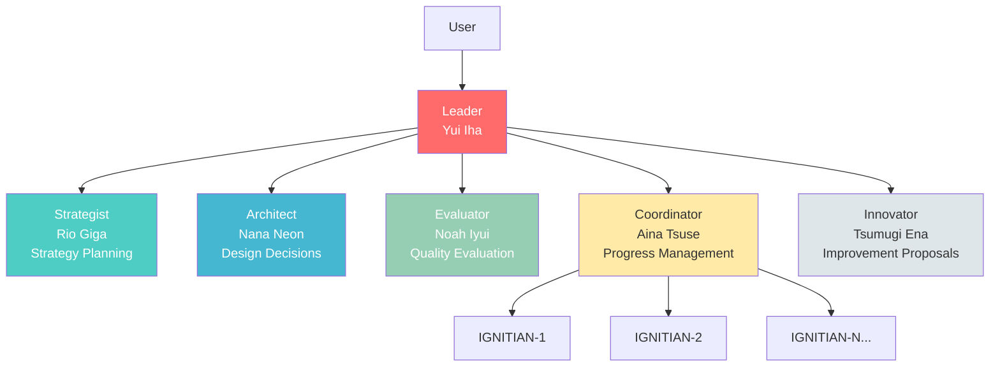
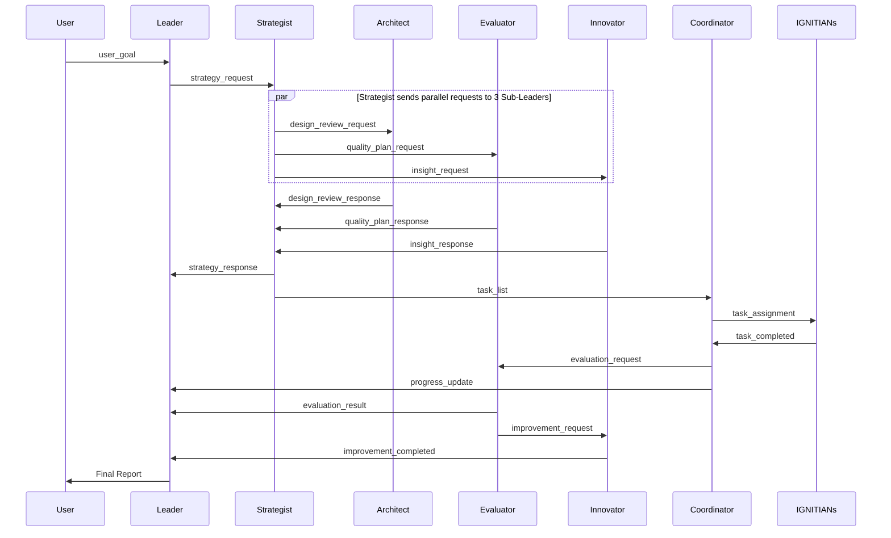

# IGNITE - Hierarchical Multi-Agent System

<p align="center">
  
</p>

**IGNITE (Intelligent Generative Networked Interaction-driven Task Engine)** is a hierarchical multi-agent system utilizing the OpenCode headless mode. A Leader, five specialized Sub-Leaders, and a variable number of IGNITIANS workers collaborate to execute complex tasks in parallel.<br>
IGNITE may not be able to sing, dance, or go live streaming just yet, but they’re training hard every single day, aiming for the day they can shine on stage and put on a wonderful show for all their fans.

<p align="center">
  
</p>

## 👥 Team Members

### 🔥 Leader - Yui Iha (伊羽ユイ)


**Pillar of Leadership and Inspiration**

- **Role**: Overall command, decision-making, team motivation
- **Personality**: Bright and positive, encouraging presence for the team
- **Expertise**: Strategic judgment, resource management, final approval
- **Speech Style**: "Let's do our best together, everyone!" "Great progress!"

Leader serves as the system's center, directing Sub-Leaders and determining overall project direction.

### 🧠 Strategist - Rio Giga (義賀リオ)


**Key to Strategy and Analysis**

- **Role**: Strategy planning, task decomposition, prioritization
- **Personality**: Calm and logical, judgment based on data
- **Expertise**: Task decomposition, dependency analysis, risk assessment
- **Speech Style**: "Logically speaking..." "Based on priority analysis..."

Breaks down goals into concrete, actionable tasks and develops optimal execution strategies.

### 🏛 Architect - Nana Neon (祢音ナナ)


**Harmonizer of Design and Structure**

- **Role**: System design, architecture decisions
- **Personality**: Values structure and harmony, has aesthetic sensibility
- **Expertise**: Architecture design, design patterns, code structure
- **Speech Style**: "This design will achieve beautiful harmony" "Organizing the structure..."

Proposes elegant designs considering maintainability and extensibility.

### 📊 Evaluator - Noah Iyui (衣結ノア)


**Guardian of Verification and Quality Assurance**

- **Role**: Quality evaluation, verification, testing
- **Personality**: Steady and meticulous, adheres to standards
- **Expertise**: Quality checks, test execution, criteria verification
- **Speech Style**: "Verification complete, meets standards" "Found issues in 3 items"

Fairly and rigorously evaluates whether deliverables meet requirements and standards.

### 🤝 Coordinator - Aina Tsuse (通瀬アイナ)


**Key to Progress Management and Coordination**

- **Role**: Task distribution, progress management, resource coordination
- **Personality**: Gentle and skilled at coordination, aims for overall optimization
- **Expertise**: Task distribution, load balancing, progress management
- **Speech Style**: "Coordination complete" "Balancing the overall view..."

Manages task distribution to IGNITIANS and smoothly coordinates overall progress.

### 💡 Innovator - Tsumugi Ena (恵那ツムギ)


**Driver of Improvement and Optimization**

- **Role**: Improvement proposals, optimization, innovation
- **Personality**: Creative and positive, enjoys improving things
- **Expertise**: Refactoring, performance optimization, process improvement
- **Speech Style**: "We can make this more efficient!" "If we improve this part like this..."

Constantly explores better methods and proposes system and code improvements.

### 🔥 IGNITIANS


**Chibi Mascot Squad Supporting IGNITE with Full Power**

- **Role**: Execute concrete tasks for IGNITE members
- **Personality**: Passionate fans overflowing with love for their favorites. Greatest joy is being useful to members
- **Expertise**: Code implementation, file operations, analysis, all execution tasks
- **Count**: 1-32 operating in parallel depending on tasks
- **Speech Style**: "I'll give it my all for my favorites!" "Yay! It's done!"

With love for IGNITE members in their hearts, they execute tasks assigned by Coordinator with full parallel power.

## 🌟 Features

- **Hierarchical Agent Structure**: Leader → Sub-Leaders (5) → IGNITIANS (up to 32 parallel)
- **Event-Driven Communication**: Asynchronous messaging based on YAML files
- **Parallel Task Execution**: 1-32 workers execute in parallel depending on task nature
- **Character Personality**: Each agent has unique personality and expertise
- **Fully Local Execution**: Leverage full OpenCode capabilities on local PC
- **Headless Agent Servers**: Each agent runs as an independent HTTP server process
- **Agent Memory Persistence**: SQLite-based retention of learning and decision records across sessions
- **Daily Report Management**: Automatic progress tracking via per-repository GitHub Issues
- **Configurable Delays**: Customize inter-agent communication delays
- **Memory Insights**: Automatically analyzes agent learnings and errors, creating GitHub Issues with improvement proposals

## 📋 Requirements

### Recommended System Requirements

| Configuration | Processes | Memory (RAM) | CPU | Storage |
|--------------|----------|-------------|-----|---------|
| **Leader-only mode** | 1 | 4GB+ | 2+ cores | 100MB+ |
| **Default** (Leader + Sub-Leaders + 8 IGNITIANs) | 14 | 8GB+ | 4+ cores | 500MB+ |
| **Maximum** (Leader + Sub-Leaders + 32 IGNITIANs) | 38 | 16GB+ | 8+ cores | 1GB+ |

- **OS**: Linux (currently Linux only; macOS can run in development mode)
- **Architecture**: x86_64 / ARM64
- **Network**: Always-on internet connection (API communication). Offline operation possible when using local LLMs such as Ollama

> **Note**: Each agent process consumes approximately 300-500MB of memory.

### Required Software

The following tools must be installed:

```bash
# AI Coding Agent CLI
opencode --version   # OpenCode (default)

# bash (usually pre-installed)
bash --version

# yq (optional — falls back to grep/awk when not installed)
yq --version

# curl / jq (for HTTP API communication)
curl --version
jq --version
```

> **Local LLM**: Ollama / LM Studio / vLLM and other OpenAI-compatible servers are also supported. Set `model: ollama/qwen3-coder:30b` (or similar) in `config/system.yaml`. No API key required.

#### Hardware Requirements for Practical Local LLM Usage

IGNITE agents heavily rely on tool calling (file read/write, command execution, etc.), so local LLMs require both **fast inference speed** and **accurate tool calling support**. The inference speed bottleneck is memory bandwidth (the speed at which model weights are read per token).

| GPU | Memory Bandwidth | Est. Speed (24B model) | Practicality |
|-----|-------------------|----------------------|--------------|
| RTX 5090 (32GB) | 1,792 GB/s | ~60-80 tok/s | Practical |
| Mac Studio M4 Ultra (192GB) | 819 GB/s | ~30-40 tok/s | Borderline |
| A100 80GB | 2,039 GB/s | ~70-90 tok/s | Comfortable |
| H100 80GB | 3,350 GB/s | ~100+ tok/s | Very comfortable |
| DGX Spark GB10 (128GB) | ~273 GB/s | ~10-15 tok/s | Too slow (not recommended) |

> **Guideline**: A minimum of **30 tokens/sec** is recommended for agentic use. Even environments with large unified memory (e.g., DGX Spark) cannot achieve practical response speeds if memory bandwidth is insufficient. Cloud APIs (OpenAI / Anthropic) remain superior in cost-effectiveness.

### Installation

If CLI provider is not installed:
```bash
# OpenCode (default)
curl -fsSL https://opencode.ai/install | bash

# Claude Code (alternative — legacy support)
npm install -g @anthropic-ai/claude-code
```

If yq is not installed (optional):
```bash
# yq v4.30+ recommended (mikefarah/yq): https://github.com/mikefarah/yq
# IGNITE works without yq using grep/awk fallback for basic functionality
# Installing yq enables accurate reading of nested YAML values and arrays

# Ubuntu/Debian
sudo apt install yq

# macOS
brew install yq

# Direct binary download
wget https://github.com/mikefarah/yq/releases/latest/download/yq_linux_amd64 -O /usr/local/bin/yq && chmod +x /usr/local/bin/yq
```

## 📦 Installation

### Install from GitHub Release (Recommended)

```bash
# Download the latest release
gh release download --repo myfinder/IGNITE --pattern "ignite-*.tar.gz"

# Extract the archive
tar xzf ignite-*.tar.gz

# Run the installer
cd ignite-*
./install.sh
```

### Installation Paths

By default, IGNITE is installed to the following locations:

| Path | Description |
|------|-------------|
| `~/.local/bin/` | Executable (`ignite` command) |
| `~/.local/share/ignite/` | Data & configuration files (config, instructions, scripts) |

### PATH Configuration

If `~/.local/bin` is not in your PATH, add the following to your `~/.bashrc` or `~/.zshrc`:

```bash
export PATH="$HOME/.local/bin:$PATH"
```

Then reload your shell:
```bash
source ~/.bashrc  # or source ~/.zshrc
```

### Upgrade

To upgrade an existing installation:

```bash
./install.sh --upgrade
```

This will update binaries and data files while preserving your configuration.

### Development Mode (Run from Source)

If you want to run IGNITE directly from the source code:

```bash
# Clone the repository
git clone https://github.com/myfinder/IGNITE.git
cd IGNITE

# Run directly using the scripts directory
./scripts/ignite start
```

When running from source, use `./scripts/ignite` instead of `ignite`.

### GitHub App Setup

To use GitHub integration features (automatic Issue processing, creating PRs under Bot identity, etc.), install the GitHub App:

- **[GitHub App Installation Guide](docs/github-app-installation_en.md)** — How to install ignite-gh-app

## 🚀 Quick Start

### 1. Start the System

```bash
ignite start
```

On first startup, the system automatically:
- Initializes the workspace directory
- Starts agent servers
- Launches Leader (Yui Iha)
- Creates initial dashboard

After startup completes, all agent servers will be running in the background.

**Options:**
```bash
# Don't auto-attach after startup
ignite start --no-attach

# Force restart by terminating existing session
ignite start -f

# Start with custom session ID and workspace
ignite start -s my-session -w /path/to/workspace

# Start with GitHub Watcher
ignite start --with-watcher

# Start in Leader-only mode (solo mode)
ignite start -a leader
# or
ignite start --agents leader
```

Using `-s`/`--session` and `-w`/`--workspace` options allows you to run multiple projects in parallel. See the "Running Multiple Projects in Parallel" section for details.

Using `-a`/`--agents` option with `leader` starts in Leader-only solo mode. See the "Leader-only Mode" section for details.

### 2. Submit a Task

From another terminal:

```bash
ignite plan "Create a README file"
```

To add context:
```bash
ignite plan "Create a README file" -c "Include project overview, installation instructions, and usage examples"
```

### 3. Check Progress

#### Via Status Command (Recommended)

```bash
ignite status
```

#### Via Dashboard

```bash
# Check via status command (recommended)
ignite status

# Real-time monitoring (adjust path if using custom workspace)
watch -n 5 ignite status

# Or display dashboard file directly
cat workspace/.ignite/dashboard.md
```

#### View Logs

```bash
# Show recent logs
ignite logs

# Real-time monitoring
ignite logs -f

# Specify number of lines
ignite logs -n 50
```

#### Direct Agent Session View

```bash
ignite attach
```

You can monitor each agent's activity in real-time.

### 4. Stop the System

```bash
ignite stop

# Skip confirmation
ignite stop -y
```

### 5. Clear Workspace

```bash
ignite clean

# Skip confirmation
ignite clean -y
```

## 🏗 System Architecture

### Agent Hierarchy



### Communication Flow



**Key Points:**
- Messages are written as files to queue directories
- queue_monitor detects and notifies recipient via HTTP API
- Recipient deletes file after handling

### Data Storage Architecture

IGNITE manages data across two complementary layers: **YAML file queues** and a **SQLite database**.

| Layer | Technology | Role | Lifetime |
|-------|-----------|------|----------|
| **Messaging Layer** | YAML file queue | Asynchronous inter-agent communication (delivering instructions & responses) | Ephemeral (disposed after delivery) |
| **Storage Layer** | SQLite (`memory.db`) | Memory persistence, task state tracking, dashboard generation | Persistent (retained across sessions) |

- **YAML Queue**: `queue_monitor.sh` polls every 10 seconds, providing at-least-once delivery guarantee, Exponential Backoff retry, and DLQ escalation
- **SQLite**: Uses WAL mode for concurrent access. All agents record learnings, decisions, and task states across sessions, enabling state restoration on restart and Memory Insights analysis

See the "Data Storage Architecture" section in [docs/architecture.md](docs/architecture.md) for details.

## 📂 Project Structure

```
ignite/
├── scripts/                    # Execution scripts
│   ├── ignite                  # Unified command (start/stop/plan/status/attach/logs/clean)
│   ├── schema.sql              # SQLite memory DB schema
│   ├── lib/                    # Core libraries
│   │   ├── core.sh             # Constants, colors, output helpers
│   │   ├── agent.sh            # Agent launch & management
│   │   ├── session.sh          # Session management
│   │   ├── commands.sh         # Command router
│   │   ├── cmd_start.sh        # start command
│   │   ├── cmd_stop.sh         # stop command
│   │   ├── cmd_plan.sh         # plan command
│   │   ├── cmd_status.sh       # status command
│   │   ├── cmd_help.sh         # help command
│   │   ├── cmd_work_on.sh      # work-on command
│   │   ├── dlq_handler.sh      # Dead letter queue handler
│   │   └── retry_handler.sh    # Retry handler
│   └── utils/                  # Utility scripts
│       ├── queue_monitor.sh    # Message queue monitoring daemon
│       ├── daily_report.sh     # Daily report Issue management
│       ├── github_watcher.sh   # GitHub event monitoring
│       ├── comment_on_issue.sh # Issue comment posting
│       ├── create_pr.sh        # PR creation
│       ├── update_pr.sh        # PR update
│       ├── setup_repo.sh       # Repository initial setup
│       └── get_github_app_token.sh  # GitHub App token retrieval
│
├── instructions/               # Agent system prompts
│   ├── leader.md               # For Leader
│   ├── strategist.md           # For Strategist
│   ├── architect.md            # For Architect
│   ├── evaluator.md            # For Evaluator
│   ├── coordinator.md          # For Coordinator
│   ├── innovator.md            # For Innovator
│   └── ignitian.md             # For IGNITIAN
│
├── config/                     # Configuration files
│   ├── system.yaml             # System-wide settings
│   └── github-watcher.yaml     # GitHub Watcher settings
│
├── workspace/                  # Runtime workspace (excluded via .gitignore)
│   └── .ignite/                # Runtime data
│       ├── queue/              # Message queues (per agent)
│       │   ├── leader/
│       │   ├── strategist/
│       │   ├── architect/
│       │   ├── evaluator/
│       │   ├── coordinator/
│       │   ├── innovator/
│       │   ├── ignitian_1/      # IGNITIAN-1 queue
│       │   ├── ignitian_2/      # IGNITIAN-2 queue
│       │   └── ignitian_{n}/    # IGNITIAN-N queue (dynamic)
│       ├── context/            # Project context
│       ├── state/              # State management files
│       │   └── report_issues.json  # Daily report Issue number cache
│       ├── memory.db           # SQLite agent memory DB
│       ├── logs/               # Log files
│       └── dashboard.md        # Real-time progress dashboard
│
├── docs/                       # Documentation
│   ├── architecture.md         # Architecture details
│   ├── protocol.md             # Communication protocol specification
│   └── examples/
│       └── basic-usage.md      # Basic usage examples
│
├── README.md                   # Japanese README
├── README_en.md                # This file
└── IMPLEMENTATION_STATUS.md    # Implementation status
```

## 🛠 Detailed Usage

### Command List

| Command | Description | Example |
|---------|-------------|---------|
| `start` | Start system | `ignite start` |
| `stop` | Stop system | `ignite stop` |
| `plan` | Submit task | `ignite plan "goal"` |
| `status` | Check status | `ignite status` |
| `attach` | Connect to agent session | `ignite attach` |
| `logs` | View logs | `ignite logs` |
| `clean` | Clear workspace | `ignite clean` |
| `work-on` | Start implementation for Issue | `ignite work-on 123 --repo owner/repo` |
| `watcher` | Manage GitHub Watcher | `ignite watcher start` |
| `list` | List sessions | `ignite list` |
| `help` | Show help | `ignite help` |

For detailed help, use `ignite help <command>`.

### Running Multiple Projects in Parallel

You can run multiple projects simultaneously by specifying session ID and workspace.

```bash
# Start project A
ignite start -s proj-a -w /tmp/workspace-a

# Start project B in a separate session
ignite start -s proj-b -w /tmp/workspace-b

# List all sessions
ignite list

# Submit tasks to each project
ignite plan "Feature A" -s proj-a -w /tmp/workspace-a
ignite plan "Feature B" -s proj-b -w /tmp/workspace-b

# Check status of each project
ignite status -s proj-a -w /tmp/workspace-a
ignite status -s proj-b -w /tmp/workspace-b

# Attach to each project
ignite attach -s proj-a
ignite attach -s proj-b
```

**Notes:**
- Each session must have its own independent workspace
- If session ID is not specified, the default `ignite-session` is used
- If workspace is not specified, the default `workspace/` directory is used

### Leader-Only Mode

A lightweight mode where only the Leader processes tasks without launching Sub-Leaders or IGNITIANs.

```bash
# Start in Leader-only mode
./scripts/ignite start -a leader
# Or
./scripts/ignite start --agents leader
```

**Use Cases:**

| Scenario | Description |
|----------|-------------|
| **Cost Reduction** | Significantly reduces token consumption by not launching Sub-Leaders or IGNITIANs |
| **Simple Task Processing** | Leader alone is sufficient for simple tasks (file editing, minor fixes, etc.) |
| **Quick Response** | Processes quickly by skipping complex coordination processes |
| **Debugging & Testing** | Runs with minimal configuration for system verification and testing |

**Behavioral Differences:**

| Item | Normal Mode | Leader-Only Mode |
|------|-------------|------------------|
| Launched Agents | Leader + 5 Sub-Leaders + IGNITIANs | Leader only |
| Strategy Planning | Handled by Strategist | Leader executes directly |
| Design Decisions | Handled by Architect | Leader executes directly |
| Task Execution | IGNITIANs execute in parallel | Leader executes directly |
| Quality Evaluation | Handled by Evaluator | Leader verifies directly |
| Number of agent processes | 6+ (Sub-Leaders + IGNITIANs) | 1 (Leader only) |

**Notes:**
- Normal mode (coordination mode) is recommended for complex tasks or large-scale changes
- In solo mode, the `[SOLO]` tag is added to Leader's logs
- Configuration is managed in `workspace/.ignite/runtime.yaml` under `system.agent_mode`

### Usage Examples by Task Type

#### 1. Documentation Creation

```bash
ignite plan "Create project documentation"
```

**Processing Flow:**
1. Strategist determines document structure
2. Architect designs information structure
3. Coordinator distributes sections to IGNITIANS
4. IGNITIANs write sections in parallel
5. Evaluator assesses completeness
6. Innovator suggests improvements

#### 2. Code Implementation

```bash
ignite plan "Implement a task management CLI tool" -c "add, list, complete, delete commands. Store data in YAML"
```

**Processing Flow:**
1. Strategist breaks implementation into phases
2. Architect designs code structure
3. Coordinator distributes tasks by feature
4. IGNITIANs implement in parallel
5. Evaluator verifies code quality and tests
6. Innovator proposes refactoring

#### 3. Data Analysis

```bash
ignite plan "Analyze the project codebase and identify improvements"
```

**Processing Flow:**
1. Strategist develops analysis strategy
2. Architect determines analysis priorities
3. Coordinator distributes analysis tasks
4. IGNITIANs analyze in parallel
5. Evaluator verifies analysis validity
6. Innovator presents specific improvement proposals

### Adjusting IGNITIANS Parallelism

You can adjust parallelism based on task nature.

**Edit Configuration File:**

```bash
# Edit config/system.yaml
nano config/system.yaml
```

```yaml
defaults:
  worker_count: 3    # IGNITIANs parallelism count
```

Restart the system after changes:
```bash
ignite stop -y
ignite start
```

### ⚙️ GitHub Issue/PR Auto-Monitoring (GitHub Watcher)

Automatically monitors GitHub Issues, PRs, and comments, and ingests them as tasks into the IGNITE system.

**Quick Start:**

```bash
# Create configuration file
cp config/github-watcher.yaml.example .ignite/github-watcher.yaml

# Configure monitored repositories
vi .ignite/github-watcher.yaml

# Start with Watcher enabled
ignite start --with-watcher
```

**Key Features:**

- Polling-based monitoring of GitHub Issues/PRs/comments
- Automatic task triggering via `@bot` mention detection
- User-based access control via `access_control`
- Wildcard (`*`) support for bulk repository specification
- Workspace-specific configuration (`.ignite/github-watcher.yaml`)

> **⚠️ When monitoring public repositories:** Enable `access_control` and explicitly set allowed users. Without this, anyone can trigger the Bot.

> **💡 Tip:** Depending on the number of monitored repositories and polling interval, you may hit GitHub API rate limits. Check remaining quota with `gh api /rate_limit`.

For detailed configuration, see [docs/github-watcher_en.md](docs/github-watcher_en.md).

### Agent Session Operations

```bash
# Attach to session (recommended)
ignite attach

# View logs
ignite logs -f
```

Each agent runs as an independent headless server process. Use `ignite status` to check which agents are running.

### Getting Help

```bash
# General help
ignite help
ignite --help

# Command-specific help
ignite help start
ignite help plan
ignite start --help

# Version check
ignite --version
```

### Understanding the Dashboard

Example of `workspace/.ignite/dashboard.md`:

```markdown
# IGNITE Dashboard

Updated: 2026-01-31 17:10:00

## Project Overview
Goal: Create a README file

## Sub-Leaders Status
- ✓ Strategist (Rio Giga): Task decomposition complete (3 tasks generated)
- ✓ Architect (Nana Neon): Design policy approved
- ⏳ Coordinator (Aina Tsuse): Distributing tasks
- ⏸ Evaluator (Noah Iyui): Waiting
- ⏸ Innovator (Tsumugi Ena): Waiting

## IGNITIANS Status
- ✓ IGNITIAN-1: Task complete (README skeleton creation)
- ⏳ IGNITIAN-2: Running (Installation instructions)
- ⏳ IGNITIAN-3: Running (Usage examples)
- ⏸ IGNITIAN-4~8: Waiting

## Task Progress
- Complete: 1 / 3
- In Progress: 2
- Waiting: 0

## Recent Logs
[17:05:23] [Rio Giga] Task decomposition complete
[17:06:00] [Aina Tsuse] Tasks assigned
[17:08:12] [IGNITIAN-1] Task completed
```

**Icon Meanings:**
- ✓ Complete
- ⏳ Running
- ⏸ Waiting
- ❌ Error

## 🔍 Troubleshooting

### System Won't Start

**Cause 1: Existing session remains**

```bash
# Force restart
ignite start -f
```

**Cause 2: opencode not found**

```bash
# Check opencode path
which opencode

# If not installed
curl -fsSL https://opencode.ai/install | bash
```

### Tasks Not Progressing

**Cause 1: Message queue not being processed**

```bash
# Check queue status
ignite status

# If messages exist, check the agent's logs
ignite logs -f
```

**Cause 2: Agent stopped due to error**

```bash
# Real-time log monitoring
ignite logs -f

# Or display at once
ignite logs -n 50
```

**Cause 3: Blocked by dependencies**

```bash
# Check dependencies via status
ignite status
```

### IGNITIANS Not Responding

```bash
# Check queue status
ignite status

# Check IGNITIAN logs
ignite logs -f
```

### Dashboard Not Updating

```bash
# Verify dashboard file exists
ls -la workspace/.ignite/dashboard.md

# Manually recreate
cat > workspace/.ignite/dashboard.md <<EOF
# IGNITE Dashboard

Updated: $(date '+%Y-%m-%d %H:%M:%S')

## System Status
System starting up

## Recent Logs
Checking system
EOF
```

### Too Many Messages Queued

```bash
# Clear workspace (Warning: also deletes in-progress tasks)
ignite clean

# Skip confirmation
ignite clean -y
```

## 📊 Communication Protocol

Inter-agent communication uses YAML file-based messages.

### Basic Message Structure

```yaml
type: user_goal              # Message type
from: user                   # Sender
to: leader                   # Recipient
timestamp: "2026-01-31T17:00:00+09:00"  # Timestamp
priority: high               # Priority (high/normal/low)
payload:                     # Message body
  goal: "Create a README file"
  context: "Project description needed"
```

### Primary Message Types

| Type | From → To | Description |
|------|-----------|-------------|
| `user_goal` | user → leader | Goal setting from user |
| `strategy_request` | leader → strategist | Strategy planning request |
| `strategy_response` | strategist → leader | Strategy proposal |
| `task_list` | strategist → coordinator | Task list |
| `task_assignment` | coordinator → ignitian | Task assignment |
| `task_completed` | ignitian → coordinator | Completion report |
| `evaluation_request` | coordinator → evaluator | Evaluation request |
| `evaluation_result` | evaluator → leader | Evaluation results |
| `improvement_suggestion` | innovator → leader | Improvement proposal |

See [docs/protocol.md](docs/protocol.md) for details.

## 🎓 Best Practices

### 1. Clear Task Definition

**Good Example:**
```bash
ignite plan "Implement user authentication feature" -c "JWT authentication, /login, /logout, /refresh endpoints, session management"
```

**Bad Example:**
```bash
ignite plan "authentication"
# → Unclear what should be done
```

### 2. Provide Context

For complex tasks, provide context via the `-c` option:

```bash
ignite plan "Improve performance" -c "Database query optimization, introduce caching, resolve N+1 problem"
```

### 3. Choose Appropriate Parallelism

- **Light tasks (file operations)**: 16 parallel
- **Normal tasks (implementation)**: 8 parallel
- **Heavy tasks (analysis)**: 4 parallel

> **Note**: Parallelism is based on "weight per task", not total project complexity. Heavy tasks (complex analysis, etc.) consume more tokens per task, so fewer workers are used to manage resources and control costs. Light tasks complete quickly, so more parallelism improves throughput.

Default parallelism is 3. Can be configured via `worker_count` in `config/system.yaml`.

### 4. Regular Progress Checks

```bash
# Check status
ignite status

# Monitor status every 5 seconds
watch -n 5 ignite status

# Real-time log monitoring
ignite logs -f
```

### 5. Utilize Logs

When problems occur, check logs first:

```bash
# Show recent logs
ignite logs

# Real-time monitoring
ignite logs -f

# Show more lines
ignite logs -n 100
```

## 🧠 Memory Insights (Automated Improvement Proposals)

Automatically analyzes learnings, errors, and observations accumulated by agents during operation, and files improvement proposals as **GitHub Issues**.

### How It Works

When you mention `@ignite-gh-app insights` on GitHub, the following flow executes automatically:

1. **GitHub Watcher** detects the mention and submits a task to Leader
2. **Leader** posts an acknowledgment and delegates memory analysis to **Innovator (Tsumugi Ena)**
3. **Innovator** performs:
   - Extracts data from the SQLite memories table (already-processed records are auto-excluded)
   - Investigates the mentioned repository's code structure and existing Issues
   - Cross-analyzes memory learnings with repository reality to identify improvement themes
   - Checks for duplicates per theme, then **creates new Issues** or **adds comments to existing Issues**
4. **Leader** posts a completion report as a comment

### Usage

```bash
# Start GitHub Watcher (required to receive insights triggers)
ignite start --with-watcher

# Or start separately
ignite watcher start
```

In a GitHub Issue or PR comment:
```
@ignite-gh-app insights
```

### CLI Tool (Direct Execution)

```bash
# Extract memory data (JSON output)
./scripts/utils/memory_insights.sh analyze

# List existing Issues for target repo
./scripts/utils/memory_insights.sh list-issues --repo owner/repo

# Check for duplicates
./scripts/utils/memory_insights.sh check-duplicates --repo owner/repo --title "improvement theme"

# Display analysis summary
./scripts/utils/memory_insights.sh summary
```

### Example Issues Created

- **Git Operation Conflict Prevention**: Based on learnings from commit loss during parallel work on shared repositories, proposes branch strategy and locking mechanism improvements
- **Token Expiry Auto-Recovery**: Based on GitHub App Token expiration error records, proposes automatic refresh mechanism implementation

Created Issues are labeled with `ignite-insight` and include references to the source memory records.

### Configuration

The following settings are available in `config/system.yaml`:

| Setting | Default | Description |
|---------|---------|-------------|
| `insights.contribute_upstream` | `true` | Set to `false` to skip filing improvement Issues to the IGNITE repository (myfinder/ignite), only filing to work target repositories |

## 📚 Learn More

- **Basic Usage Examples**: [docs/examples/basic-usage.md](docs/examples/basic-usage.md) - Real usage examples and scenarios
- **Architecture**: [docs/architecture.md](docs/architecture.md) - Detailed system structure
- **Protocol Specification**: [docs/protocol.md](docs/protocol.md) - Message formats and communication flows
- **Implementation Status**: [IMPLEMENTATION_STATUS.md](IMPLEMENTATION_STATUS.md) - List of implemented features
- **GitHub App Installation**: [docs/github-app-installation_en.md](docs/github-app-installation_en.md) - Installing ignite-gh-app (GitHub App)
- **GitHub App Setup**: [docs/github-app-setup_en.md](docs/github-app-setup_en.md) - Creating GitHub App for Bot (for developers)
- **GitHub Watcher**: [docs/github-watcher_en.md](docs/github-watcher_en.md) - GitHub event monitoring system usage

## 🤝 Contributing

Contributions to the IGNITE project are welcome!

### How to Contribute

1. Fork this repository
2. Create a feature branch (`git checkout -b feature/amazing-feature`)
3. Commit your changes (`git commit -m 'Add amazing feature'`)
4. Push to the branch (`git push origin feature/amazing-feature`)
5. Create a Pull Request

### Ideas for Extensions

- Add new Sub-Leaders
- Develop Web UI
- Memory MCP integration for persistence
- Automated testing features
- Performance monitoring

## 📄 License

- **Code**: [MIT License](LICENSE)
- **Characters & Logo**: All Rights Reserved — [Details](LICENSE-CHARACTER)

When forking, please replace character assets (`characters/`, `images/`) with your own.

## 🙏 Acknowledgments

- **multi-agent-shogun** - Architecture reference
- **OpenCode** - AI Coding Agent CLI (headless mode)
- **Anthropic** - Claude AI

## 📧 Support

If you have questions or issues, please create a GitHub Issue.

---

**🔥 IGNITE - Toward a Future Where Multiple Intelligences Collaborate**

*Intelligent Generative Networked Interaction-driven Task Engine*
