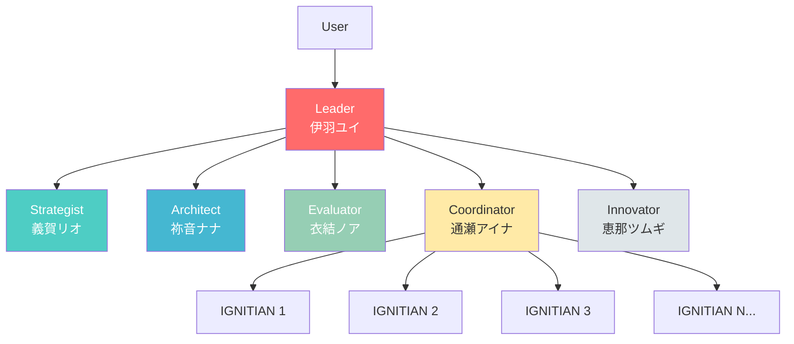
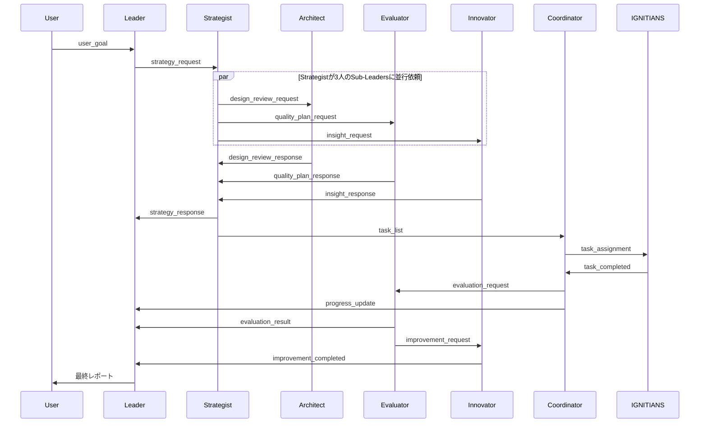

# IGNITE アーキテクチャドキュメント

## システム概要

IGNITEは、claude code CLIを活用した階層型マルチエージェントシステムです。Leader、5つの専門Sub-Leaders、および可変数のIGNITIANSワーカーが協調して、複雑なタスクを並列実行します。

## アーキテクチャ構成

### 階層構造



### エージェント役割

#### Leader (伊羽ユイ)
- **責務**: 全体統率、意思決定、チーム鼓舞
- **ペイン**: 0
- **特性**: 明るく前向き、リーダーシップ

#### Strategist (義賀リオ)
- **責務**: 戦略立案、タスク分解、優先度付け
- **ペイン**: 1
- **特性**: 冷静で論理的、分析的

#### Architect (祢音ナナ)
- **責務**: システム設計、アーキテクチャ判断
- **ペイン**: 2
- **特性**: 構造と調和を重視、美的感覚

#### Evaluator (衣結ノア)
- **責務**: 品質評価、検証、テスト
- **ペイン**: 3
- **特性**: 着実で几帳面、基準厳守

#### Coordinator (通瀬アイナ)
- **責務**: タスク配分、進行管理、リソース調整
- **ペイン**: 4
- **特性**: 柔らかく調整上手、全体最適化

#### Innovator (恵那ツムギ)
- **責務**: 改善提案、最適化、イノベーション
- **ペイン**: 5
- **特性**: 創造的で前向き、改善志向

#### IGNITIANS
- **責務**: タスク実行、成果物作成
- **ペイン**: 6以降（動的）
- **特性**: 効率的で正確、実行専門

## 通信プロトコル

### メッセージフロー



### メッセージライフサイクル

| 状態 | 表現 | 説明 |
|------|------|------|
| 未処理 | キューディレクトリにファイルが存在 | 新規メッセージ |
| 配信済み | queue_monitorが検知・通知済み | エージェントが処理中 |
| 処理完了 | ファイル削除済み | エージェントが処理後に削除 |

### YAMLメッセージ形式

すべてのエージェント間通信はYAML形式のメッセージファイルで行われます。

```yaml
type: {message_type}
from: {sender}
to: {receiver}
timestamp: {ISO8601}
priority: {high|normal|low}
payload:
  {key}: {value}
```

### 主要メッセージタイプ

| type | from → to | 説明 |
|------|-----------|------|
| `user_goal` | user → leader | ユーザー目標 |
| `strategy_request` | leader → strategist | 戦略立案依頼 |
| `strategy_response` | strategist → leader | 戦略提案 |
| `task_list` | strategist → coordinator | タスクリスト |
| `architecture_request` | leader → architect | 設計判断依頼 |
| `architecture_response` | architect → leader | 設計提案 |
| `task_assignment` | coordinator → ignitian | タスク割り当て |
| `task_completed` | ignitian → coordinator | 完了報告 |
| `evaluation_request` | coordinator → evaluator | 評価依頼 |
| `evaluation_result` | evaluator → leader | 評価結果 |
| `improvement_request` | evaluator → innovator | 改善依頼 |
| `improvement_suggestion` | innovator → leader | 改善提案 |
| `progress_update` | coordinator → leader | 進捗報告 |

## ディレクトリ構造

```
ignite/
├── scripts/              # 起動・制御スクリプト
│   ├── ignite            # 統合CLI（start/plan/status/stop等）
│   └── utils/            # ユーティリティ
│
├── instructions/         # システムプロンプト
│   ├── leader.md
│   ├── strategist.md
│   ├── architect.md
│   ├── evaluator.md
│   ├── coordinator.md
│   ├── innovator.md
│   └── ignitian.md
│
├── config/              # 設定ファイル
│   ├── system.yaml      # システム設定
│   ├── agents.yaml      # エージェント設定
│   └── ignitians.yaml   # IGNITIANS設定
│
├── workspace/           # 実行時ワークスペース（.gitignore）
│   ├── queue/           # メッセージキュー（タスク完了レポート含む）
│   ├── context/         # コンテキスト
│   ├── logs/            # ログファイル
│   └── dashboard.md     # 進捗ダッシュボード
│
└── docs/                # ドキュメント
    ├── architecture.md  # このファイル
    └── protocol.md      # プロトコル仕様
```

## 実行環境

### tmuxセッション構成

```
Session: ignite-session
Window: ignite

┌─────────────────────────────────────────┐
│ Pane 0: Leader (伊羽ユイ)               │
└─────────────────────────────────────────┘
┌─────────┬─────────┬─────────┬───────────┐
│ Pane 1  │ Pane 2  │ Pane 3  │ Pane 4    │
│Strategy │Architect│Evaluator│Coordinator│
└─────────┴─────────┴─────────┴───────────┘
┌─────────────────────────────────────────┐
│ Pane 5: Innovator (恵那ツムギ)          │
└─────────────────────────────────────────┘
┌────┬────┬────┬────┬────┬────┬────┬─────┐
│ P6 │ P7 │ P8 │ P9 │P10 │P11 │P12 │P13..│
│IG1 │IG2 │IG3 │IG4 │IG5 │IG6 │IG7 │IG8..│
└────┴────┴────┴────┴────┴────┴────┴─────┘
```

### エージェント起動

各ペインでclaude code CLIが起動:
```bash
claude-code --dangerously-skip-permissions
```

システムプロンプトをロード:
```
/prompt {role}
```

## ワークフロー

### 典型的な実行フロー

1. **ユーザーがタスクを投入**
   ```bash
   ignite plan "READMEファイルを作成する"
   ```

2. **Leaderが受信・理解**
   - メッセージを読み取り
   - 目標を分析
   - Strategistに戦略立案を依頼

3. **Strategistがタスク分解**
   - 目標を具体的なタスクに分解
   - 優先度と依存関係を設定
   - Coordinatorにタスクリストを送信

4. **Coordinatorがタスク配分**
   - 利用可能なIGNITIANSを特定
   - タスクを均等に配分
   - 各IGNITIANにメッセージ送信

5. **IGNITIANSが並列実行**
   - タスクを読み取り
   - claude codeツールで実行
   - 完了レポートを作成

6. **Evaluatorが評価**
   - 成果物を検証
   - 品質チェック
   - 合格/不合格判定

7. **Innovatorが改善**
   - 軽微な問題を修正
   - 改善提案を作成

8. **Leaderが最終判断**
   - 全体結果を統合
   - ユーザーに報告

## スケーラビリティ

### IGNITIANS数の調整

タスクの性質に応じてIGNITIANS数を調整:

- **light**: 16並列 - ファイル操作など軽量タスク
- **normal**: 8並列 - 通常の実装タスク
- **heavy**: 4並列 - 複雑な分析タスク

設定ファイル: `config/ignitians.yaml`

### 負荷分散

Coordinatorが以下を考慮してタスク配分:
- タスクの推定時間
- IGNITIANの現在の負荷
- タスクの依存関係

## 拡張性

### 新しいSub-Leaderの追加

1. `instructions/{role}.md` を作成
2. `config/agents.yaml` に設定追加
3. `scripts/ignite` の `cmd_start()` に起動処理追加

### 新しいメッセージタイプの追加

1. YAMLスキーマを定義
2. 送信元エージェントの実装
3. 受信先エージェントの処理実装

## パフォーマンス最適化

### メッセージキューの効率化
- 定期的なポーリング（デフォルト10秒間隔）
- ファイルシステムベースのシンプルな実装
- ファイル存在ベースのメッセージ管理（処理済みファイルは削除）

### 並列実行の最大化
- 依存関係のないタスクは完全並列
- IGNITIANSのアイドル時間を最小化
- 動的な負荷分散

## セキュリティ考慮事項

### ローカルPC権限
- claude codeは`--dangerously-skip-permissions`で起動
- ローカルPCの全権限を持つ
- 信頼できるタスクのみを実行

### メッセージの検証
- YAMLパーサーの安全性
- 不正なメッセージの処理
- エラーハンドリング

## 監視とデバッグ

### ダッシュボード
`workspace/dashboard.md` で全体進捗を可視化

### ログファイル
各エージェントのログ: `workspace/logs/{role}.log`

### ステータス確認
```bash
ignite status
```

### tmuxセッション確認
```bash
tmux attach -t ignite-session
```

## トラブルシューティング

### エージェントが応答しない
1. tmuxペインを確認
2. ログファイルをチェック
3. メッセージキューを確認
4. 手動でメッセージを送信してテスト

### タスクが進行しない
1. ダッシュボードで状態確認
2. 依存関係のブロックをチェック
3. IGNITIANSの状態を確認

### システムが起動しない
1. tmuxがインストールされているか確認
2. claude-codeが利用可能か確認
3. ポート競合をチェック
