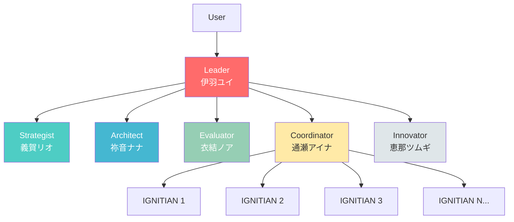
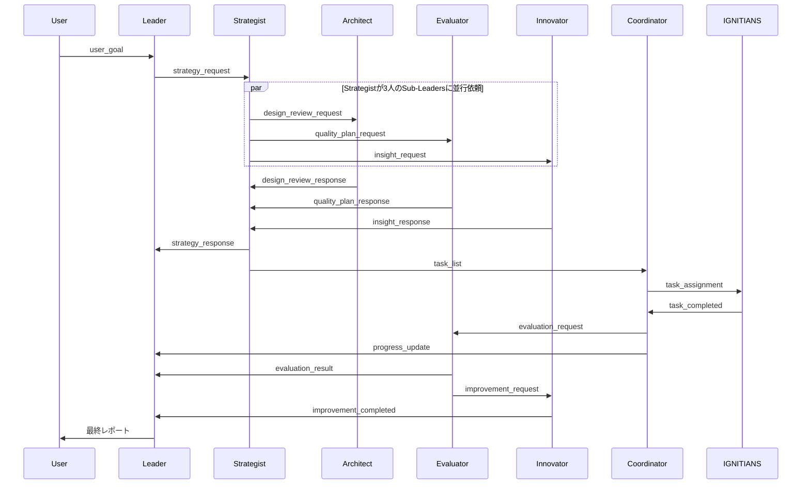
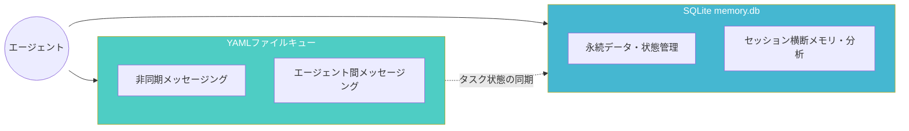
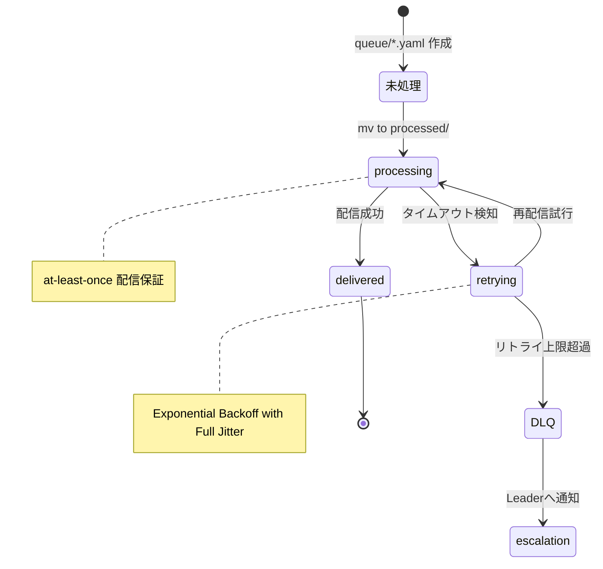
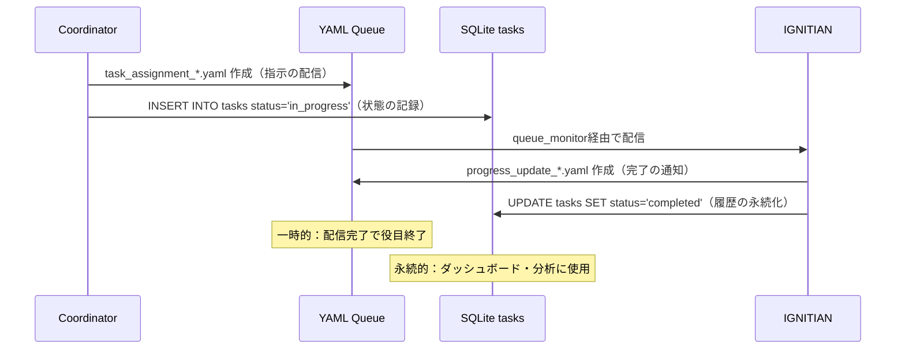

# IGNITE アーキテクチャドキュメント

## システム概要

IGNITEは、claude code CLIを活用した階層型マルチエージェントシステムです。Leader、5つの専門Sub-Leaders、および可変数のIGNITIANSワーカーが協調して、複雑なタスクを並列実行します。

## アーキテクチャ構成

### 階層構造



### エージェント役割

#### Leader (伊羽ユイ)
- **責務**: 全体統率、意思決定、チーム鼓舞
- **ペイン**: 0
- **特性**: 明るく前向き、リーダーシップ

#### Strategist (義賀リオ)
- **責務**: 戦略立案、タスク分解、優先度付け
- **ペイン**: 1
- **特性**: 冷静で論理的、分析的

#### Architect (祢音ナナ)
- **責務**: システム設計、アーキテクチャ判断
- **ペイン**: 2
- **特性**: 構造と調和を重視、美的感覚

#### Evaluator (衣結ノア)
- **責務**: 品質評価、検証、テスト
- **ペイン**: 3
- **特性**: 着実で几帳面、基準厳守

#### Coordinator (通瀬アイナ)
- **責務**: タスク配分、進行管理、リソース調整
- **ペイン**: 4
- **特性**: 柔らかく調整上手、全体最適化

#### Innovator (恵那ツムギ)
- **責務**: 改善提案、最適化、イノベーション
- **ペイン**: 5
- **特性**: 創造的で前向き、改善志向

#### IGNITIANS
- **責務**: タスク実行、成果物作成
- **ペイン**: 6以降（動的）
- **特性**: 効率的で正確、実行専門

## 通信プロトコル

### メッセージフロー



### メッセージライフサイクル

| 状態 | 表現 | 説明 |
|------|------|------|
| 未処理 | キューディレクトリにファイルが存在 | 新規メッセージ |
| 配信済み | queue_monitorが検知・通知済み | エージェントが処理中 |
| 処理完了 | ファイル削除済み | エージェントが処理後に削除 |

### YAMLメッセージ形式

すべてのエージェント間通信はYAML形式のメッセージファイルで行われます。

```yaml
type: {message_type}
from: {sender}
to: {receiver}
timestamp: {ISO8601}
priority: {high|normal|low}
payload:
  {key}: {value}
```

### 主要メッセージタイプ

| type | from → to | 説明 |
|------|-----------|------|
| `user_goal` | user → leader | ユーザー目標 |
| `strategy_request` | leader → strategist | 戦略立案依頼 |
| `strategy_response` | strategist → leader | 戦略提案 |
| `task_list` | strategist → coordinator | タスクリスト |
| `architecture_request` | leader → architect | 設計判断依頼 |
| `architecture_response` | architect → leader | 設計提案 |
| `task_assignment` | coordinator → ignitian | タスク割り当て |
| `task_completed` | ignitian → coordinator | 完了報告 |
| `evaluation_request` | coordinator → evaluator | 評価依頼 |
| `evaluation_result` | evaluator → leader | 評価結果（日次レポートIssueへ自動記録） |
| `improvement_request` | evaluator → innovator | 改善依頼 |
| `improvement_suggestion` | innovator → leader | 改善提案 |
| `progress_update` | coordinator → leader | 進捗報告（日次レポートIssueへ自動記録） |

## ディレクトリ構造

```
ignite/
├── scripts/              # 起動・制御スクリプト
│   ├── ignite            # 統合CLI（start/plan/status/stop等）
│   ├── schema.sql        # SQLiteメモリDBスキーマ
│   ├── lib/              # コアライブラリ
│   │   ├── core.sh       # 定数・カラー・出力ヘルパー
│   │   ├── agent.sh      # エージェント起動・管理
│   │   ├── session.sh    # tmuxセッション管理
│   │   ├── commands.sh   # コマンドルーター
│   │   ├── cmd_*.sh      # 各サブコマンド実装
│   │   ├── cost_utils.sh # コスト計算
│   │   ├── dlq_handler.sh    # デッドレターキュー処理
│   │   └── retry_handler.sh  # リトライ処理
│   └── utils/            # ユーティリティ
│       ├── queue_monitor.sh    # メッセージキュー監視デーモン
│       ├── daily_report.sh     # 日次レポートIssue管理
│       ├── github_watcher.sh   # GitHubイベント監視
│       └── ...                 # その他GitHub連携スクリプト
│
├── instructions/         # システムプロンプト
│   ├── leader.md
│   ├── strategist.md
│   ├── architect.md
│   ├── evaluator.md
│   ├── coordinator.md
│   ├── innovator.md
│   └── ignitian.md
│
├── config/              # 設定ファイル
│   ├── system.yaml      # システム設定（IGNITIANs並列数含む）
│   └── github-watcher.yaml  # GitHub Watcher設定
│
├── workspace/           # 実行時ワークスペース（.gitignore）
│   ├── queue/           # メッセージキュー（タスク完了レポート含む）
│   ├── context/         # コンテキスト
│   ├── state/           # 状態管理ファイル
│   │   └── report_issues.json  # 日次レポートIssue番号キャッシュ
│   ├── memory.db        # SQLiteエージェントメモリDB
│   ├── logs/            # ログファイル
│   └── dashboard.md     # 進捗ダッシュボード
│
└── docs/                # ドキュメント
    ├── architecture.md  # このファイル
    └── protocol.md      # プロトコル仕様
```

## 実行環境

### tmuxセッション構成

Session `ignite-session` の単一ウィンドウ内に、全ペインが `tiled` レイアウト（均等タイル配置）で並びます。

**ペイン番号の割り当て:**

| ペイン | エージェント | 備考 |
|--------|-------------|------|
| 0 | Leader (伊羽ユイ) | 最初のペイン |
| 1 | Strategist (義賀リオ) | Sub-Leaders |
| 2 | Architect (祢音ナナ) | Sub-Leaders |
| 3 | Evaluator (衣結ノア) | Sub-Leaders |
| 4 | Coordinator (通瀬アイナ) | Sub-Leaders |
| 5 | Innovator (恵那ツムギ) | Sub-Leaders |
| 6 | IGNITIAN-1 | `5 + N` で算出 |
| 7 | IGNITIAN-2 | |
| ... | IGNITIAN-N | 最大32並列 |

各ペインは `tmux split-window -h` で追加後 `select-layout tiled` で均等配置されます。

### エージェント起動

各ペインでclaude code CLIが起動:
```bash
claude-code --dangerously-skip-permissions
```

システムプロンプトをロード:
```
/prompt {role}
```

## ワークフロー

### 典型的な実行フロー

1. **ユーザーがタスクを投入**
   ```bash
   ignite plan "READMEファイルを作成する"
   ```

2. **Leaderが受信・理解**
   - メッセージを読み取り
   - 目標を分析
   - Strategistに戦略立案を依頼

3. **Strategistがタスク分解**
   - 目標を具体的なタスクに分解
   - 優先度と依存関係を設定
   - Coordinatorにタスクリストを送信

4. **Coordinatorがタスク配分**
   - 利用可能なIGNITIANSを特定
   - タスクを均等に配分
   - 各IGNITIANにメッセージ送信

5. **IGNITIANSが並列実行**
   - タスクを読み取り
   - claude codeツールで実行
   - 完了レポートを作成

6. **Evaluatorが評価**
   - 成果物を検証
   - 品質チェック
   - 合格/不合格判定

7. **Innovatorが改善**
   - 軽微な問題を修正
   - 改善提案を作成

8. **Leaderが最終判断**
   - 全体結果を統合
   - ユーザーに報告

## スケーラビリティ

### IGNITIANS数の調整

タスクの性質に応じてIGNITIANS数を調整:

- **light**: 8並列 - ファイル操作など軽量タスク
- **normal**: 3並列 - 通常の実装タスク（デフォルト）
- **heavy**: 1並列 - 複雑な分析タスク

設定ファイル: `config/system.yaml` の `defaults.worker_count`

### 負荷分散

Coordinatorが以下を考慮してタスク配分:
- タスクの推定時間
- IGNITIANの現在の負荷
- タスクの依存関係

## 拡張性

### 新しいSub-Leaderの追加

1. `instructions/{role}.md` を作成
2. `scripts/lib/core.sh` の `SUB_LEADERS` 配列に追加
3. `scripts/lib/cmd_start.sh` に起動処理追加

### 新しいメッセージタイプの追加

1. YAMLスキーマを定義
2. 送信元エージェントの実装
3. 受信先エージェントの処理実装

## データストレージアーキテクチャ

IGNITEは **YAMLファイルキュー** と **SQLiteデータベース** の2層で情報を管理します。それぞれ役割が明確に分かれており、相互に補完する設計です。



### 使い分けの原則

| 観点 | YAMLファイルキュー | SQLite |
|------|-------------------|--------|
| **役割** | 非同期通信（「今何をすべきか」） | 永続記録（「何が起きたか・今どうか」） |
| **寿命** | 短命（配信完了で役目終了） | 永続（セッション横断で保持） |
| **データ型** | メッセージ（命令・応答） | 構造化レコード（履歴・状態） |
| **アクセス** | ファイル mv/read/write | SQL CRUD |
| **並行制御** | ファイルシステムの原子性 | WALモード + busy_timeout |
| **障害対応** | リトライ + DLQ | 冪等スキーマ + マイグレーション |
| **主な使用者** | `queue_monitor.sh` | 各エージェント（instructions内で直接実行） |

### YAMLファイルキュー — メッセージング層

エージェント間の非同期メッセージングを担います。`queue_monitor.sh` が10秒ポーリングでキューを監視し、tmux経由でエージェントに配信します。

**キューディレクトリ:**
```
workspace/queue/
├── leader/              # Leaderエージェント用
│   ├── *.yaml           # 未処理メッセージ
│   └── processed/       # 処理中・完了メッセージ
├── strategist/          # Strategist用
├── architect/           # Architect用
├── evaluator/           # Evaluator用
├── coordinator/         # Coordinator用
├── innovator/           # Innovator用
├── ignitian_1/          # IGNITIAN-1用（個別ディレクトリ）
├── ignitian_2/          # IGNITIAN-2用
├── ignitian_{n}/        # IGNITIAN-N用（動的）
└── dead_letter/         # リトライ失敗後のメッセージ
```

**メッセージライフサイクル:**



**関連スクリプト:**
- `scripts/utils/queue_monitor.sh` — キュー監視デーモン
- `scripts/lib/retry_handler.sh` — Exponential Backoff with Full Jitterリトライ
- `scripts/lib/dlq_handler.sh` — Dead Letter Queue処理・エスカレーション

### SQLite (memory.db) — 永続ストレージ層

セッション横断のメモリ永続化・タスク状態追跡・ダッシュボード生成を担います。

**テーブル構成（v2スキーマ）:**

| テーブル | 用途 |
|---------|------|
| `memories` | 全エージェントの学習・決定・観察・エラーログ |
| `tasks` | タスク進行状態の追跡（repository, issue_number含む） |
| `agent_states` | エージェント再起動時の状態復元 |
| `strategist_state` | 戦略立案の状態管理（JSONフィールド使用） |
| `insight_log` | Memory Insights処理履歴 |

**初期化シーケンス（`cmd_start.sh`）:**
1. `schema.sql` でテーブル・インデックス作成（`IF NOT EXISTS`で冪等）
2. `PRAGMA journal_mode=WAL; PRAGMA busy_timeout=5000;` で並行アクセス対応
3. `schema_migrate.sh` でスキーマバージョンアップ（`PRAGMA user_version`管理）

**関連スクリプト:**
- `scripts/schema.sql` — スキーマ定義
- `scripts/schema_migrate.sh` — マイグレーション（v1→v2）
- `scripts/lib/cmd_start.sh` — DB初期化

### タスクデータの二重管理

`tasks`は唯一、YAMLとSQLiteの両方で管理されるデータです。ただし用途は明確に異なります。



- **YAML**: 「このタスクをやれ」という**指示の配信手段**（一時的）
- **SQLite**: 「このタスクは今どうなっている」という**状態の記録**（永続的、ダッシュボード・分析に使用）

## 日次レポート管理

作業進捗をリポジトリ別の GitHub Issues で自動追跡するシステムです。

### 概要

`scripts/utils/daily_report.sh` が日次レポートIssue のライフサイクルを管理します。作業対象リポジトリごとに、日付単位でIssueを作成・更新・クローズします。

### サブコマンド

| サブコマンド | 説明 |
|-------------|------|
| `ensure` | 当日のIssueがなければ作成、あれば番号を返す |
| `create` | 日次レポートIssueを新規作成 |
| `comment` | Issueにコメントを追加 |
| `update` | Issue本文を更新 |
| `close` | Issueをclose |
| `close-all` | 全リポジトリの当日Issueを一括close |

### 自動連携

- **タスク受信時**: `queue_monitor.sh` が `github_task` 検知時に日次レポートIssueへ "Task Started" コメントを自動記録
- **進捗報告時**: `progress_update` メッセージ受信時に進捗内容を日次レポートIssueへ記録
- **評価完了時**: `evaluation_result` メッセージ受信時に評価結果を日次レポートIssueへ記録
- **セッション終了時**: `ignite stop` で当日の全日次レポートIssueを自動close

### 状態管理

`workspace/state/report_issues.json` にリポジトリ×日付→Issue番号のキャッシュを保持し、重複作成を防止します（アトミック書き込み対応）。

## パフォーマンス最適化

### メッセージキューの効率化
- 定期的なポーリング（デフォルト10秒間隔）
- ファイルシステムベースのシンプルな実装
- ファイル存在ベースのメッセージ管理（処理済みファイルは削除）

### 並列実行の最大化
- 依存関係のないタスクは完全並列
- IGNITIANSのアイドル時間を最小化
- 動的な負荷分散

## セキュリティ考慮事項

### ローカルPC権限
- claude codeは`--dangerously-skip-permissions`で起動
- ローカルPCの全権限を持つ
- 信頼できるタスクのみを実行

### メッセージの検証
- YAMLパーサーの安全性
- 不正なメッセージの処理
- エラーハンドリング

## 監視とデバッグ

### ダッシュボード
`workspace/dashboard.md` で全体進捗を可視化

### ログファイル
各エージェントのログ: `workspace/logs/{role}.log`

### ステータス確認
```bash
ignite status
```

### tmuxセッション確認
```bash
tmux attach -t ignite-session
```

## トラブルシューティング

### エージェントが応答しない
1. tmuxペインを確認
2. ログファイルをチェック
3. メッセージキューを確認
4. 手動でメッセージを送信してテスト

### タスクが進行しない
1. ダッシュボードで状態確認
2. 依存関係のブロックをチェック
3. IGNITIANSの状態を確認

### システムが起動しない
1. tmuxがインストールされているか確認
2. claude-codeが利用可能か確認
3. ポート競合をチェック
