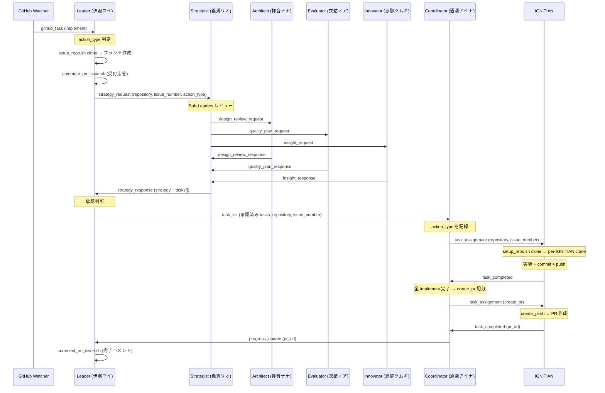
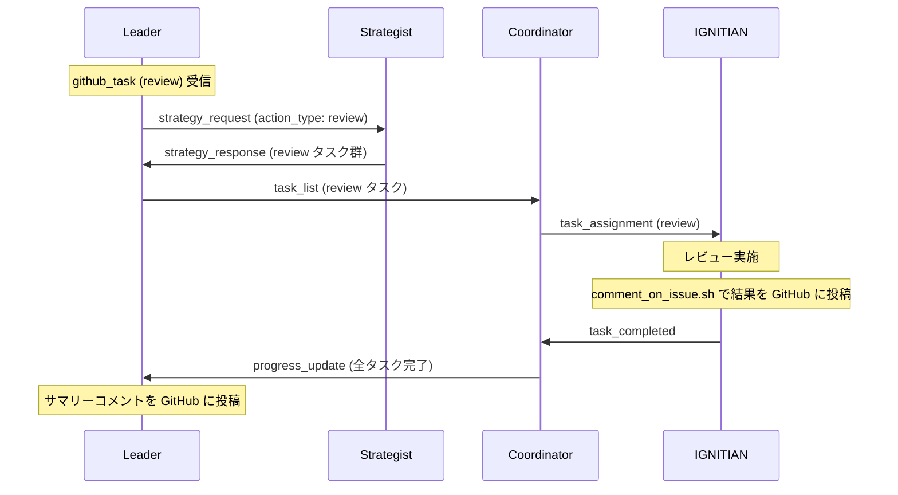
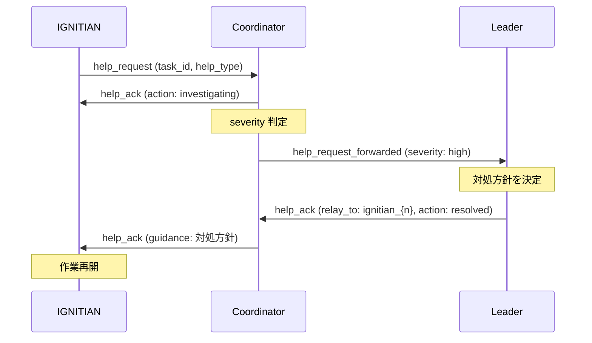
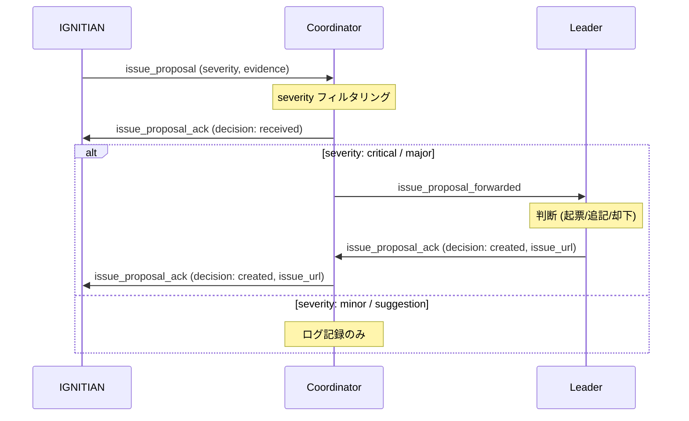

# エージェント間コミュニケーションフロー

IGNITE システムにおけるエージェント間のメッセージフローを図示します。

## implement フロー全体図

## review フロー

## help_request / help_ack リレー

## issue_proposal リレー

## メッセージタイプ一覧

### Leader 発信

| メッセージタイプ | 送信先 | 用途 |
|---|---|---|
| `strategy_request` | Strategist | 戦略立案依頼 |
| `task_list` | Coordinator | タスク配分指示（Strategist 承認後） |
| `revision_request` | Strategist | 戦略の差し戻し |
| `help_ack` | Coordinator / Sub-Leader | ヘルプ要求への応答 |
| `issue_proposal_ack` | Coordinator / Sub-Leader | Issue提案への応答 |
| `improvement_request` | Innovator | 改善実行の指示 |
| `improvement_suggestion_ack` | Innovator | 改善提案への応答 |

### Strategist 発信

| メッセージタイプ | 送信先 | 用途 |
|---|---|---|
| `strategy_response` | Leader | 戦略提案（tasks 配列含む） |
| `design_review_request` | Architect | 設計レビュー依頼 |
| `quality_plan_request` | Evaluator | 品質プラン依頼 |
| `insight_request` | Innovator | インサイト依頼 |

### Coordinator 発信

| メッセージタイプ | 送信先 | 用途 |
|---|---|---|
| `task_assignment` | IGNITIAN | タスク割り当て |
| `revision_request` | IGNITIAN | 成果物の差し戻し |
| `progress_update` | Leader | 進捗報告（PR URL 含む場合あり） |
| `help_ack` | IGNITIAN | ヘルプ要求への応答（Leader からのリレー含む） |
| `help_request_forwarded` | Leader | IGNITIAN のヘルプ要求を転送 |
| `issue_proposal_ack` | IGNITIAN | Issue提案への応答（Leader からのリレー含む） |
| `issue_proposal_forwarded` | Leader | IGNITIAN の Issue 提案を転送 |
| `evaluation_request` | Evaluator | 判断困難ケースの相談 |

### IGNITIAN 発信

| メッセージタイプ | 送信先 | 用途 |
|---|---|---|
| `task_completed` | Coordinator | タスク完了報告 |
| `help_request` | Coordinator | ヘルプ要求 |
| `issue_proposal` | Coordinator | Issue 提案 |
