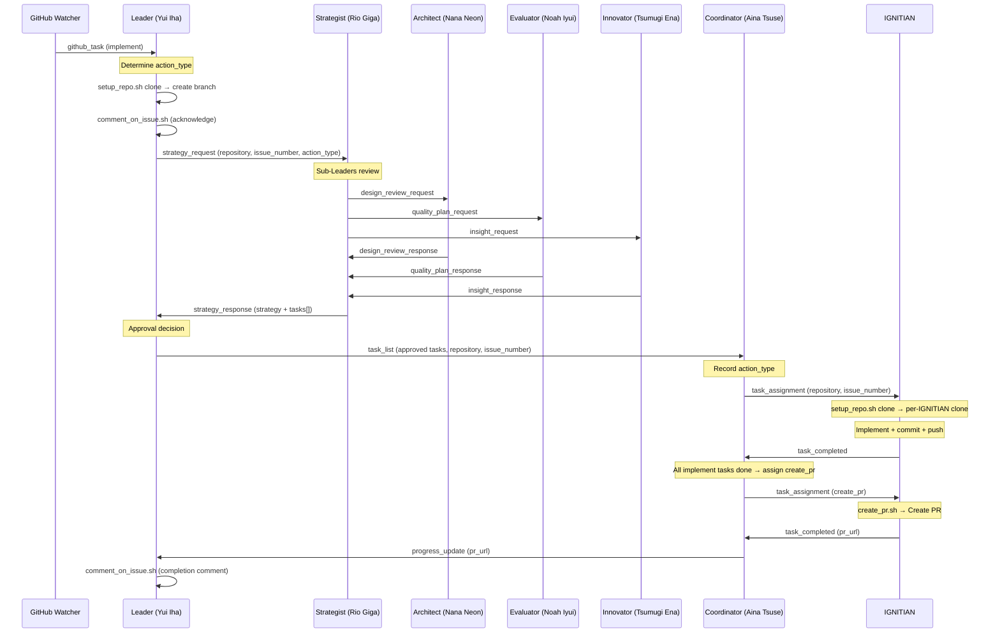
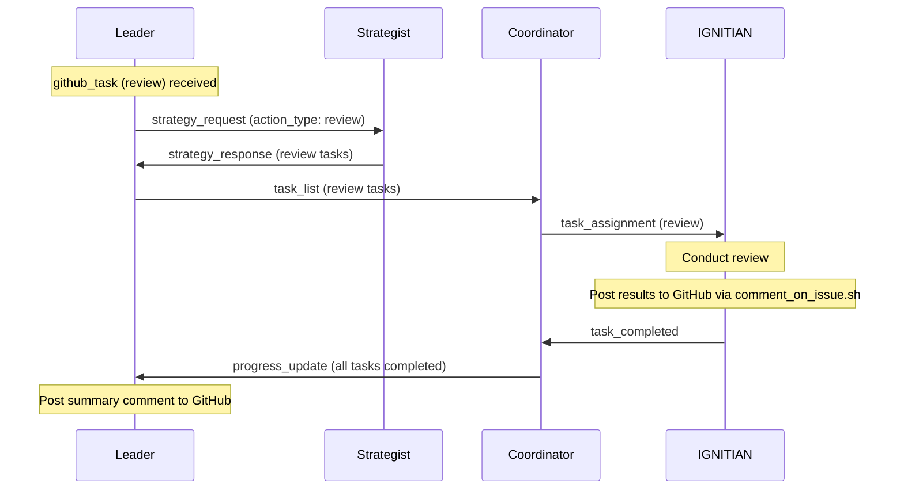
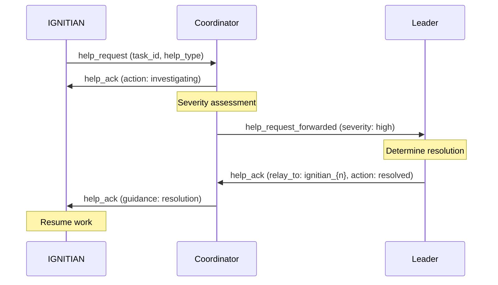
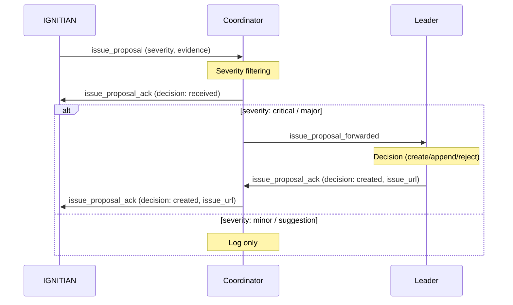

# Agent Communication Flow

This document illustrates the message flow between agents in the IGNITE system.

## Implement Flow (Full)

## Review Flow

## help_request / help_ack Relay

## issue_proposal Relay

## Message Type Reference

### Leader Outbound

| Message Type | Destination | Purpose |
|---|---|---|
| `strategy_request` | Strategist | Request strategy planning |
| `task_list` | Coordinator | Task distribution (after Strategist approval) |
| `revision_request` | Strategist | Strategy revision request |
| `help_ack` | Coordinator / Sub-Leader | Response to help request |
| `issue_proposal_ack` | Coordinator / Sub-Leader | Response to issue proposal |
| `improvement_request` | Innovator | Request improvement execution |
| `improvement_suggestion_ack` | Innovator | Response to improvement suggestion |

### Strategist Outbound

| Message Type | Destination | Purpose |
|---|---|---|
| `strategy_response` | Leader | Strategy proposal (includes tasks array) |
| `design_review_request` | Architect | Design review request |
| `quality_plan_request` | Evaluator | Quality plan request |
| `insight_request` | Innovator | Insight request |

### Coordinator Outbound

| Message Type | Destination | Purpose |
|---|---|---|
| `task_assignment` | IGNITIAN | Task assignment |
| `revision_request` | IGNITIAN | Deliverable revision request |
| `progress_update` | Leader | Progress report (may include PR URL) |
| `help_ack` | IGNITIAN | Help request response (including relay from Leader) |
| `help_request_forwarded` | Leader | Forward IGNITIAN help request |
| `issue_proposal_ack` | IGNITIAN | Issue proposal response (including relay from Leader) |
| `issue_proposal_forwarded` | Leader | Forward IGNITIAN issue proposal |
| `evaluation_request` | Evaluator | Consultation for ambiguous cases |

### IGNITIAN Outbound

| Message Type | Destination | Purpose |
|---|---|---|
| `task_completed` | Coordinator | Task completion report |
| `help_request` | Coordinator | Help request |
| `issue_proposal` | Coordinator | Issue proposal |
