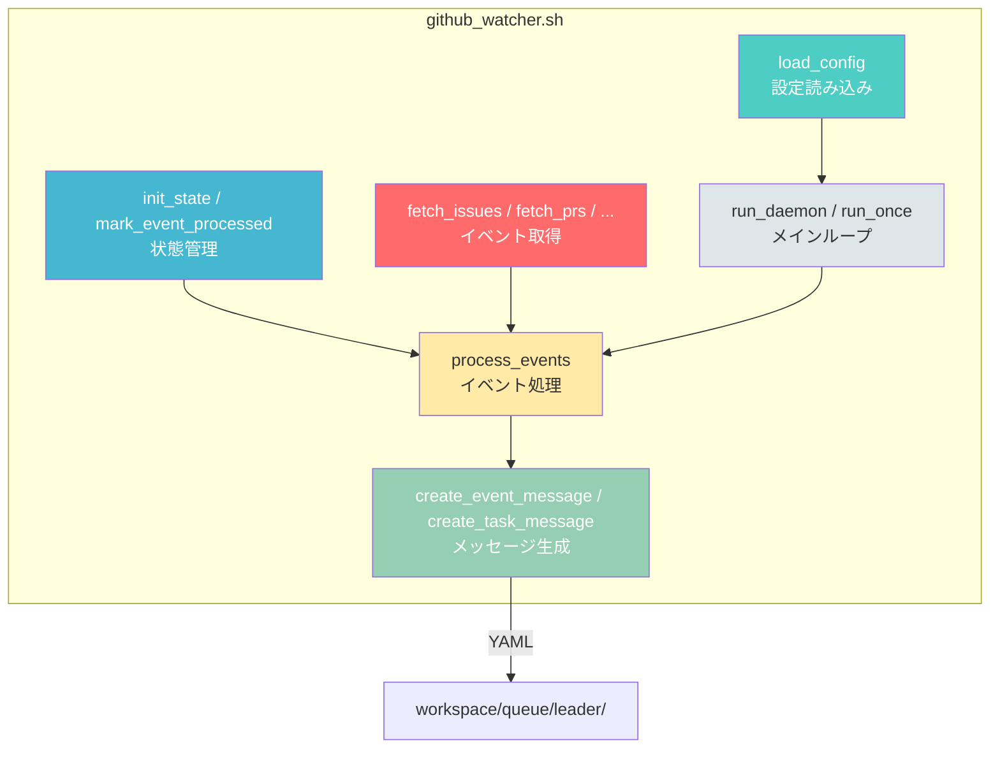
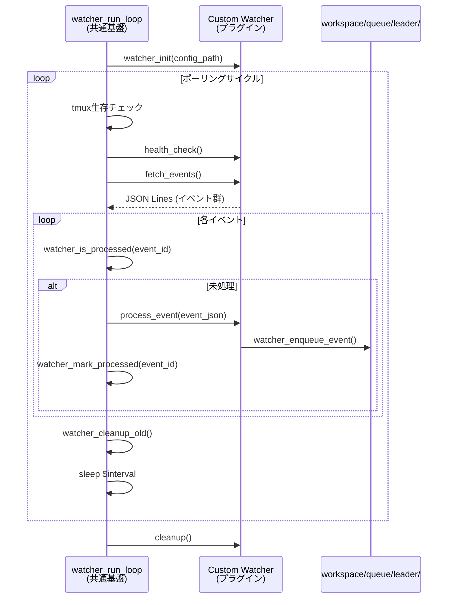
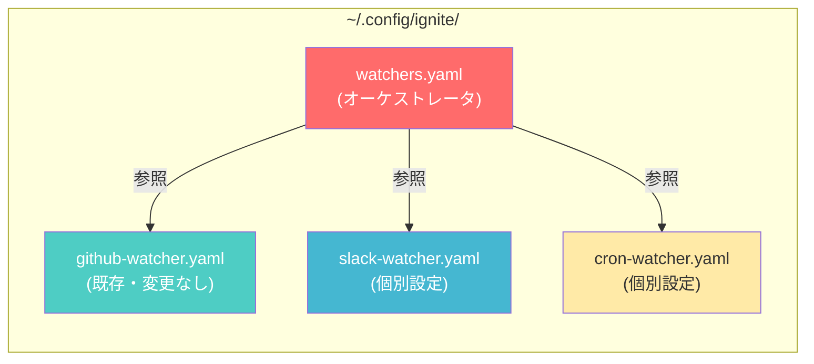
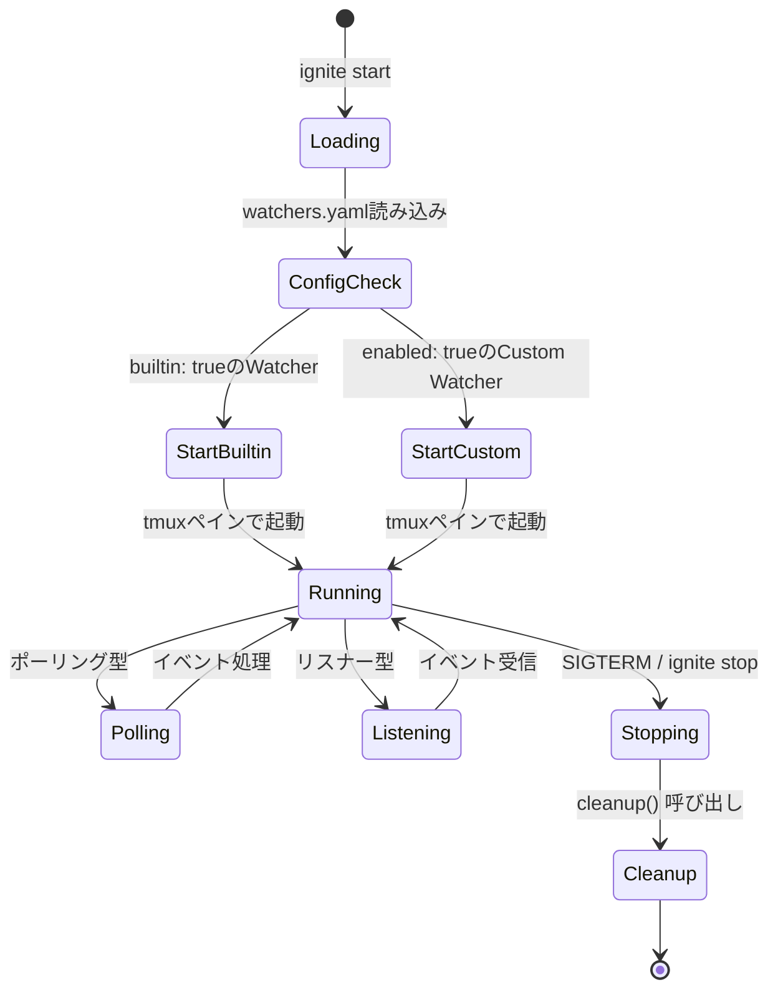
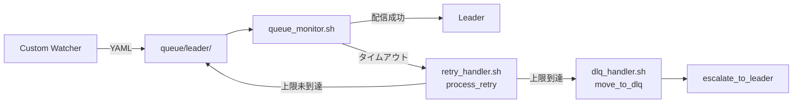

# Custom Watcher 設計方針ドキュメント

> **Issue**: #199 — Custom Watcherの実装方法整理とドキュメント化
> **Phase**: 1 (枠組み定義)
> **設計アプローチ**: 独立実行型 + 共通ヘルパーライブラリ方式

## 目次

1. [背景と目的](#1-背景と目的)
2. [既存 github_watcher.sh のアーキテクチャ分析](#2-既存-github_watchersh-のアーキテクチャ分析)
3. [Watcher Interface Contract](#3-watcher-interface-contract)
4. [プラグイン規約](#4-プラグイン規約)
5. [設定ファイル構造](#5-設定ファイル構造)
6. [メッセージフォーマット](#6-メッセージフォーマット)
7. [ライフサイクル管理](#7-ライフサイクル管理)
8. [セキュリティ考慮事項](#8-セキュリティ考慮事項)
9. [テスト方針](#9-テスト方針)
10. [エラーハンドリング規約](#10-エラーハンドリング規約)
11. [リソース制御](#11-リソース制御)
12. [サンプルユースケース](#12-サンプルユースケース)
13. [実装ロードマップ](#13-実装ロードマップ)
14. [設計課題](#14-設計課題)

---

## 1. 背景と目的

### 現状

IGNITEシステムには `github_watcher.sh`（1,418行、30以上の関数）が唯一のイベントソースとして存在する。GitHub APIポーリングに特化した実装であり、他のイベントソース（Slack、Webhook、Cron等）に対応するには大幅な拡張が必要になる。

### 目的

外部イベントソースをプラグインとして追加可能な **Custom Watcher フレームワーク** を定義する。既存の `github_watcher.sh` との整合性を保ちながら、最小限のインターフェースで拡張性を確保する。

### 設計原則

- **YAGNI**: 現時点で必要な最小限のインターフェースのみ定義する
- **後方互換性**: 既存の `github_watcher.sh` と `github-watcher.yaml` はそのまま動作する
- **独立実行型**: 各Watcherは独立したプロセスとして実行される
- **共通ヘルパー**: 状態管理・キュー投入・ログなどの共通処理はライブラリとして提供する

---

## 2. 既存 github_watcher.sh のアーキテクチャ分析

### 構造の概観



### 主要コンポーネントと行数

| コンポーネント | 関数群 | 概要 |
|---|---|---|
| 設定読み込み | `load_config`, `expand_patterns` | YAML設定パース、ワイルドカード展開 |
| 状態管理 | `init_state`, `is_event_processed`, `mark_event_processed`, `update_last_check`, `cleanup_old_events` | JSON状態ファイルによる重複防止 |
| Bot判別 | `is_human_event` | author_type + login名によるBot検出 |
| アクセス制御 | `is_user_authorized` | ホワイトリストによるユーザー認可 |
| イベント取得 | `fetch_issues`, `fetch_issue_comments`, `fetch_prs`, `fetch_pr_comments`, `fetch_pr_reviews`, `fetch_pr_review_comments` | GitHub API経由のイベント取得 |
| メッセージ生成 | `create_event_message`, `create_task_message` | YAML形式のキューメッセージ作成 |
| イベント処理 | `process_events`, `process_issues`, `process_issue_comments`, `process_prs`, `process_pr_comments`, `process_pr_reviews` | 取得→フィルタ→メッセージ生成のパイプライン |
| メインループ | `run_daemon`, `run_once`, `main` | ポーリングループ、CLI解析 |

### 抽出可能な共通パターン

既存コードから以下のパターンが共通基盤として抽出可能:

1. **XDGパス解決**: `IGNITE_CONFIG_DIR` の判定ロジック
2. **状態管理**: JSONファイルによるイベント重複防止
3. **キュー投入**: `workspace/queue/leader/` へのYAMLファイル書き出し
4. **ポーリングループ**: `sleep $INTERVAL` + tmuxセッション生存チェック
5. **アクセス制御**: ホワイトリストベースのユーザー認可
6. **ログ出力**: カラー付きログ関数群
7. **グレースフル停止**: `trap SIGTERM SIGINT` による停止処理

---

## 3. Watcher Interface Contract

### 必須関数

各Custom Watcherは以下の4つの関数を実装しなければならない:

```bash
# Watcherの一意な識別名を返す
# 戻り値: 文字列（例: "slack", "cron", "webhook"）
watcher_name() {
    echo "my_watcher"
}

# Watcherの初期化処理
# 設定ファイルの読み込み、APIクライアントの準備など
# 引数: $1 - 設定ファイルパス
# 戻り値: 0=成功, 1=失敗
watcher_init() {
    local config_file="$1"
    # 初期化処理
    return 0
}

# イベントを取得する
# 標準出力にJSON Lines形式（1行1イベント）で出力する
# 戻り値: 0=成功, 1=失敗
fetch_events() {
    # イベント取得処理
    # 出力形式（JSON Lines）:
    #   {"id":"evt_001","type":"message","data":{...},"timestamp":"2026-..."}
    return 0
}

# 個別イベントを処理し、IGNITEキューに投入する
# 引数: $1 - イベントJSON（1行）
# 戻り値: 0=処理済み, 1=スキップ, 2=エラー
process_event() {
    local event_json="$1"
    # イベント処理 → キュー投入
    return 0
}
```

### オプション関数

```bash
# クリーンアップ処理（Watcher停止時に呼ばれる）
# 一時ファイル削除、API接続切断など
cleanup() {
    # クリーンアップ処理
    return 0
}

# ヘルスチェック（ポーリングサイクル間に呼ばれる）
# 戻り値: 0=正常, 1=異常
health_check() {
    # ヘルスチェック処理
    return 0
}
```

### 共通基盤提供機能（ヘルパーライブラリ）

共通ヘルパーライブラリ `watcher_helpers.sh` が以下の機能を提供する:

| 機能 | 関数 | 説明 |
|---|---|---|
| 状態管理 | `watcher_state_init`, `watcher_is_processed`, `watcher_mark_processed`, `watcher_cleanup_old` | JSON状態ファイルによる重複防止（既存パターン踏襲） |
| キュー投入 | `watcher_enqueue_event`, `watcher_enqueue_task` | `workspace/queue/leader/` へのYAML書き出し |
| ポーリングループ | `watcher_run_loop` | `sleep` + tmux生存チェックの共通ループ |
| アクセス制御 | `watcher_check_access` | ホワイトリストベースの認可 |
| ログ | `watcher_log_info`, `watcher_log_warn`, `watcher_log_error`, `watcher_log_event` | カラー付きログ出力 |
| 設定 | `watcher_load_config` | per-watcher YAML設定の読み込み |

### インターフェースの呼び出しフロー



---

## 4. プラグイン規約

### ディレクトリ構造

```
~/.config/ignite/watchers/          # XDG準拠のプラグインディレクトリ
├── slack_watcher.sh                # Slack Watcher プラグイン
├── cron_watcher.sh                 # Cron Watcher プラグイン
├── webhook_watcher.sh              # Webhook Watcher プラグイン
└── ...
```

### 命名規則

| 項目 | 規則 | 例 |
|---|---|---|
| ファイル名 | `{name}_watcher.sh` | `slack_watcher.sh` |
| `watcher_name()` の戻り値 | `{name}` | `slack` |
| 設定ファイル | `{name}-watcher.yaml` | `slack-watcher.yaml` |
| 状態ファイル | `state/{name}_watcher_state.json` | `state/slack_watcher_state.json` |
| ログファイル | `logs/{name}_watcher.log` | `logs/slack_watcher.log` |

### 登録方法

`watchers.yaml`（後述）の `watchers` セクションにエントリを追加する:

```yaml
watchers:
  - name: slack
    enabled: true
    config: slack-watcher.yaml
```

### プラグインファイルの構造テンプレート

```bash
#!/bin/bash
# {Name} Watcher - IGNITEカスタムウォッチャープラグイン
set -eu

# 共通ヘルパーの読み込み
SCRIPT_DIR="$(cd "$(dirname "${BASH_SOURCE[0]}")" && pwd)"
source "${WATCHER_LIB_DIR:-$SCRIPT_DIR/../scripts/lib}/watcher_helpers.sh"

# --- 必須関数 ---

watcher_name() { echo "my_watcher"; }

watcher_init() {
    local config_file="$1"
    # プラグイン固有の初期化
    return 0
}

fetch_events() {
    # イベント取得 → JSON Lines出力
    return 0
}

process_event() {
    local event_json="$1"
    # イベント処理 → watcher_enqueue_event 呼び出し
    return 0
}

# --- オプション関数 ---

cleanup() { return 0; }
health_check() { return 0; }
```

---

## 5. 設定ファイル構造

### ハイブリッド方式

設定はオーケストレータ設定（`watchers.yaml`）と個別Watcher設定（per-watcher yaml）の2層で構成する。



### watchers.yaml（オーケストレータ設定）

```yaml
# ~/.config/ignite/watchers.yaml
# Custom Watcher オーケストレータ設定

# 登録済みWatcher一覧
watchers:
  # 既存GitHub Watcherとの後方互換
  - name: github
    enabled: true
    config: github-watcher.yaml    # 既存設定ファイルをそのまま参照
    builtin: true                   # 組み込みWatcher（scripts/utils/に配置）

  # カスタムWatcher例
  - name: slack
    enabled: false
    config: slack-watcher.yaml

  - name: cron
    enabled: false
    config: cron-watcher.yaml
```

### per-watcher yaml（個別Watcher設定）

各Watcherの設定ファイルは以下の共通フィールドを持つ:

```yaml
# ~/.config/ignite/{name}-watcher.yaml

watcher:
  # ポーリング間隔（秒）— ポーリング型Watcherのみ
  interval: 60

  # 監視するイベントタイプ（Watcher固有）
  events:
    # Watcher固有のイベント設定

# アクセス制御（共通）
access_control:
  enabled: false
  allowed_users: []

# トリガー設定（共通）
triggers:
  mention_pattern: "@ignite-gh-app"
```

### 既存 github-watcher.yaml との後方互換性

既存の `github-watcher.yaml` は一切変更しない。`watchers.yaml` が存在しない場合は、従来通り `github_watcher.sh` が単独で起動・動作する。`watchers.yaml` が存在する場合のみ、オーケストレータがWatcher群を管理する。

---

## 6. メッセージフォーマット

### 既存フォーマットとの互換性

Custom Watcherが生成するメッセージは、既存の `type/from/to/timestamp/priority/payload` パターンに完全準拠する。

### イベントメッセージ

```yaml
type: watcher_event                    # 固定
from: "{watcher_name}_watcher"         # 例: slack_watcher
to: leader
timestamp: "2026-02-08T15:00:00+09:00"
priority: normal                       # system.yamlのdefaults.message_priorityに従う
payload:
  event_type: "{watcher固有イベント名}" # 例: slack_message, cron_trigger
  source: "{watcher_name}"             # Watcher識別名
  data:                                # Watcher固有のイベントデータ
    # ...フリーフォーマット
  url: ""                              # 元イベントへのリンク（あれば）
```

### タスクメッセージ（トリガー検知時）

```yaml
type: watcher_task                     # 固定
from: "{watcher_name}_watcher"
to: leader
timestamp: "2026-02-08T15:00:00+09:00"
priority: high
payload:
  trigger: "{トリガータイプ}"           # implement, review, explain, insights
  source: "{watcher_name}"
  issue_number: 0                      # 該当する場合のみ
  issue_title: ""
  issue_body: ""
  requested_by: "{ユーザー識別名}"
  trigger_comment: |
    トリガーとなったテキスト
  url: ""
```

### 既存メッセージタイプとの関係

| 既存タイプ | Custom Watcherタイプ | 互換性 |
|---|---|---|
| `github_event` | `watcher_event` | Leaderが同等に処理可能 |
| `github_task` | `watcher_task` | Leaderが同等に処理可能 |

> **注**: 既存の `github_event` / `github_task` タイプは変更しない。`github_watcher.sh` は従来通りこれらのタイプを使用する。Custom Watcherは新タイプ `watcher_event` / `watcher_task` を使用し、Leader側で両方を処理できるようにする。

---

## 7. ライフサイクル管理

### 起動フロー



### tmux統合

各Watcherは独立したtmuxペインで実行される:

```
Session: ignite-session
Window: ignite

Pane 0:  Leader
Pane 1:  Strategist
...
Pane N:  github_watcher    (既存)
Pane N+1: slack_watcher     (Custom)
Pane N+2: cron_watcher      (Custom)
```

### 起動コマンド

```bash
# watchers.yamlに基づいて全Watcherを起動
ignite start --with-watcher

# 特定Watcherのみ起動しない
ignite start --no-watcher

# 個別Watcher制御（将来拡張）
# ignite watcher start slack
# ignite watcher stop slack
```

### 停止処理

`ignite stop` 実行時:
1. 各WatcherのtmuxペインにSIGTERMを送信
2. Watcher内の `trap` が `cleanup()` を呼び出す
3. グレースフルに停止

---

## 8. セキュリティ考慮事項

### 信頼モデル

| レベル | 対象 | 信頼度 |
|---|---|---|
| 組み込み | `github_watcher.sh` | 完全信頼（リポジトリ管理下） |
| カスタム | `~/.config/ignite/watchers/` 配下 | ユーザー管理（ローカルファイル） |

Custom Watcherはユーザーが `~/.config/ignite/watchers/` に手動配置するため、ユーザー自身が内容を信頼する前提とする。

### YAMLインジェクション防止

- Watcherが生成するYAMLメッセージは、共通ヘルパー `watcher_enqueue_event` を通じて書き出す
- ヘルパー内でペイロード値のサニタイズ（改行・特殊文字のエスケープ）を行う
- 外部入力（Slackメッセージ本文等）は `body: |` ブロックスカラーとして格納し、YAML構造への干渉を防ぐ

### 認証情報管理

- APIトークン等の認証情報はper-watcher yamlに記載しない
- 環境変数または `~/.config/ignite/secrets/` 配下の専用ファイルで管理する
- 既存パターン: GitHub App設定は `github-app.yaml` で管理し、`get_github_app_token.sh` で取得

### レートリミット

- 各Watcherのper-watcher yamlで `interval`（ポーリング間隔）を設定可能
- 最小間隔は共通基盤で強制する（デフォルト: 10秒）
- API固有のレートリミットはWatcher側で管理する

---

## 9. テスト方針

### --dry-run モード

各Watcherは `--dry-run` オプションをサポートする。dry-runモードでは:

1. **イベント取得は実行する**（APIコールは発生する）
2. **キュー投入はスキップする**（`workspace/queue/` にファイルを書き出さない）
3. **検知したイベントを標準出力に表示する**
4. **状態ファイルは更新しない**（再実行で同じイベントを再検知可能）

```bash
# dry-runモードで実行
~/.config/ignite/watchers/slack_watcher.sh --dry-run --once

# 共通ヘルパー経由で起動する場合
# watcher_run_loop 内で DRY_RUN 変数を参照
```

### モックイベント注入

テスト用に、モックイベントをWatcherに注入する仕組みを提供する:

```bash
# モックイベントファイルを作成
cat > /tmp/mock_event.json <<EOF
{"id":"mock_001","type":"message","data":{"text":"test"},"timestamp":"2026-02-08T15:00:00+09:00"}
EOF

# モックモードで実行（fetch_eventsの代わりにファイルから読む）
WATCHER_MOCK_EVENTS=/tmp/mock_event.json \
  ~/.config/ignite/watchers/slack_watcher.sh --once
```

### テスト実行コマンド

```bash
# 単発実行（--once）+ dry-runでの動作確認
~/.config/ignite/watchers/slack_watcher.sh --once --dry-run

# 既存github_watcherと同じパターン
./scripts/utils/github_watcher.sh --once
```

---

## 10. エラーハンドリング規約

### Watcher内部のエラー

| エラー種別 | 対応 | 例 |
|---|---|---|
| API接続失敗 | ログ出力して次のサイクルでリトライ | ネットワーク障害 |
| 認証失敗 | ログ出力して停止 | トークン期限切れ |
| パース失敗 | 該当イベントをスキップ | 不正なJSON応答 |
| 設定不備 | 起動時にエラーで終了 | 必須設定の欠落 |

### DLQ / retry_handler 連携

Custom Watcherが生成したメッセージが `queue_monitor.sh` 経由で配信される際、既存のリトライ機構が適用される:



- Watcherがキューに投入したメッセージは、`queue_monitor.sh` の既存のリトライ/DLQ機構でそのまま管理される
- Watcher自体のリトライ（APIコール失敗等）はWatcher内部で処理する
- メッセージ配信のリトライはキュー基盤に委ねる

### `process_event` の戻り値規約

| 戻り値 | 意味 | 共通基盤の対応 |
|---|---|---|
| `0` | 正常処理済み | `watcher_mark_processed` を呼ぶ |
| `1` | スキップ（Bot投稿、権限なし等） | `watcher_mark_processed` を呼ぶ（再処理不要） |
| `2` | エラー（リトライ可能） | ログ出力、次サイクルで再試行 |

---

## 11. リソース制御

### APIレート制限管理

```yaml
# per-watcher yaml の共通フィールド
watcher:
  interval: 60              # ポーリング間隔（秒）
  rate_limit:
    max_requests_per_hour: 1000   # API呼び出し上限（目安）
```

- ポーリング間隔は最低10秒を共通基盤で強制する
- API固有のレートリミット情報（残りリクエスト数等）はWatcher側で取得・判断する
- レートリミットに近づいた場合、Watcher側でポーリング間隔を自動拡大する

### リソースの共有

| リソース | 管理方法 |
|---|---|
| CPU/メモリ | 各Watcherは独立プロセス。tmuxペインごとに分離 |
| ディスク（状態ファイル） | Watcher名で名前空間分離（`state/{name}_watcher_state.json`） |
| ディスク（キュー） | 共通の `queue/leader/` に書き出し。ファイル名にWatcher名を含める |

### キューファイル命名

```
queue/leader/{watcher_name}_event_{timestamp}.yaml
queue/leader/{watcher_name}_task_{timestamp}.yaml
```

例:
```
queue/leader/slack_event_1770532167384632.yaml
queue/leader/github_event_1770532167384633.yaml
```

---

## 12. サンプルユースケース

### Cron Watcher — 定期タスクトリガー

日次・週次で定型タスクをIGNITEに投入するWatcher。

**ユースケース**: 毎朝9時に「日次レビュー」タスクをLeaderに投入する

```yaml
# ~/.config/ignite/cron-watcher.yaml
watcher:
  interval: 60  # 1分間隔でcronスケジュールをチェック

schedules:
  - name: daily_review
    cron: "0 9 * * *"           # 毎朝9時
    trigger: review
    payload:
      title: "日次コードレビュー"
      description: "前日のPR・コミットをレビューしてください"
      priority: normal

  - name: weekly_report
    cron: "0 17 * * 5"          # 毎週金曜17時
    trigger: implement
    payload:
      title: "週次レポート作成"
      description: "今週の作業成果を集計してレポートを生成"
      priority: normal
```

**プラグイン実装の概要**:

```bash
watcher_name() { echo "cron"; }

watcher_init() {
    local config_file="$1"
    # cronスケジュールの読み込み
    # 最終実行時刻の状態復元
}

fetch_events() {
    # 現在時刻と各スケジュールのcron式を比較
    # 実行タイミングに達したスケジュールをJSON Linesで出力
}

process_event() {
    local event_json="$1"
    local title trigger description priority
    title=$(echo "$event_json" | jq -r '.data.title')
    trigger=$(echo "$event_json" | jq -r '.data.trigger')
    description=$(echo "$event_json" | jq -r '.data.description')
    priority=$(echo "$event_json" | jq -r '.data.priority // "normal"')

    watcher_enqueue_task "$trigger" "" 0 "$title" "$description" "cron_scheduler" "" "$priority"
}
```

---

## 13. 実装ロードマップ

### Phase 1: 枠組み定義（本ドキュメント）

- [x] Watcher Interface Contract の定義
- [x] プラグイン規約の策定
- [x] 設定ファイル構造（ハイブリッド方式）の設計
- [x] メッセージフォーマットの定義
- [x] セキュリティ・テスト・エラーハンドリング方針

### Phase 2: 共通基盤実装

- 共通ヘルパーライブラリ `watcher_helpers.sh` の実装
  - 状態管理関数群
  - キュー投入関数群
  - ポーリングループ関数
  - ログ関数群
- `watchers.yaml` のパース処理
- `ignite start` への Custom Watcher 起動統合
- `--dry-run` / `--once` モードの共通サポート

### Phase 3: 既存 github_watcher.sh の移行

- `github_watcher.sh` を共通基盤ベースにリファクタリング（オプション）
- `watcher_helpers.sh` を `source` して共通処理を委譲
- 既存の動作・設定ファイルとの後方互換性を維持
- 段階的移行: まず共通ヘルパーの `source` のみ追加し、徐々に置き換え

> **注**: Phase 3は既存Watcherが安定稼働しているため、優先度は低い。共通基盤の成熟を待ってから実施する。

---

## 14. 設計課題

### 14.1 Trigger Keywords のハードコード問題

**現状**: `github_watcher.sh` のトリガー判別ロジックがコード内にハードコードされている:

```bash
# github_watcher.sh L986-992
if [[ "$body" =~ (インサイト|insights?) ]]; then
    trigger_type="insights"
elif [[ "$body" =~ (レビュー|review) ]]; then
    trigger_type="review"
elif [[ "$body" =~ (説明|explain) ]]; then
    trigger_type="explain"
fi
```

一方、`github-watcher.yaml.example` にはキーワード設定が定義されている（L69-95）が、実際のコードはこの設定を読み込んでいない。

**課題**:
- 設定ファイルのキーワード定義とコードの判別ロジックが乖離している
- 新しいトリガータイプを追加するにはコード変更が必要
- Custom Watcherごとに異なるトリガーキーワードを設定できない

**方向性**: 共通基盤で `triggers.keywords` セクションを読み込み、正規表現パターンを動的に構築するヘルパー関数を提供する。

### 14.2 CLI登録コマンドの可能性

**将来の拡張候補**:

```bash
# Watcherプラグインの登録
ignite watcher add slack --from ~/my-watchers/slack_watcher.sh

# 登録済みWatcher一覧
ignite watcher list

# Watcher個別の起動/停止
ignite watcher start slack
ignite watcher stop slack

# Watcherのステータス確認
ignite watcher status
```

**現段階の判断**: YAGNI原則により、現時点ではCLI登録コマンドは実装しない。`watchers.yaml` を手動編集する方式で開始し、利用実態に基づいて判断する。

### 14.3 Webhook型Watcherの考慮

ポーリング型ではなく、外部からHTTPリクエストを受けるWebhook型Watcherの場合:

- `fetch_events()` の代わりにHTTPサーバーでイベントを受信する
- `watcher_run_loop` のポーリングモデルと整合しない
- 共通基盤に「リスナーモード」を追加する必要がある

**現段階の判断**: Webhook型は要件が複雑（ポート管理、SSL、認証）なため、Phase 2以降で必要に応じて検討する。

### 14.4 複数Watcherの優先度制御

複数Watcherが同時にイベントを投入した場合の処理順序:

- 現状: ファイルシステムの `mtime` 順で `queue_monitor.sh` が処理
- 各Watcherの `priority` フィールドで制御可能
- 大量イベント発生時のキュー飽和対策は Phase 2 で検討

---

## 付録: 用語集

| 用語 | 定義 |
|---|---|
| Watcher | 外部イベントソースを監視し、IGNITEキューにイベントを投入するコンポーネント |
| プラグイン | `~/.config/ignite/watchers/` に配置されたCustom Watcherスクリプト |
| 組み込みWatcher | `scripts/utils/` に配置された標準Watcher（github_watcher.sh） |
| オーケストレータ | `watchers.yaml` に基づいてWatcher群を管理する仕組み |
| ヘルパーライブラリ | `watcher_helpers.sh` — 共通処理を提供するシェルライブラリ |
| per-watcher yaml | 各Watcher固有の設定ファイル |
