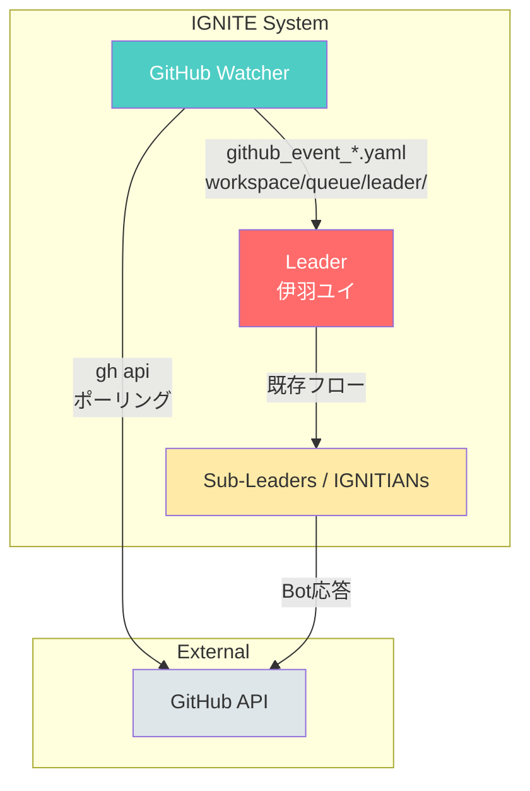

# GitHub Watcher 使用ガイド

このドキュメントでは、IGNITEのGitHubイベント監視システム（GitHub Watcher）の使い方を説明します。

## 概要

GitHub Watcherは、GitHubリポジトリのイベント（Issue、PR、コメント）を監視し、検知したイベントをIGNITEシステムに自動投入する機能です。

### 主な機能

- **Issue/PRイベントの監視**: 新規作成、更新を検知
- **コメント監視**: Issue/PRへのコメントを検知
- **トリガー機能**: メンション（@ignite-gh-app）でタスクを自動起動
- **Bot判別**: 自身のBot投稿には反応しない
- **重複防止**: 処理済みイベントを記録して重複処理を防止

### アーキテクチャ



## 前提条件

GitHub Watcherを使用するには、以下の設定が必要です:

1. **GitHub CLI (gh)** がインストールされ、認証済みであること
2. **GitHub App** の設定が完了していること（Bot応答を使用する場合）

GitHub Appの設定については [github-app-setup.md](./github-app-setup.md) を参照してください。

## 設定

### 1. 設定ファイルの作成

```bash
cp config/github-watcher.yaml.example config/github-watcher.yaml
```

### 2. 監視対象リポジトリの設定

```yaml
watcher:
  # 監視対象リポジトリ
  repositories:
    - owner/repo1
    - owner/repo2
    - organization/repo3

  # ポーリング間隔（秒）
  interval: 60

  # 監視するイベントタイプ
  events:
    issues: true
    issue_comments: true
    pull_requests: true
    pr_comments: true

  # Bot投稿を無視
  ignore_bot: true
```

### 3. トリガー設定

メンションやキーワードで自動タスクを起動:

```yaml
triggers:
  # メンションパターン
  mention_pattern: "@ignite-gh-app"

  # キーワード別アクション
  keywords:
    implement:
      - "実装して"
      - "implement"
      - "fix this"
    review:
      - "レビューして"
      - "review"
    explain:
      - "説明して"
      - "explain"

  # 自動トリガーラベル
  auto_labels:
    - "ignite-auto"
    - "help-wanted"
```

## 使用方法

### 基本的な起動

```bash
# デーモンモード（継続監視）
./scripts/utils/github_watcher.sh

# バックグラウンドで起動
./scripts/utils/github_watcher.sh &

# 単発実行
./scripts/utils/github_watcher.sh --once
```

### オプション

| オプション | 説明 |
|------------|------|
| `-d, --daemon` | デーモンモードで起動（デフォルト） |
| `-o, --once` | 単発実行 |
| `-c, --config <file>` | 設定ファイルを指定 |
| `-h, --help` | ヘルプを表示 |

### IGNITEシステムとの統合起動

IGNITEシステム起動時に、GitHub Watcherも一緒に起動することができます。

#### オプション指定での起動

```bash
# Watcherも一緒に起動
ignite start --with-watcher

# Watcherを起動しない（設定で有効でも）
ignite start --no-watcher
```

#### 設定ファイルでの自動起動

`config/github-watcher.yaml` で自動起動を設定できます:

```yaml
# 自動起動設定
auto_start:
  # ignite start 時に自動起動するか
  # --with-watcher / --no-watcher オプションで上書き可能
  enabled: true
```

この設定を有効にすると、`ignite start` だけでWatcherも自動起動します。

#### 状態確認

```bash
# Watcherの状態を含むシステム状態を表示
ignite status
```

#### 停止

`ignite stop` を実行すると、Watcherも自動的に停止します。

**注意事項:**
- セッションごとにWatcherが起動されます（各ワークスペースにPIDとログを保存）
- 同じリポジトリを複数セッションで監視すると重複処理の可能性があります（設定ファイルで異なるリポジトリを指定推奨）

### 手動でのWatcher起動

IGNITEとは別に手動でWatcherを起動する場合:

```bash
# ターミナル1: IGNITEシステム起動
ignite start

# ターミナル2: GitHub Watcher起動
./scripts/utils/github_watcher.sh
```

## イベントメッセージ形式

### 通常イベント（github_event）

GitHub Watcherが検知したイベントは、以下の形式でメッセージファイルとして保存されます:

**Issue作成時:**
```yaml
type: github_event
from: github_watcher
to: leader
timestamp: "2026-02-03T12:00:00+09:00"
priority: normal
payload:
  event_type: issue_created
  repository: owner/repo
  issue_number: 123
  issue_title: "ログイン機能のバグ修正"
  author: human-user
  author_type: User
  body: |
    ログイン時にエラーが発生します。
    再現手順: ...
  url: "https://github.com/owner/repo/issues/123"
```

**Issueコメント時:**
```yaml
type: github_event
from: github_watcher
to: leader
timestamp: "2026-02-03T12:05:00+09:00"
priority: normal
payload:
  event_type: issue_comment
  repository: owner/repo
  issue_number: 123
  comment_id: 456789
  author: human-user
  author_type: User
  body: |
    この問題について追加情報があります。
  url: "https://github.com/owner/repo/issues/123#issuecomment-456789"
```

### タスクメッセージ（github_task）

メンショントリガーが検知された場合:

```yaml
type: github_task
from: github_watcher
to: leader
timestamp: "2026-02-03T12:10:00+09:00"
priority: high
payload:
  trigger: "implement"
  repository: owner/repo
  issue_number: 123
  issue_title: "ログイン機能のバグ修正"
  issue_body: |
    ログイン時にエラーが発生します。
  requested_by: human-user
  trigger_comment: |
    @ignite-gh-app このIssueを実装して
  branch_prefix: "ignite/"
  url: "https://github.com/owner/repo/issues/123#issuecomment-456789"
```

## トリガーの使い方

### メンションによるタスク起動

GitHubのIssue/PRコメントで以下のようにメンションすると、IGNITEが自動でタスクを開始します:

```
@ignite-gh-app このIssueを実装して
```

```
@ignite-gh-app fix this issue
```

```
@ignite-gh-app PRを作成して
```

### トリガータイプ

| トリガー | 説明 | キーワード例 |
|----------|------|--------------|
| `implement` | Issue/機能の実装 | 実装して, implement, fix this |
| `review` | コードレビュー | レビューして, review |
| `explain` | 説明・解説 | 説明して, explain |

## Issue → PR 自動作成フロー

1. **トリガー検知**: ユーザーが `@ignite-gh-app 実装して` とコメント
2. **タスクメッセージ生成**: GitHub Watcherが `github_task` メッセージを作成
3. **IGNITE処理**: Leader → Strategist → IGNITIANs の流れでタスク実行
4. **PR作成**: 実装完了後、`create_pr.sh` でBot名義でPR作成
5. **通知**: PRリンクをIssueにコメント

### PR作成スクリプト

```bash
# Issue #123 に対するPRを作成
./scripts/utils/create_pr.sh 123 --repo owner/repo

# Bot名義で作成
./scripts/utils/create_pr.sh 123 --repo owner/repo --bot

# ドラフトPRとして作成
./scripts/utils/create_pr.sh 123 --repo owner/repo --draft
```

## work-onコマンド

`ignite` コマンドから直接Issueに対する作業を開始できます:

```bash
# Issue番号で指定
ignite work-on 123 --repo owner/repo

# Issue URLで指定
ignite work-on https://github.com/owner/repo/issues/123
```

## ステート管理

### 処理済みイベント

処理済みイベントは `workspace/state/github_watcher_state.json` に記録されます:

```json
{
  "processed_events": {
    "issue_12345": "2026-02-03T12:00:00+09:00",
    "issue_comment_67890": "2026-02-03T12:05:00+09:00"
  },
  "last_check": {
    "owner/repo_issues": "2026-02-03T12:10:00+09:00",
    "owner/repo_issue_comments": "2026-02-03T12:10:00+09:00"
  }
}
```

### クリーンアップ

24時間以上前の処理済みイベントは自動的にクリーンアップされます。

## トラブルシューティング

### イベントが検知されない

1. **gh CLI認証確認**
   ```bash
   gh auth status
   ```

2. **リポジトリへのアクセス確認**
   ```bash
   gh api /repos/owner/repo/issues
   ```

3. **設定ファイルの確認**
   ```bash
   cat config/github-watcher.yaml
   ```

### Bot応答が動作しない

1. **GitHub App設定確認**
   ```bash
   ./scripts/utils/get_github_app_token.sh --check
   ```

2. **トークン取得テスト**
   ```bash
   BOT_TOKEN=$(./scripts/utils/get_github_app_token.sh --repo owner/repo)
   echo $BOT_TOKEN
   ```

### メッセージが重複する

ステートファイルをリセット:
```bash
rm workspace/state/github_watcher_state.json
```

### APIレート制限

GitHub APIのレート制限に注意してください:
- 認証済み: 5000 requests/hour
- 推奨間隔: 60秒以上

レート制限状況の確認:
```bash
gh api /rate_limit
```

## ログの確認

```bash
# Watcherのログを確認
tail -f workspace/logs/github_watcher.log

# 生成されたメッセージを確認
ls -la workspace/queue/leader/github_*.yaml
```

## セキュリティに関する注意

1. **認証情報の管理**: GitHub Appの設定は安全に管理してください
2. **リポジトリアクセス**: 監視対象は信頼できるリポジトリのみに限定
3. **Bot投稿の無視**: `ignore_bot: true` を維持して無限ループを防止

## Bot応答機能

### コメント投稿ユーティリティ

IGNITEには、Issueへのコメント投稿を簡単に行うためのユーティリティスクリプトが用意されています。

```bash
# 直接メッセージ投稿
./scripts/utils/comment_on_issue.sh 123 --repo owner/repo --body "コメント内容"

# Bot名義で投稿
./scripts/utils/comment_on_issue.sh 123 --repo owner/repo --bot --body "Bot応答"

# テンプレート使用
./scripts/utils/comment_on_issue.sh 123 --repo owner/repo --bot --template acknowledge
./scripts/utils/comment_on_issue.sh 123 --repo owner/repo --bot --template success --context "完了しました"
./scripts/utils/comment_on_issue.sh 123 --repo owner/repo --bot --template error --context "エラー発生"
```

### テンプレートタイプ

| テンプレート | 説明 | 用途 |
|-------------|------|------|
| `acknowledge` | タスク受付時の応答 | Issue/PRを確認したことを通知 |
| `success` | 処理完了時の応答 | PR作成完了、レビュー完了など |
| `error` | エラー発生時の応答 | 処理失敗時の報告 |
| `progress` | 進捗報告 | 処理中の状況報告 |

### ignite watcher コマンド

```bash
# コメント投稿
ignite watcher comment 123 --repo owner/repo --bot --body "メッセージ"

# 受付応答を投稿（テンプレート使用）
ignite watcher ack 123 owner/repo
```

## 外部リポジトリでの作業

### リポジトリ管理スクリプト

外部リポジトリをcloneして作業するためのユーティリティスクリプトです。

```bash
# リポジトリをclone
./scripts/utils/setup_repo.sh clone owner/repo

# 特定のブランチを指定してclone
./scripts/utils/setup_repo.sh clone owner/repo develop

# パス取得
REPO_PATH=$(./scripts/utils/setup_repo.sh path owner/repo)
echo $REPO_PATH  # workspace/repos/owner_repo

# Issue用ブランチ作成
./scripts/utils/setup_repo.sh branch "$REPO_PATH" 123
# → ignite/issue-123 ブランチが作成される
```

### 作業フロー

1. **リポジトリをセットアップ**
   ```bash
   REPO_PATH=$(./scripts/utils/setup_repo.sh clone owner/repo)
   ```

2. **Issue用ブランチを作成**
   ```bash
   ./scripts/utils/setup_repo.sh branch "$REPO_PATH" 123
   ```

3. **ファイルを編集**（IGNITIANsが実行）
   ```bash
   cd "$REPO_PATH"
   # 編集作業
   ```

4. **PR作成**
   ```bash
   ./scripts/utils/create_pr.sh 123 --repo owner/repo --bot
   ```

5. **完了報告**
   ```bash
   ./scripts/utils/comment_on_issue.sh 123 --repo owner/repo --bot \
     --template success --context "PR #456 を作成しました"
   ```

### PR修正フロー

PRにレビューコメントが付いた場合の修正対応:

```bash
# リベース
./scripts/utils/update_pr.sh rebase "$REPO_PATH" main

# コンフリクト発生時
# → IGNITIANsがコンフリクトを解決
./scripts/utils/update_pr.sh continue "$REPO_PATH"

# コンフリクト解決できない場合
./scripts/utils/update_pr.sh abort "$REPO_PATH"

# 追加コミット
./scripts/utils/update_pr.sh commit "$REPO_PATH" "fix: address review comments"

# プッシュ
./scripts/utils/update_pr.sh push "$REPO_PATH"

# Force push（リベース後）
./scripts/utils/update_pr.sh force-push "$REPO_PATH"
```

### ベースブランチ設定

リポジトリごとにベースブランチを設定できます:

```yaml
# config/github-watcher.yaml
watcher:
  repositories:
    - repo: owner/repo1
      base_branch: main
    - repo: owner/repo2
      base_branch: develop
    - repo: owner/repo3
      # base_branch 未指定 → リポジトリのデフォルトブランチを使用
```

## 関連ドキュメント

- [GitHub App設定ガイド](./github-app-setup.md) - Bot用GitHub Appの作成手順
- [プロトコル仕様](./protocol.md) - メッセージフォーマット
- [アーキテクチャ](./architecture.md) - システム構造の詳細
