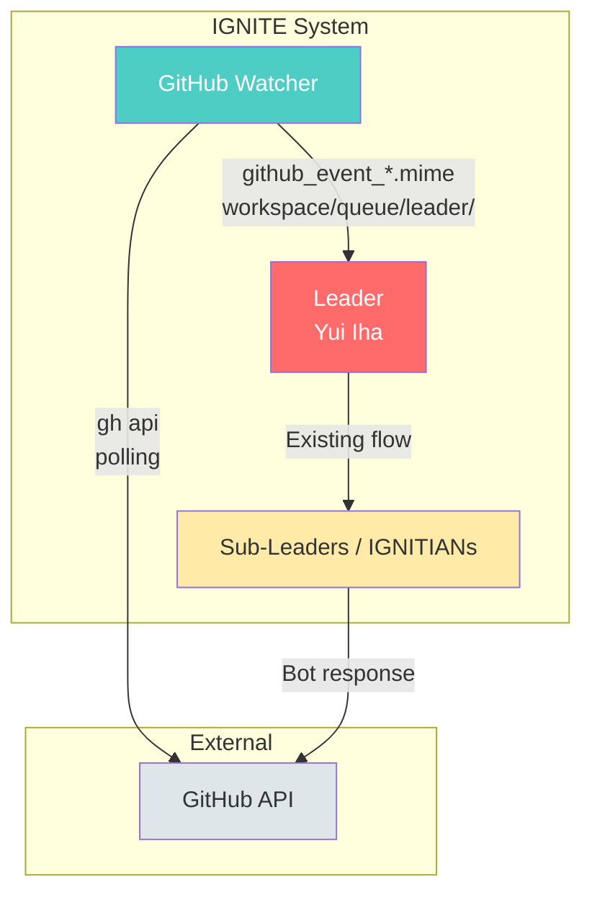

# GitHub Watcher Usage Guide

This document explains how to use IGNITE's GitHub event monitoring system (GitHub Watcher).

## Overview

GitHub Watcher monitors events (Issues, PRs, comments) in GitHub repositories and automatically submits detected events to the IGNITE system.

### Key Features

- **Issue/PR event monitoring**: Detect new creations and updates
- **Comment monitoring**: Detect comments on Issues/PRs
- **Trigger functionality**: Automatically start tasks via mentions (@ignite-gh-app)
- **Bot detection**: Does not react to own Bot posts
- **Duplicate prevention**: Records processed events to prevent duplicate processing

### Architecture



## Prerequisites

To use GitHub Watcher, the following setup is required:

1. **GitHub CLI (gh)** must be installed and authenticated
2. **GitHub App** configuration must be complete (if using Bot responses)

For GitHub App setup, see [github-app-setup_en.md](./github-app-setup_en.md).

## Configuration

### 1. Create Configuration File

```bash
cp config/github-watcher.yaml.example config/github-watcher.yaml
```

### 2. Configure Monitored Repositories

```yaml
watcher:
  # Monitored repositories
  repositories:
    - owner/repo1
    - owner/repo2
    - organization/repo3

  # Polling interval (seconds)
  interval: 60

  # Event types to monitor
  events:
    issues: true
    issue_comments: true
    pull_requests: true
    pr_comments: true

  # Ignore Bot posts
  ignore_bot: true
```

### 3. Trigger Configuration

Start automatic tasks via mentions or keywords:

```yaml
triggers:
  # Mention pattern
  mention_pattern: "@ignite-gh-app"

  # Actions by keyword
  keywords:
    implement:
      - "implement"
      - "fix this"
      - "create PR"
    review:
      - "review"
      - "check this"
    explain:
      - "explain"
      - "describe"

  # Auto-trigger labels
  auto_labels:
    - "ignite-auto"
    - "help-wanted"
```

## Usage

### Basic Startup

```bash
# Daemon mode (continuous monitoring)
./scripts/utils/github_watcher.sh

# Run in background
./scripts/utils/github_watcher.sh &

# Single execution
./scripts/utils/github_watcher.sh --once
```

### Options

| Option | Description |
|--------|-------------|
| `-d, --daemon` | Start in daemon mode (default) |
| `-o, --once` | Single execution |
| `-c, --config <file>` | Specify configuration file |
| `-h, --help` | Show help |

### Integrated Startup with IGNITE System

You can start GitHub Watcher together with the IGNITE system.

#### Starting with Option

```bash
# Start with Watcher
ignite start --with-watcher

# Start without Watcher (even if enabled in config)
ignite start --no-watcher
```

#### Auto-start via Configuration File

You can configure auto-start in `config/github-watcher.yaml`:

```yaml
# Auto-start settings
auto_start:
  # Auto-start when ignite start is executed
  # Can be overridden by --with-watcher / --no-watcher options
  enabled: true
```

With this setting enabled, Watcher will auto-start with just `ignite start`.

#### Status Check

```bash
# Show system status including Watcher status
ignite status
```

#### Stopping

Running `ignite stop` will automatically stop the Watcher as well.

**Notes:**
- Watcher is started per session (PID and logs are saved in each workspace)
- Monitoring the same repository from multiple sessions may cause duplicate processing (recommend configuring different repositories in each config file)

### Manual Watcher Startup

To start Watcher separately from IGNITE:

```bash
# Terminal 1: Start IGNITE system
ignite start

# Terminal 2: Start GitHub Watcher
./scripts/utils/github_watcher.sh
```

## Event Message Formats

### Regular Events (github_event)

Events detected by GitHub Watcher are saved as message files in the following format:

**On Issue creation:**
```yaml
type: github_event
from: github_watcher
to: leader
timestamp: "2026-02-03T12:00:00+09:00"
priority: normal
payload:
  event_type: issue_created
  repository: owner/repo
  issue_number: 123
  issue_title: "Fix login bug"
  author: human-user
  author_type: User
  body: |
    Error occurs during login.
    Steps to reproduce: ...
  url: "https://github.com/owner/repo/issues/123"
```

**On Issue comment:**
```yaml
type: github_event
from: github_watcher
to: leader
timestamp: "2026-02-03T12:05:00+09:00"
priority: normal
payload:
  event_type: issue_comment
  repository: owner/repo
  issue_number: 123
  comment_id: 456789
  author: human-user
  author_type: User
  body: |
    I have additional information about this issue.
  url: "https://github.com/owner/repo/issues/123#issuecomment-456789"
```

### Task Messages (github_task)

When a mention trigger is detected:

```yaml
type: github_task
from: github_watcher
to: leader
timestamp: "2026-02-03T12:10:00+09:00"
priority: high
payload:
  trigger: "implement"
  repository: owner/repo
  issue_number: 123
  issue_title: "Fix login bug"
  issue_body: |
    Error occurs during login.
  requested_by: human-user
  trigger_comment: |
    @ignite-gh-app implement this issue
  branch_prefix: "ignite/"
  url: "https://github.com/owner/repo/issues/123#issuecomment-456789"
```

## Using Triggers

### Starting Tasks via Mention

Mentioning in GitHub Issue/PR comments like below will automatically start IGNITE tasks:

```
@ignite-gh-app implement this issue
```

```
@ignite-gh-app fix this issue
```

```
@ignite-gh-app create a PR
```

### Trigger Types

| Trigger | Description | Keyword Examples |
|---------|-------------|------------------|
| `implement` | Implement Issue/feature | implement, fix this |
| `review` | Code review | review, check this |
| `explain` | Explanation | explain, describe |

## Issue → PR Auto-creation Flow

1. **Trigger detection**: User comments `@ignite-gh-app implement this`
2. **Task message generation**: GitHub Watcher creates `github_task` message
3. **IGNITE processing**: Task execution through Leader → Strategist → IGNITIANs flow
4. **PR creation**: After implementation, create PR as Bot using `create_pr.sh`
5. **Notification**: Comment PR link on Issue

### PR Creation Script

```bash
# Create PR for Issue #123
./scripts/utils/create_pr.sh 123 --repo owner/repo

# Create as Bot
./scripts/utils/create_pr.sh 123 --repo owner/repo --bot

# Create as draft PR
./scripts/utils/create_pr.sh 123 --repo owner/repo --draft
```

## work-on Command

You can start work on an Issue directly from the `ignite` command:

```bash
# Specify by Issue number
ignite work-on 123 --repo owner/repo

# Specify by Issue URL
ignite work-on https://github.com/owner/repo/issues/123
```

## State Management

### Processed Events

Processed events are recorded in `workspace/state/github_watcher_state.json`:

```json
{
  "processed_events": {
    "issue_12345": "2026-02-03T12:00:00+09:00",
    "issue_comment_67890": "2026-02-03T12:05:00+09:00"
  },
  "last_check": {
    "owner/repo_issues": "2026-02-03T12:10:00+09:00",
    "owner/repo_issue_comments": "2026-02-03T12:10:00+09:00"
  }
}
```

### Cleanup

Processed events older than 24 hours are automatically cleaned up.

## Troubleshooting

### Events Not Detected

1. **Verify gh CLI authentication**
   ```bash
   gh auth status
   ```

2. **Verify repository access**
   ```bash
   gh api /repos/owner/repo/issues
   ```

3. **Check configuration file**
   ```bash
   cat config/github-watcher.yaml
   ```

### Bot Response Not Working

1. **Verify GitHub App setup**
   ```bash
   ./scripts/utils/get_github_app_token.sh --check
   ```

2. **Test token retrieval**
   ```bash
   BOT_TOKEN=$(./scripts/utils/get_github_app_token.sh --repo owner/repo)
   echo $BOT_TOKEN
   ```

### Duplicate Messages

Reset state file:
```bash
rm workspace/state/github_watcher_state.json
```

### API Rate Limiting

Be aware of GitHub API rate limits:
- Authenticated: 5000 requests/hour
- Recommended interval: 60 seconds or more

Check rate limit status:
```bash
gh api /rate_limit
```

## Viewing Logs

```bash
# Check Watcher logs
tail -f workspace/logs/github_watcher.log

# Check generated messages
ls -la workspace/queue/leader/github_*.mime
```

## Security Notes

1. **Credential management**: Manage GitHub App settings securely
2. **Repository access**: Limit monitoring to trusted repositories only
3. **Ignore Bot posts**: Maintain `ignore_bot: true` to prevent infinite loops

## Bot Response Features

### Comment Posting Utility

IGNITE provides a utility script for easily posting comments to Issues.

```bash
# Direct message posting
./scripts/utils/comment_on_issue.sh 123 --repo owner/repo --body "Comment content"

# Post as Bot
./scripts/utils/comment_on_issue.sh 123 --repo owner/repo --bot --body "Bot response"

# Using templates
./scripts/utils/comment_on_issue.sh 123 --repo owner/repo --bot --template acknowledge
./scripts/utils/comment_on_issue.sh 123 --repo owner/repo --bot --template success --context "Completed"
./scripts/utils/comment_on_issue.sh 123 --repo owner/repo --bot --template error --context "Error occurred"
```

### Template Types

| Template | Description | Use Case |
|----------|-------------|----------|
| `acknowledge` | Task receipt response | Notify that Issue/PR has been acknowledged |
| `success` | Completion response | PR creation complete, review complete, etc. |
| `error` | Error response | Report when processing fails |
| `progress` | Progress report | Status during processing |

### ignite watcher Command

```bash
# Post comment
ignite watcher comment 123 --repo owner/repo --bot --body "Message"

# Post acknowledgment (using template)
ignite watcher ack 123 owner/repo
```

## Working with External Repositories

### Repository Management Script

Utility script for cloning and working with external repositories.

```bash
# Clone repository
./scripts/utils/setup_repo.sh clone owner/repo

# Clone with specific branch
./scripts/utils/setup_repo.sh clone owner/repo develop

# Get path
REPO_PATH=$(./scripts/utils/setup_repo.sh path owner/repo)
echo $REPO_PATH  # workspace/repos/owner_repo

# Create Issue branch
./scripts/utils/setup_repo.sh branch "$REPO_PATH" 123
# → Creates ignite/issue-123 branch
```

### Workflow

1. **Setup repository**
   ```bash
   REPO_PATH=$(./scripts/utils/setup_repo.sh clone owner/repo)
   ```

2. **Create Issue branch**
   ```bash
   ./scripts/utils/setup_repo.sh branch "$REPO_PATH" 123
   ```

3. **Edit files** (executed by IGNITIANs)
   ```bash
   cd "$REPO_PATH"
   # editing work
   ```

4. **Create PR**
   ```bash
   ./scripts/utils/create_pr.sh 123 --repo owner/repo --bot
   ```

5. **Report completion**
   ```bash
   ./scripts/utils/comment_on_issue.sh 123 --repo owner/repo --bot \
     --template success --context "Created PR #456"
   ```

### PR Update Flow

Handling updates when review comments are received on a PR:

```bash
# Rebase
./scripts/utils/update_pr.sh rebase "$REPO_PATH" main

# On conflict
# → IGNITIANs resolve conflicts
./scripts/utils/update_pr.sh continue "$REPO_PATH"

# If conflict cannot be resolved
./scripts/utils/update_pr.sh abort "$REPO_PATH"

# Additional commit
./scripts/utils/update_pr.sh commit "$REPO_PATH" "fix: address review comments"

# Push
./scripts/utils/update_pr.sh push "$REPO_PATH"

# Force push (after rebase)
./scripts/utils/update_pr.sh force-push "$REPO_PATH"
```

### Base Branch Configuration

You can configure base branch per repository:

```yaml
# config/github-watcher.yaml
watcher:
  repositories:
    - repo: owner/repo1
      base_branch: main
    - repo: owner/repo2
      base_branch: develop
    - repo: owner/repo3
      # base_branch not specified → uses repository's default branch
```

## Related Documentation

- [GitHub App Setup Guide](./github-app-setup_en.md) - Creating GitHub App for Bot
- [Protocol Specification](./protocol.md) - Message formats
- [Architecture](./architecture.md) - System structure details
