# IGNITE Service（systemd統合）使用ガイド

このドキュメントでは、IGNITEをsystemdユーザーサービスとして管理する方法を説明します。

## 概要

IGNITE Serviceは、systemdのテンプレートユニットを使用してIGNITEシステムをサービスとして管理する機能です。サーバー環境でのログアウト後も継続稼働、OS再起動時の自動復旧をサポートします。

### 主な機能

- **systemd統合**: ユーザーサービスとしてIGNITEを管理
- **複数ワークスペース**: テンプレートユニット `ignite@.service` で独立管理
- **自動起動**: `enable` + `loginctl enable-linger` でOS再起動後も自動復旧
- **ジャーナルログ**: `journalctl` でログの一元管理
- **環境変数管理**: `~/.config/ignite/env` で機密情報を安全に管理
- **--daemonフラグ**: systemd `Type=oneshot` + `RemainAfterExit=yes` との連携

### アーキテクチャ

```mermaid
flowchart TB
    subgraph systemd["systemd (user)"]
        Unit["ignite@&lt;session&gt;.service<br/>Type=oneshot + RemainAfterExit"]
        Monitor["ignite-monitor@&lt;session&gt;.service<br/>キューモニター"]
        Watcher["ignite-watcher@&lt;session&gt;.service"]
        Unit -.->|"PartOf"| Monitor
    end

    subgraph IGNITE["IGNITE プロセス"]
        Start["ignite start --daemon"]
        Agents["エージェントサーバー群"]
        QueueMon["queue_monitor.sh<br/>flock 排他制御"]
        Leader["Leader"]
        SubLeaders["Sub-Leaders"]
        IGNITIANs["IGNITIANs"]

        Start -->|"PIDファイル書出し<br/>exit 0"| Agents
        Agents --> Leader
        Agents --> SubLeaders
        Agents --> IGNITIANs
    end

    subgraph Config["設定"]
        EnvFile["~/.config/ignite/env.&lt;session&gt;<br/>chmod 600"]
    end

    Unit -->|"ExecStart=<br/>ignite start --daemon"| Start
    Unit -->|"EnvironmentFile="| EnvFile
    Monitor -->|"ExecStart=<br/>queue_monitor.sh"| QueueMon
    Monitor -->|"EnvironmentFile="| EnvFile
    systemd -->|"journalctl"| Watcher

    style Unit fill:#4ecdc4,color:#fff
    style Monitor fill:#45b7d1,color:#fff
    style Agents fill:#ff6b6b,color:#fff
    style QueueMon fill:#ff6b6b,color:#fff
    style EnvFile fill:#ffeaa7,color:#333
```



### サービスユニット構成

IGNITE は3つの systemd テンプレートユニットで構成されます:

| ユニット | Type | 役割 | 依存関係 |
|---------|------|------|---------|
| `ignite@.service` | `oneshot` + `RemainAfterExit` | メインサービス。エージェントサーバーを起動し `exit 0` | — |
| `ignite-monitor@.service` | `simple` | キューモニター（`queue_monitor.sh`）。メッセージキューを監視 | `PartOf=ignite@%i.service` |
| `ignite-watcher@.service` | — | GitHub Watcher | — |

#### `PartOf=` ディレクティブの動作

`ignite-monitor@.service` は `PartOf=ignite@%i.service` を設定しています。これにより:

- `ignite@<session>.service` が停止/再起動されると、`ignite-monitor@<session>.service` も**自動的に停止/再起動**される
- 逆方向（monitor 停止 → メインサービス停止）は発生しない
- `enable`/`disable` は連動しないため、個別に設定が必要

### サービスステータスの読み方

`systemctl --user list-units` の出力例:

```
ignite@my-project.service         loaded active exited  IGNITE my-project
ignite-monitor@my-project.service loaded active running IGNITE Monitor my-project
ignite-watcher@my-project.service loaded active running IGNITE Watcher my-project
```

| ステータス | 意味 | 正常/異常 |
|-----------|------|----------|
| `active (exited)` | `Type=oneshot` のプロセスが `exit 0` で正常終了。`RemainAfterExit=yes` によりアクティブ状態を維持 | **正常** — `ignite@.service` はこの状態が正しい |
| `active (running)` | プロセスが稼働中 | **正常** — `ignite-monitor@.service` はこの状態が正しい |
| `inactive (dead)` | サービスが停止中 | 意図的な停止なら正常 |
| `failed` (● 赤丸表示) | プロセスが異常終了した | **要調査** — ログを確認 |

> **💡 ポイント:** `ignite@.service` が `active (exited)` と表示されるのは正常です。`Type=oneshot` + `RemainAfterExit=yes` の設計により、`ignite start --daemon` プロセスが `exit 0` した後もサービスはアクティブ状態を維持します。エージェントサーバーはバックグラウンドで独立して稼働し続けています。

### キューモニターのライフサイクル

`queue_monitor.sh` はメッセージキューを監視し、新しいメッセージをエージェントに配信するプロセスです。

#### 排他制御（flock）

各ワークスペースのキューモニターは `flock` による排他制御で**単一インスタンス**のみ稼働します:

- ロックファイル: `<workspace>/.ignite/state/queue_monitor.lock`
- ワークスペースごとに独立したロックファイルを使用
- 同一ワークスペースで2つ目のモニターが起動すると `flock` 取得に失敗し即座に終了

#### systemd 環境でのモニター起動

`ignite-monitor@.service` が enabled の場合:
1. `ignite@.service` が `ignite start --daemon` を実行
2. `cmd_start.sh` が `ignite-monitor@.service` の enabled 状態を検出し、**自分ではモニターを起動しない**
3. systemd が `ignite-monitor@.service` を起動 → `queue_monitor.sh` が稼働

`ignite-monitor@.service` が enabled でない場合:
1. `ignite@.service` が `ignite start --daemon` を実行
2. `cmd_start.sh` がモニターをバックグラウンドプロセスとして起動

#### 環境変数の伝搬

systemd 環境では `env.<session>` ファイル経由で環境変数が渡されます:

```
env.<session> → IGNITE_WORKSPACE=/path/to/workspace
                WORKSPACE_DIR=/path/to/workspace
                         ↓
queue_monitor.sh → WORKSPACE_DIR を使用して
                   ロックファイルパスを決定
                   .ignite/state/queue_monitor.lock
```

`IGNITE_WORKSPACE` と `WORKSPACE_DIR` の両方が env ファイルに含まれることで、スクリプト内の変数解決が正しく行われます。

## 前提条件

| 要件 | 最小バージョン | 確認コマンド |
|------|--------------|------------|
| systemd | 246+ | `systemctl --version` |
| bash | 5.0+ | `bash --version` |
| loginctl | — | `loginctl --version` |

> **⚠️ 重要:** `loginctl enable-linger` を実行しないと、ログアウト後にサービスが停止します。

```bash
# linger を有効化（必須）
loginctl enable-linger $(whoami)

# 確認
loginctl show-user $(whoami) --property=Linger
# 出力: Linger=yes
```

## クイックスタート

```bash
# 1. ユニットファイルをインストール
ignite service install

# 2. 環境変数を設定
ignite service setup-env my-project

# 3. サービスを有効化（自動起動設定）
ignite service enable my-project

# 4. linger を有効化（ログアウト後も維持）
loginctl enable-linger $(whoami)

# 5. サービスを開始
ignite service start my-project
```

## サブコマンドリファレンス

### `install` — ユニットファイルのインストール

テンプレートユニットファイル `ignite@.service` を `~/.config/systemd/user/` にインストールします。

**書式:**

```bash
ignite service install [--force]
```

**オプション:**

| オプション | 説明 |
|-----------|------|
| `-y`, `--yes`, `--force` | 既存ファイルを確認なしで上書き |

**使用例:**

```bash
# 通常インストール
ignite service install

# 強制上書き
ignite service install --force
```

**アップグレード動作:**

| 状態 | 動作 |
|------|------|
| 初回インストール | そのままコピー |
| 既存ファイルと同一 | `最新版です` を表示してスキップ |
| 差分あり | `diff -u` で変更内容を表示し、確認プロンプト |
| `--force` + 差分あり | `diff -u` を表示して確認なしで上書き |

**出力例（初回）:**

```
ユニットファイルをインストール中...
✓ ignite@.service をインストールしました
✓ ignite-watcher@.service をインストールしました
systemd daemon-reload を実行中...
✓ daemon-reload 完了

インストール完了

次のステップ:
  1. 環境変数を設定: ignite service setup-env
  2. サービスを有効化: ignite service enable <session>
  3. linger 有効化: loginctl enable-linger <user>
```

**出力例（アップグレード時）:**

```
⚠ ignite@.service に変更があります:

--- /home/user/.config/systemd/user/ignite@.service
+++ /home/user/.local/share/ignite/templates/systemd/ignite@.service
@@ -1,3 +1,3 @@
 [Unit]
-Description=IGNITE old %i
+Description=IGNITE %i
 ...

ユニットファイルを更新しますか? (y/N):
```

**ユニットファイル検索パス（優先順）:**

| 優先度 | パス |
|--------|------|
| 1（最高） | `$IGNITE_DATA_DIR/templates/systemd/` |
| 2 | `$IGNITE_CONFIG_DIR/` |
| 3（最低） | `$PROJECT_ROOT/templates/systemd/` |

---

### `uninstall` — ユニットファイルのアンインストール

稼働中のサービスを停止・無効化し、ユニットファイルを削除します。

**書式:**

```bash
ignite service uninstall
```

**使用例:**

```bash
ignite service uninstall
```

**動作:**

1. 稼働中の `ignite@*.service` を検出
2. 各サービスを `stop` → `disable`
3. ユニットファイルを削除
4. `systemctl --user daemon-reload`

---

### `enable` — サービスの有効化

指定セッションのサービスを有効化します。`loginctl enable-linger` と組み合わせることで、OS再起動時に自動起動します。

**書式:**

```bash
ignite service enable <session>
```

**使用例:**

```bash
ignite service enable my-project
```

---

### `disable` — サービスの無効化

指定セッションの自動起動を無効化します。

**書式:**

```bash
ignite service disable <session>
```

**使用例:**

```bash
ignite service disable my-project
```

---

### `start` — サービスの開始

指定セッションのサービスを開始します。

**書式:**

```bash
ignite service start <session>
```

**使用例:**

```bash
ignite service start my-project
```

---

### `stop` — サービスの停止

指定セッションのサービスを停止します。

**書式:**

```bash
ignite service stop <session>
```

**使用例:**

```bash
ignite service stop my-project
```

---

### `restart` — サービスの再起動

指定セッションのサービスを再起動します。

**書式:**

```bash
ignite service restart <session>
```

**使用例:**

```bash
ignite service restart my-project
```

---

### `status` — サービスの状態表示

指定セッションまたは全IGNITEサービスの状態を表示します。

**書式:**

```bash
ignite service status [session]
```

**使用例:**

```bash
# 全サービス一覧
ignite service status

# 特定セッション
ignite service status my-project
```

**出力例（全サービス）:**

```
=== IGNITE サービス状態 ===

ignite@my-project.service         loaded active exited  IGNITE my-project
ignite-monitor@my-project.service loaded active running IGNITE Monitor my-project
ignite@staging.service            loaded active exited  IGNITE staging
ignite-monitor@staging.service    loaded active running IGNITE Monitor staging
```

---

### `logs` — ジャーナルログの表示

`journalctl` を使用してサービスのログを表示します。

**書式:**

```bash
ignite service logs <session> [--no-follow]
```

**オプション:**

| オプション | 説明 |
|-----------|------|
| `--no-follow` | リアルタイム追跡を無効化（デフォルトは `-f` 有効） |

**使用例:**

```bash
# リアルタイムログ表示
ignite service logs my-project

# 過去ログのみ表示
ignite service logs my-project --no-follow
```

---

### `setup-env` — 環境変数ファイルの生成

systemdサービスで使用する環境変数ファイルをセッション別に生成します。

**書式:**

```bash
ignite service setup-env <session> [--force]
```

**引数:**

| 引数 | 必須 | 説明 |
|------|------|------|
| `session` | ✓ | セッション名（`enable`/`start` で使用する名前と同じ） |

**オプション:**

| オプション | 説明 |
|-----------|------|
| `-y`, `--yes`, `--force` | 既存ファイルを確認なしで上書き |

**使用例:**

```bash
ignite service setup-env my-project
```

**生成ファイル:** `~/.config/ignite/env.<session>`

> **Note:** API Key 等のプロジェクト固有変数は `.ignite/.env` で管理してください。`setup-env` はパス・ターミナル設定等の最小限の変数のみを生成します。

---

### `help` — ヘルプ表示

serviceコマンドの使用方法を表示します。

**書式:**

```bash
ignite service help
```

---

## `--daemon` フラグ

`ignite start --daemon` は、systemd `Type=oneshot` + `RemainAfterExit=yes` との連携を目的としたフラグです。

### 通常モード vs daemonモード

| 項目 | 通常モード | daemonモード (`--daemon`) |
|------|----------|------------------------|
| コマンド | `ignite start` | `ignite start --daemon` |
| エージェントサーバー | 起動 | 起動 |
| 起動後の動作 | アタッチプロンプト表示 | PIDファイル書出し → `exit 0` |
| プロセス終了 | ユーザー操作まで維持 | 即座に終了（エージェントサーバーは残存） |
| systemd連携 | 不可 | `Type=oneshot` + `RemainAfterExit=yes` で連携可能 |
| PIDファイル | なし | `<workspace>/ignite-daemon.pid` |

### systemd Type=oneshot + RemainAfterExit との連携

`--daemon` フラグを指定すると、`ignite start` プロセスは以下の動作をします:

1. エージェントサーバーを起動
2. PIDファイル `<workspace>/ignite-daemon.pid` に自身のPIDを書出し
3. `exit 0` でプロセスを終了

systemdは `Type=oneshot` + `RemainAfterExit=yes` により、`exit 0` をもってサービスを `active (exited)` 状態に遷移させます。エージェントサーバーはバックグラウンドで稼働し続けます。

### 暗黙的に有効化されるオプション

`--daemon` を指定すると、以下のオプションが自動的に有効化されます:

| オプション | 理由 |
|-----------|------|
| `--no-attach` | 非対話環境で使用するため |
| `--force` | 既存セッションを自動クリーンアップ |

### 使用例

```bash
# 手動でdaemonモードを使用（systemdなし）
ignite start --daemon -s my-project -w ~/workspace/my-project

# PIDファイルの確認
cat ~/workspace/my-project/ignite-daemon.pid

# プロセスの確認（エージェントサーバー）
ignite status
```

---

## 環境ファイル設定

### ファイルパス

```
~/.config/ignite/env.<session>
```

> **⚠️ セキュリティ:** 必ず `chmod 600` を設定してください（`setup-env` が自動設定します）。

### `env.<session>` の変数テーブル

`setup-env` が生成する最小限の変数です。

| 変数名 | 必須 | 説明 | 例 |
|--------|------|------|-----|
| `PATH` | ✓ | 実行パス | `${HOME}/.local/bin:/usr/local/bin:/usr/bin:/bin` |
| `HOME` | ✓ | ホームディレクトリ | `/home/user` |
| `TERM` | ✓ | ターミナルタイプ | `xterm-256color` |
| `CLAUDE_CODE_EXPERIMENTAL_AGENT_TEAMS` | — | チーム機能有効化（CLI固有） | `1` |
| `XDG_CONFIG_HOME` | — | XDG設定ディレクトリ | `${HOME}/.config` |
| `XDG_DATA_HOME` | — | XDGデータディレクトリ | `${HOME}/.local/share` |
| `IGNITE_WORKSPACE` | — | ワークスペースパス | `/home/user/repos/my-project` |
| `WORKSPACE_DIR` | — | ワークスペースパス（スクリプト内部用。`IGNITE_WORKSPACE` と同値） | `/home/user/repos/my-project` |

### API Key 等のプロジェクト固有変数

API Key はワークスペースの `.ignite/.env` で管理します（`cmd_start.sh` が起動時に `source` します）。

```ini
# .ignite/.env
ANTHROPIC_API_KEY=sk-ant-api03-xxxxxxxxxxxx
```

### 環境ファイルの例

```ini
# IGNITE - systemd EnvironmentFile
# chmod 600 ~/.config/ignite/env.my-project

PATH=/home/user/.local/bin:/usr/local/bin:/usr/bin:/bin
HOME=/home/user
TERM=xterm-256color

CLAUDE_CODE_EXPERIMENTAL_AGENT_TEAMS=1

XDG_CONFIG_HOME=/home/user/.config
XDG_DATA_HOME=/home/user/.local/share

# ワークスペースパス（systemd 起動時に使用）
IGNITE_WORKSPACE=/home/user/repos/my-project
WORKSPACE_DIR=/home/user/repos/my-project
```

---

## トラブルシューティング

### キューモニターのシーソー現象（複数ワークスペース）

**症状:** 複数ワークスペースのサービスを同時起動すると、一方の `ignite-monitor@` を起動すると他方が停止する

**原因:** `queue_monitor.sh` が `IGNITE_WORKSPACE` を認識できず、全インスタンスが同一のデフォルトパスで `flock` を取得。排他制御により1つしか起動できない

**解決方法:**

```bash
# 1. v0.6.2 以降にアップグレード
cd /path/to/ignite && git pull
./scripts/install.sh --upgrade

# 2. env ファイルに WORKSPACE_DIR が含まれることを確認
grep WORKSPACE_DIR ~/.config/ignite/env.<session>

# 3. 含まれていない場合は再生成
ignite service setup-env <session> --force
```

---

### キューモニターの flock 取得失敗

**症状:** ジャーナルログに「flock取得失敗: 別のモニターが稼働中」と表示される

**原因:** `ignite start --daemon`（`ignite@.service` の ExecStart）がモニターをバックグラウンドで起動し、さらに `ignite-monitor@.service` も起動するため flock が衝突

**解決方法:**

```bash
# 1. v0.6.2 以降にアップグレード（cmd_start.sh のモニター二重起動防止が含まれる）
./scripts/install.sh --upgrade

# 2. 孤立したモニタープロセスを停止
pkill -f 'queue_monitor.sh'

# 3. failed 状態をリセット
systemctl --user reset-failed

# 4. サービスを再起動
ignite service restart <session>
```

---

### サービスが `failed` (● 赤丸) 状態

**症状:** `systemctl --user list-units` で `●` マーク（赤丸）が表示され、サービスが `failed` 状態

**原因:** サービスプロセスが異常終了した（flock 衝突、設定エラー等）

**解決方法:**

```bash
# 1. ログを確認して原因を特定
journalctl --user-unit ignite-monitor@<session>.service --no-pager -n 50

# 2. 孤立プロセスを停止（必要に応じて）
pkill -f 'queue_monitor.sh'

# 3. failed 状態をリセット
systemctl --user reset-failed

# 4. サービスを再起動
ignite service restart <session>
```

---

### linger が有効になっていない

**症状:** ログアウト後にサービスが停止する

**原因:** `loginctl enable-linger` が実行されていない

**解決方法:**

```bash
# linger を有効化
loginctl enable-linger $(whoami)

# 確認
loginctl show-user $(whoami) --property=Linger
```

---

### ユニットファイルが見つからない

**症状:** `ignite service install` で「テンプレートユニットファイルが見つかりません」エラー

**原因:** `ignite@.service` テンプレートがインストールパスに存在しない

**解決方法:**

```bash
# テンプレートファイルの検索パスを確認
ls ${IGNITE_DATA_DIR:-~/.local/share/ignite}/templates/systemd/
ls ${PROJECT_ROOT}/templates/systemd/

# 手動コピー（テンプレートが見つかった場合）
mkdir -p ~/.config/systemd/user
cp templates/systemd/ignite@.service ~/.config/systemd/user/
systemctl --user daemon-reload
```

---

### D-Bus 接続失敗

**症状:** `Failed to connect to bus: No medium found` エラー

**原因:** SSHセッションで `XDG_RUNTIME_DIR` が未設定

**解決方法:**

```bash
# 環境変数を設定
export XDG_RUNTIME_DIR="/run/user/$(id -u)"

# systemctl が動作するか確認
systemctl --user status
```

---

### 権限エラー

**症状:** `Failed to enable unit: Access denied` エラー

**原因:** ユーザーサービスの権限問題

**解決方法:**

```bash
# ユニットディレクトリの権限確認
ls -la ~/.config/systemd/user/

# 権限修正
chmod 644 ~/.config/systemd/user/ignite@.service
systemctl --user daemon-reload
```

---

### エージェントプロセスが残留

**症状:** `ignite service stop` 後もエージェントプロセスが残る

**原因:** systemd停止がPIDプロセスのみ終了し、エージェントサーバーは独立プロセス

**解決方法:**

```bash
# 残留プロセスの確認
ignite status

# ignite stop を使用してクリーンアップ
ignite stop -s <session-name>
```

---

## daemon → service 移行ガイド

> **⚠️ 非推奨告知:** `nohup` / `screen` / 手動バックグラウンド実行は非推奨です。`ignite service` またはは `ignite start --daemon` を使用してください。

### 移行手順

| 手順 | 従来の方法 | 新しい方法 |
|------|----------|----------|
| 起動 | `nohup ignite start &` | `ignite service start <session>` |
| 停止 | `kill $(cat pid)` | `ignite service stop <session>` |
| ログ確認 | `tail -f nohup.out` | `ignite service logs <session>` |
| 自動起動 | cron `@reboot` | `ignite service enable <session>` |
| 状態確認 | `ps aux \| grep ignite` | `ignite service status` |

### 段階的移行

1. **Phase 1**: `ignite start --daemon` でdaemonモード使用
2. **Phase 2**: `ignite service install` でユニットファイル導入
3. **Phase 3（現在）**: `ignite service enable` で自動起動設定、cron `@reboot` 削除
