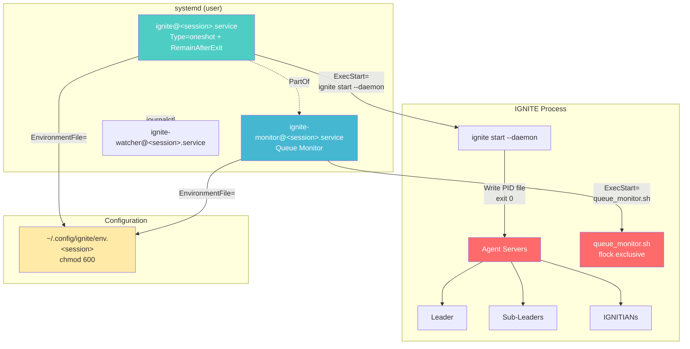

# IGNITE Service (systemd Integration) User Guide

This document explains how to manage IGNITE as a systemd user service.

## Overview

IGNITE Service provides systemd-based service management using template units. It supports continuous operation after logout and automatic recovery on OS restart.

### Key Features

- **systemd Integration**: Manage IGNITE as a user service
- **Multiple Workspaces**: Independent management via `ignite@.service` template unit
- **Auto-start**: Automatic recovery on OS restart with `enable` + `loginctl enable-linger`
- **Journal Logging**: Centralized log management via `journalctl`
- **Environment Management**: Securely manage credentials in `~/.config/ignite/env`
- **--daemon Flag**: Integration with systemd `Type=oneshot` + `RemainAfterExit=yes`

### Architecture



### Service Unit Structure

IGNITE consists of three systemd template units:

| Unit | Type | Role | Dependencies |
|------|------|------|-------------|
| `ignite@.service` | `oneshot` + `RemainAfterExit` | Main service. Starts agent servers and exits with `exit 0` | — |
| `ignite-monitor@.service` | `simple` | Queue monitor (`queue_monitor.sh`). Watches message queues | `PartOf=ignite@%i.service` |
| `ignite-watcher@.service` | — | GitHub Watcher | — |

#### `PartOf=` Directive Behavior

`ignite-monitor@.service` has `PartOf=ignite@%i.service` configured. This means:

- When `ignite@<session>.service` is stopped/restarted, `ignite-monitor@<session>.service` is **automatically stopped/restarted** as well
- The reverse (monitor stop → main service stop) does **not** happen
- `enable`/`disable` are not linked; they must be configured individually

### Understanding Service Status

Example `systemctl --user list-units` output:

```
ignite@my-project.service         loaded active exited  IGNITE my-project
ignite-monitor@my-project.service loaded active running IGNITE Monitor my-project
ignite-watcher@my-project.service loaded active running IGNITE Watcher my-project
```

| Status | Meaning | Normal/Abnormal |
|--------|---------|----------------|
| `active (exited)` | `Type=oneshot` process exited with `exit 0`. `RemainAfterExit=yes` keeps it in active state | **Normal** — correct state for `ignite@.service` |
| `active (running)` | Process is running | **Normal** — correct state for `ignite-monitor@.service` |
| `inactive (dead)` | Service is stopped | Normal if intentionally stopped |
| `failed` (● red dot) | Process exited abnormally | **Investigate** — check logs |

> **Tip:** It is normal for `ignite@.service` to show `active (exited)`. By design with `Type=oneshot` + `RemainAfterExit=yes`, the `ignite start --daemon` process exits with `exit 0` and the service remains in active state. Agent servers continue running independently in the background.

### Queue Monitor Lifecycle

`queue_monitor.sh` monitors message queues and delivers new messages to agents.

#### Exclusive Locking (flock)

Each workspace's queue monitor uses `flock` for exclusive locking to ensure only a **single instance** runs:

- Lock file: `<workspace>/.ignite/state/queue_monitor.lock`
- Each workspace uses an independent lock file
- If a second monitor starts for the same workspace, it fails to acquire `flock` and exits immediately

#### Monitor Startup in systemd Environment

When `ignite-monitor@.service` is enabled:
1. `ignite@.service` runs `ignite start --daemon`
2. `cmd_start.sh` detects that `ignite-monitor@.service` is enabled and **does not start the monitor itself**
3. systemd starts `ignite-monitor@.service` → `queue_monitor.sh` runs

When `ignite-monitor@.service` is not enabled:
1. `ignite@.service` runs `ignite start --daemon`
2. `cmd_start.sh` starts the monitor as a background process

#### Environment Variable Propagation

In systemd environments, environment variables are passed via the `env.<session>` file:

```
env.<session> → IGNITE_WORKSPACE=/path/to/workspace
                WORKSPACE_DIR=/path/to/workspace
                         ↓
queue_monitor.sh → Uses WORKSPACE_DIR to determine
                   lock file path:
                   .ignite/state/queue_monitor.lock
```

Both `IGNITE_WORKSPACE` and `WORKSPACE_DIR` are included in the env file to ensure correct variable resolution within scripts.

## Prerequisites

| Requirement | Minimum Version | Check Command |
|-------------|----------------|---------------|
| systemd | 246+ | `systemctl --version` |
| bash | 5.0+ | `bash --version` |
| loginctl | — | `loginctl --version` |

> **⚠️ Important:** Without `loginctl enable-linger`, the service will stop when you log out.

```bash
# Enable linger (required)
loginctl enable-linger $(whoami)

# Verify
loginctl show-user $(whoami) --property=Linger
# Output: Linger=yes
```

## Quick Start

```bash
# 1. Install unit files
ignite service install

# 2. Set up environment variables
ignite service setup-env my-project

# 3. Enable the service (auto-start configuration)
ignite service enable my-project

# 4. Enable linger (persist after logout)
loginctl enable-linger $(whoami)

# 5. Start the service
ignite service start my-project
```

## Subcommand Reference

### `install` — Install Unit Files

Installs the template unit file `ignite@.service` to `~/.config/systemd/user/`.

**Usage:**

```bash
ignite service install [--force]
```

**Options:**

| Option | Description |
|--------|------------|
| `-y`, `--yes`, `--force` | Overwrite existing files without confirmation |

**Example:**

```bash
# Normal installation
ignite service install

# Force overwrite
ignite service install --force
```

**Upgrade behavior:**

| State | Behavior |
|-------|----------|
| First install | Copies files directly |
| Identical to existing | Shows `up to date` and skips |
| Differences found | Shows `diff -u` output and prompts for confirmation |
| `--force` + differences | Shows `diff -u` and overwrites without confirmation |

**Output example (first install):**

```
Installing unit files...
✓ Installed ignite@.service
✓ Installed ignite-watcher@.service
Running systemd daemon-reload...
✓ daemon-reload complete

Installation complete

Next steps:
  1. Set up environment: ignite service setup-env
  2. Enable service: ignite service enable <session>
  3. Enable linger: loginctl enable-linger <user>
```

**Output example (upgrade):**

```
⚠ ignite@.service has changes:

--- /home/user/.config/systemd/user/ignite@.service
+++ /home/user/.local/share/ignite/templates/systemd/ignite@.service
@@ -1,3 +1,3 @@
 [Unit]
-Description=IGNITE old %i
+Description=IGNITE %i
 ...

Update unit file? (y/N):
```

**Unit file search paths (priority order):**

| Priority | Path |
|----------|------|
| 1 (highest) | `$IGNITE_DATA_DIR/templates/systemd/` |
| 2 | `$IGNITE_CONFIG_DIR/` |
| 3 (lowest) | `$PROJECT_ROOT/templates/systemd/` |

---

### `uninstall` — Uninstall Unit Files

Stops and disables running services, then removes unit files.

**Usage:**

```bash
ignite service uninstall
```

**Example:**

```bash
ignite service uninstall
```

**Behavior:**

1. Detects running `ignite@*.service` units
2. Stops and disables each service
3. Deletes unit files
4. Runs `systemctl --user daemon-reload`

---

### `enable` — Enable Service

Enables auto-start for the specified session. Combined with `loginctl enable-linger`, the service will start automatically on OS reboot.

**Usage:**

```bash
ignite service enable <session>
```

**Example:**

```bash
ignite service enable my-project
```

---

### `disable` — Disable Service

Disables auto-start for the specified session.

**Usage:**

```bash
ignite service disable <session>
```

**Example:**

```bash
ignite service disable my-project
```

---

### `start` — Start Service

Starts the service for the specified session.

**Usage:**

```bash
ignite service start <session>
```

**Example:**

```bash
ignite service start my-project
```

---

### `stop` — Stop Service

Stops the service for the specified session.

**Usage:**

```bash
ignite service stop <session>
```

**Example:**

```bash
ignite service stop my-project
```

---

### `restart` — Restart Service

Restarts the service for the specified session.

**Usage:**

```bash
ignite service restart <session>
```

**Example:**

```bash
ignite service restart my-project
```

---

### `status` — Show Service Status

Displays status for a specific session or all IGNITE services.

**Usage:**

```bash
ignite service status [session]
```

**Example:**

```bash
# List all services
ignite service status

# Specific session
ignite service status my-project
```

**Output example (all services):**

```
=== IGNITE Service Status ===

ignite@my-project.service         loaded active exited  IGNITE my-project
ignite-monitor@my-project.service loaded active running IGNITE Monitor my-project
ignite@staging.service            loaded active exited  IGNITE staging
ignite-monitor@staging.service    loaded active running IGNITE Monitor staging
```

---

### `logs` — Show Journal Logs

Displays service logs using `journalctl`.

**Usage:**

```bash
ignite service logs <session> [--no-follow]
```

**Options:**

| Option | Description |
|--------|------------|
| `--no-follow` | Disable real-time log following (default: `-f` enabled) |

**Example:**

```bash
# Real-time log display
ignite service logs my-project

# Show past logs only
ignite service logs my-project --no-follow
```

---

### `setup-env` — Generate Environment File

Generates a per-session environment variable file used by the systemd service.

**Usage:**

```bash
ignite service setup-env <session> [--force]
```

**Arguments:**

| Argument | Required | Description |
|----------|----------|------------|
| `session` | ✓ | Session name (same name used with `enable`/`start`) |

**Options:**

| Option | Description |
|--------|------------|
| `-y`, `--yes`, `--force` | Overwrite existing file without confirmation |

**Example:**

```bash
ignite service setup-env my-project
```

**Generated file:** `~/.config/ignite/env.<session>`

> **Note:** Project-specific variables such as API keys should be managed in `.ignite/.env`. The `setup-env` command only generates minimal variables (PATH, terminal settings, etc.).

---

### `help` — Show Help

Displays usage information for the service command.

**Usage:**

```bash
ignite service help
```

---

## `--daemon` Flag

`ignite start --daemon` is a flag designed for integration with systemd `Type=oneshot` + `RemainAfterExit=yes`.

### Normal Mode vs Daemon Mode

| Aspect | Normal Mode | Daemon Mode (`--daemon`) |
|--------|------------|------------------------|
| Command | `ignite start` | `ignite start --daemon` |
| Agent servers | Started | Started |
| Post-startup behavior | Shows attach prompt | Writes PID file → `exit 0` |
| Process lifetime | Maintained until user action | Exits immediately (agent servers persist) |
| systemd integration | Not possible | Works with `Type=oneshot` + `RemainAfterExit=yes` |
| PID file | None | `<workspace>/ignite-daemon.pid` |

### systemd Type=oneshot + RemainAfterExit Integration

When `--daemon` is specified, the `ignite start` process behaves as follows:

1. Starts agent servers
2. Writes its own PID to `<workspace>/ignite-daemon.pid`
3. Exits with `exit 0`

With `Type=oneshot` + `RemainAfterExit=yes`, systemd transitions the service to `active (exited)` state upon `exit 0`. The agent servers continue running in the background.

### Implicitly Enabled Options

When `--daemon` is specified, the following options are automatically enabled:

| Option | Reason |
|--------|--------|
| `--no-attach` | For use in non-interactive environments |
| `--force` | Automatic cleanup of existing sessions |

### Usage Example

```bash
# Use daemon mode manually (without systemd)
ignite start --daemon -s my-project -w ~/workspace/my-project

# Check PID file
cat ~/workspace/my-project/ignite-daemon.pid

# Verify process (agent servers)
ignite status
```

---

## Environment File Configuration

### File Path

```
~/.config/ignite/env.<session>
```

> **⚠️ Security:** Always set `chmod 600` (automatically set by `setup-env`).

### `env.<session>` Variable Table

Minimal variables generated by `setup-env`:

| Variable | Required | Description | Example |
|----------|----------|------------|---------|
| `PATH` | ✓ | Execution path | `${HOME}/.local/bin:/usr/local/bin:/usr/bin:/bin` |
| `HOME` | ✓ | Home directory | `/home/user` |
| `TERM` | ✓ | Terminal type | `xterm-256color` |
| `CLAUDE_CODE_EXPERIMENTAL_AGENT_TEAMS` | — | Enable team features (CLI-specific) | `1` |
| `XDG_CONFIG_HOME` | — | XDG config directory | `${HOME}/.config` |
| `XDG_DATA_HOME` | — | XDG data directory | `${HOME}/.local/share` |
| `IGNITE_WORKSPACE` | — | Workspace path | `/home/user/repos/my-project` |
| `WORKSPACE_DIR` | — | Workspace path (internal use by scripts; same value as `IGNITE_WORKSPACE`) | `/home/user/repos/my-project` |

### Project-Specific Variables (API Keys, etc.)

API keys are managed in the workspace's `.ignite/.env` file (`cmd_start.sh` sources it at startup).

```ini
# .ignite/.env
ANTHROPIC_API_KEY=sk-ant-api03-xxxxxxxxxxxx
```

### Environment File Example

```ini
# IGNITE - systemd EnvironmentFile
# chmod 600 ~/.config/ignite/env.my-project

PATH=/home/user/.local/bin:/usr/local/bin:/usr/bin:/bin
HOME=/home/user
TERM=xterm-256color

CLAUDE_CODE_EXPERIMENTAL_AGENT_TEAMS=1

XDG_CONFIG_HOME=/home/user/.config
XDG_DATA_HOME=/home/user/.local/share

# Workspace path (used at systemd startup)
IGNITE_WORKSPACE=/home/user/repos/my-project
WORKSPACE_DIR=/home/user/repos/my-project
```

---

## Troubleshooting

### Queue Monitor Seesaw Problem (Multiple Workspaces)

**Symptom:** When running multiple workspace services simultaneously, starting one `ignite-monitor@` causes the other to stop

**Cause:** `queue_monitor.sh` cannot resolve `IGNITE_WORKSPACE`, so all instances default to the same path for `flock`. The exclusive lock allows only one to run

**Solution:**

```bash
# 1. Upgrade to v0.6.2 or later
cd /path/to/ignite && git pull
./scripts/install.sh --upgrade

# 2. Verify env file contains WORKSPACE_DIR
grep WORKSPACE_DIR ~/.config/ignite/env.<session>

# 3. If missing, regenerate the env file
ignite service setup-env <session> --force
```

---

### Queue Monitor flock Acquisition Failure

**Symptom:** Journal logs show "flock acquisition failed: another monitor is running"

**Cause:** `ignite start --daemon` (ExecStart of `ignite@.service`) starts a monitor as a background process, and `ignite-monitor@.service` also starts one, causing flock collision

**Solution:**

```bash
# 1. Upgrade to v0.6.2 or later (includes double-start prevention in cmd_start.sh)
./scripts/install.sh --upgrade

# 2. Kill orphaned monitor processes
pkill -f 'queue_monitor.sh'

# 3. Reset failed state
systemctl --user reset-failed

# 4. Restart services
ignite service restart <session>
```

---

### Service in `failed` (● Red Dot) State

**Symptom:** `systemctl --user list-units` shows `●` mark (red dot), service is in `failed` state

**Cause:** Service process exited abnormally (flock collision, configuration error, etc.)

**Solution:**

```bash
# 1. Check logs to identify the cause
journalctl --user-unit ignite-monitor@<session>.service --no-pager -n 50

# 2. Kill orphaned processes if necessary
pkill -f 'queue_monitor.sh'

# 3. Reset failed state
systemctl --user reset-failed

# 4. Restart services
ignite service restart <session>
```

---

### Linger Not Enabled

**Symptom:** Service stops after logout

**Cause:** `loginctl enable-linger` has not been executed

**Solution:**

```bash
# Enable linger
loginctl enable-linger $(whoami)

# Verify
loginctl show-user $(whoami) --property=Linger
```

---

### Unit File Not Found

**Symptom:** `ignite service install` shows "template unit file not found" error

**Cause:** `ignite@.service` template is not in the search paths

**Solution:**

```bash
# Check template file search paths
ls ${IGNITE_DATA_DIR:-~/.local/share/ignite}/templates/systemd/
ls ${PROJECT_ROOT}/templates/systemd/

# Manual copy (if template is found)
mkdir -p ~/.config/systemd/user
cp templates/systemd/ignite@.service ~/.config/systemd/user/
systemctl --user daemon-reload
```

---

### D-Bus Connection Failure

**Symptom:** `Failed to connect to bus: No medium found` error

**Cause:** `XDG_RUNTIME_DIR` is not set in SSH session

**Solution:**

```bash
# Set environment variable
export XDG_RUNTIME_DIR="/run/user/$(id -u)"

# Verify systemctl works
systemctl --user status
```

---

### Permission Error

**Symptom:** `Failed to enable unit: Access denied` error

**Cause:** User service permission issue

**Solution:**

```bash
# Check unit directory permissions
ls -la ~/.config/systemd/user/

# Fix permissions
chmod 644 ~/.config/systemd/user/ignite@.service
systemctl --user daemon-reload
```

---

### Agent Processes Persist After Stop

**Symptom:** Agent processes remain after `ignite service stop`

**Cause:** systemd stop only terminates the PID process; agent servers are independent processes

**Solution:**

```bash
# Check remaining processes
ignite status

# Use ignite stop for cleanup
ignite stop -s <session-name>
```

---

## Daemon → Service Migration Guide

> **⚠️ Deprecation Notice:** `nohup` / `screen` / manual background execution is deprecated. Please use `ignite service` or `ignite start --daemon`.

### Migration Steps

| Step | Legacy Method | New Method |
|------|-------------|-----------|
| Start | `nohup ignite start &` | `ignite service start <session>` |
| Stop | `kill $(cat pid)` | `ignite service stop <session>` |
| View logs | `tail -f nohup.out` | `ignite service logs <session>` |
| Auto-start | cron `@reboot` | `ignite service enable <session>` |
| Check status | `ps aux \| grep ignite` | `ignite service status` |

### Phased Migration

1. **Phase 1**: Use `ignite start --daemon` for daemon mode
2. **Phase 2**: Install unit files with `ignite service install`
3. **Phase 3 (Current)**: Set up auto-start with `ignite service enable`, remove cron `@reboot`
