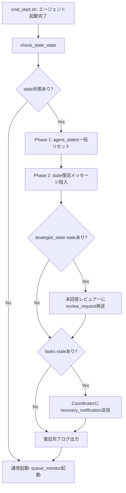

# Stale状態検出・復旧通知 設計ドキュメント

Issue: #200
Author: IGNITIAN-3
Created: 2026-02-08
Status: Draft

---

## 目次

1. [Stale状態の分類](#1-stale状態の分類)
2. [検出方法](#2-検出方法)
3. [復旧フロー（2フェーズ）](#3-復旧フロー2フェーズ)
4. [復旧メッセージフォーマット](#4-復旧メッセージフォーマット)
5. [統合ポイント](#5-統合ポイント)
6. [誤検出防止ガード](#6-誤検出防止ガード)
7. [構造化ログ設計](#7-構造化ログ設計)
8. [見落としパターン対策](#8-見落としパターン対策)
9. [既存scan_for_timeouts()との補完関係](#9-既存scan_for_timeoutsとの補完関係)
10. [将来課題](#10-将来課題)

---

## 1. Stale状態の分類

セッション再起動後、前セッションから引き継がれた「非終端状態」はすべてstaleとみなす。タイムアウトベースの判定は不要であり、状態ベースで一意に判定できる。

### 1.1 strategist_state テーブル

| フィールド | 型 | stale条件 |
|---|---|---|
| `request_id` | TEXT (PK) | - |
| `status` | TEXT | `'pending_reviews'` |
| `reviews` | TEXT (JSON) | 一部レビュアーの response が `null` |

**具体例（Issue #200 発端）:**
`strategy_20260208003533`（README v0.2.0更新）が `pending_reviews` のまま停滞。Evaluator・Innovator は回答済みだが、Architect のレビューが `null` のまま残存。

**stale判定**: `status = 'pending_reviews'` であるレコードは全てstale。セッション再起動後、レビュー待ちの状態が継続されることはなく、再送が必要。

### 1.2 tasks テーブル

| フィールド | 型 | stale条件 |
|---|---|---|
| `task_id` | TEXT (PK) | - |
| `assigned_to` | TEXT | 割当先エージェント |
| `status` | TEXT | `'queued'` または `'in_progress'` |

**stale判定**: `status IN ('queued', 'in_progress')` のレコードは全てstale。セッション再起動によりエージェントのコンテキストが失われるため、未完了タスクはそのままでは処理されない。

### 1.3 agent_states テーブル

| フィールド | 型 | stale条件 |
|---|---|---|
| `agent` | TEXT (PK) | エージェント名 |
| `status` | TEXT | `'idle'` 以外（`'busy'`, `'in_progress'` 等） |
| `current_task_id` | TEXT | 非NULL |

**stale判定**: `status != 'idle'` のレコードは全てstale。セッション再起動後、全エージェントは実際にはidle状態から開始するため、DBの非idle状態は前セッションの残存データ。

### 1.4 分類サマリー

| テーブル | stale条件 | 終端状態 | 影響 |
|---|---|---|---|
| `strategist_state` | `status = 'pending_reviews'` | `'completed'` | レビュー再送が必要 |
| `tasks` | `status IN ('queued', 'in_progress')` | `'completed'` | タスク復旧通知が必要 |
| `agent_states` | `status != 'idle'` | `'idle'` | 状態リセットが必要 |

> **Note**: `strategist_state` には `'drafting'` 状態も存在するが、draftingはStrategist単体の作業であり、セッション再起動後にStrategistが起動時メモリ復元で自律的に再開可能なため、本設計のスコープ外とする。将来的に `drafting` 状態の復旧も必要になった場合は、Strategistへの `recovery_notification` 送信を追加すればよい。

---

## 2. 検出方法

### 2.1 設計方針

- **状態ベース検出**（タイムアウト不要）
- 起動時に1回だけ実行。前セッションの全非終端状態をstaleと判定
- SQLiteの `PRAGMA busy_timeout=5000` で並行アクセスのロック競合に対応

### 2.2 検出SQLクエリ

#### 2.2.1 stale な strategist_state の検出

```sql
PRAGMA busy_timeout=5000;
SELECT
    request_id,
    goal,
    status,
    created_at,
    reviews
FROM strategist_state
WHERE status = 'pending_reviews';
```

reviewsカラム（JSON）から未回答のレビュアーを抽出するには、以下のように解析する:

```bash
# bash側でreviews JSONをパースして未回答レビュアーを特定
sqlite3 "$WORKSPACE_DIR/state/memory.db" "PRAGMA busy_timeout=5000; \
    SELECT request_id, goal, reviews FROM strategist_state \
    WHERE status = 'pending_reviews';" | while IFS='|' read -r req_id goal reviews; do
    # reviews JSON内のnull responseを検出（jqが使える場合）
    if command -v jq &>/dev/null; then
        echo "$reviews" | jq -r 'to_entries[] | select(.value.response == null) | .key'
    else
        # jq非対応の場合: grepベースの簡易パース
        echo "$reviews" | grep -oP '"(\w+)":\s*\{[^}]*"response":\s*null' | grep -oP '"\w+"' | tr -d '"'
    fi
done
```

#### 2.2.2 stale なタスクの検出

```sql
PRAGMA busy_timeout=5000;
SELECT
    task_id,
    assigned_to,
    delegated_by,
    status,
    title,
    started_at
FROM tasks
WHERE status IN ('queued', 'in_progress');
```

#### 2.2.3 stale なエージェント状態の検出

```sql
PRAGMA busy_timeout=5000;
SELECT
    agent,
    status,
    current_task_id,
    last_active,
    summary
FROM agent_states
WHERE status != 'idle';
```

### 2.3 検出結果の構造化

検出結果をbash変数に格納し、後続の復旧フローに渡す:

```bash
# 各テーブルのstaleレコード件数
STALE_STRATEGIES_COUNT=0
STALE_TASKS_COUNT=0
STALE_AGENTS_COUNT=0

# 一時ファイルに検出結果を保存
STALE_STRATEGIES_FILE=$(mktemp)
STALE_TASKS_FILE=$(mktemp)
STALE_AGENTS_FILE=$(mktemp)

trap 'rm -f "$STALE_STRATEGIES_FILE" "$STALE_TASKS_FILE" "$STALE_AGENTS_FILE"' EXIT
```

---

## 3. 復旧フロー（2フェーズ）

### 3.1 フローチャート



### 3.2 Phase 1: agent_states一括リセット

**目的**: 全エージェントをknown-good state（idle）にリセットし、一貫した初期状態を保証する。

```sql
PRAGMA busy_timeout=5000;
UPDATE agent_states
SET status = 'idle',
    current_task_id = NULL,
    last_active = datetime('now', '+9 hours'),
    summary = 'セッション再起動によるリセット'
WHERE status != 'idle';
```

**Phase 1を先に実行する理由:**
- 復旧メッセージを受信するエージェントがidle状態であることを保証
- `current_task_id` がNULLであることで、復旧タスクとの競合を防止
- 全エージェントが同じ初期状態から開始することで、予測可能な復旧動作を保証

### 3.3 Phase 2: stale復旧メッセージ投入

Phase 1完了後に実行。検出された各stale状態に対して、適切な復旧メッセージをキューに投入する。

#### 3.3.1 strategist_state の復旧

未回答レビュアーに対してレビュー依頼を再送:

```bash
# 各pending_reviewsレコードに対して
#   → 未回答のSub-Leaderのキューにrecovery_notificationを投入
# 送信先: queue/{reviewer}/ (例: queue/architect/)
```

#### 3.3.2 tasks の復旧

staleタスクの情報をCoordinatorに通知し、再割当を依頼:

```bash
# 各staleタスクに対して
#   → queue/coordinator/ にrecovery_notificationを投入
# Coordinatorが再割当またはキャンセルを判断
```

#### 3.3.3 復旧メッセージ投入のバッチ処理

複数のstale状態がある場合、メッセージを一括で投入する。各メッセージにはユニークな `idempotency_key` を付与し、重複処理を防止する。

---

## 4. 復旧メッセージフォーマット

### 4.1 共通フォーマット

既存のYAMLメッセージフォーマット（`type`/`from`/`to`/`timestamp`/`priority`/`payload`）と完全互換。`type: recovery_notification` を新設する。

```yaml
type: recovery_notification
from: startup_recovery
to: coordinator
timestamp: "2026-02-08T15:30:00+09:00"
priority: high
payload:
  recovery_type: "stale_task"
  idempotency_key: "recovery_20260208_153000_task_001"
  session_start_epoch: 1770532200
  stale_records:
    - table: "tasks"
      record:
        task_id: "task_001"
        assigned_to: "ignitian_1"
        status: "in_progress"
        title: "README骨組み作成"
        started_at: "2026-02-08T14:00:00+09:00"
  recommended_action: "reassign_or_cancel"
  notes: "セッション再起動により検出されたstaleタスク"
status: queued
```

### 4.2 strategist_state 復旧メッセージ

未回答レビュアーへのレビュー再送:

```yaml
type: recovery_notification
from: startup_recovery
to: architect
timestamp: "2026-02-08T15:30:00+09:00"
priority: high
payload:
  recovery_type: "pending_review"
  idempotency_key: "recovery_20260208_153000_strategy_20260208003533_architect"
  session_start_epoch: 1770532200
  stale_records:
    - table: "strategist_state"
      record:
        request_id: "strategy_20260208003533"
        goal: "README v0.2.0更新"
        status: "pending_reviews"
  original_context:
    request_id: "strategy_20260208003533"
    goal: "README v0.2.0更新"
    draft_strategy: "(strategist_stateのdraft_strategyをそのまま転記)"
  recommended_action: "review_and_respond"
  notes: "前セッションで未回答のレビュー依頼の再送"
status: queued
```

### 4.3 tasks 復旧メッセージ

Coordinatorへのstaleタスク通知:

```yaml
type: recovery_notification
from: startup_recovery
to: coordinator
timestamp: "2026-02-08T15:30:00+09:00"
priority: high
payload:
  recovery_type: "stale_task"
  idempotency_key: "recovery_20260208_153000_task_001"
  session_start_epoch: 1770532200
  stale_records:
    - table: "tasks"
      record:
        task_id: "task_001"
        assigned_to: "ignitian_1"
        status: "in_progress"
        title: "README骨組み作成"
  recommended_action: "reassign_or_cancel"
  notes: "セッション再起動により検出されたstaleタスク"
status: queued
```

### 4.4 idempotency_key の生成ルール

```
recovery_{YYYYMMDD}_{HHMMSS}_{対象レコードの一意識別子}
```

- `YYYYMMDD_HHMMSS`: セッション起動時刻（`SESSION_START_EPOCH` から算出）
- 対象レコードの一意識別子: `task_id`、`request_id_reviewer` 等
- 同一セッション内での重複実行を防止
- 異なるセッションでは異なるキーが生成されるため、セッションをまたぐ再実行も安全

---

## 5. 統合ポイント

### 5.1 ファイル配置

```
scripts/
└── lib/
    ├── core.sh              # 既存: 共通関数
    ├── retry_handler.sh     # 既存: リトライ機構
    ├── dlq_handler.sh       # 既存: DLQ処理
    ├── startup_recovery.sh  # 新規: stale状態検出・復旧
    └── cmd_start.sh         # 既存: 起動コマンド（修正）
```

### 5.2 startup_recovery.sh の構造

既存の `retry_handler.sh` / `dlq_handler.sh` のパターンに準拠:

```bash
#!/bin/bash
# =============================================================================
# startup_recovery.sh - セッション再起動時のstale状態検出・復旧
# =============================================================================
# セッション起動時に前セッションから残存する非終端状態を検出し、
# 適切なエージェントに復旧メッセージを送信する。
#
# 提供関数:
#   check_stale_state       - stale状態の検出（メインエントリポイント）
#   detect_stale_strategies - strategist_stateのstale検出
#   detect_stale_tasks      - tasksのstale検出
#   detect_stale_agents     - agent_statesのstale検出
#   reset_agent_states      - Phase 1: agent_states一括リセット
#   send_recovery_messages  - Phase 2: 復旧メッセージ投入
#   generate_idempotency_key - idempotency_key生成
#
# 使用方法:
#   source scripts/lib/startup_recovery.sh
# =============================================================================

# 二重読み込み防止ガード
if [[ -n "${__STARTUP_RECOVERY_LOADED:-}" ]]; then
    return 0 2>/dev/null || exit 0
fi
__STARTUP_RECOVERY_LOADED=1

# core.sh の共通関数を利用
source "${BASH_SOURCE[0]%/*}/core.sh"
```

### 5.3 提供関数一覧

| 関数名 | 目的 | 引数 | 戻り値 |
|---|---|---|---|
| `check_stale_state` | stale検出+復旧のメインエントリポイント | なし | 0=復旧実行, 1=staleなし |
| `detect_stale_strategies` | strategist_stateのstale検出 | なし | 検出件数(stdout) |
| `detect_stale_tasks` | tasksのstale検出 | なし | 検出件数(stdout) |
| `detect_stale_agents` | agent_statesのstale検出 | なし | 検出件数(stdout) |
| `reset_agent_states` | Phase 1: agent_states一括idle化 | なし | 0=成功, 1=失敗 |
| `send_recovery_messages` | Phase 2: 復旧メッセージ投入 | なし | 0=成功, 1=失敗 |
| `generate_idempotency_key` | idempotency_key生成 | $1=対象ID | key文字列(stdout) |

### 5.4 cmd_start.sh への統合

`cmd_start.sh` の修正箇所: **エージェント起動後、queue_monitor起動前** に `check_stale_state()` を呼び出す。

```bash
# 変更箇所（cmd_start.sh内、queue_monitor起動の直前に挿入）

    # Stale状態の検出・復旧（エージェント起動後、queue_monitor起動前）
    if command -v sqlite3 &>/dev/null; then
        source "$IGNITE_SCRIPTS_DIR/lib/startup_recovery.sh"
        print_info "Stale状態の検出・復旧を実行中..."
        if check_stale_state; then
            print_success "Stale状態の復旧が完了しました"
        else
            print_info "Stale状態は検出されませんでした"
        fi
    fi

    # GitHub Watcher の起動判定（既存コード）
    local start_watcher=false
    ...
```

### 5.5 実行タイミングの根拠

```
cmd_start.sh 実行フロー:

  1. ワークスペース初期化
  2. SQLiteデータベース初期化（schema.sql適用）
  3. 旧プロセスクリーンアップ
  4. tmuxセッション作成
  5. Leader起動
  6. Sub-Leaders起動
  7. IGNITIANs起動
  8. システム設定・コスト追跡情報保存
  ↓
  ★ check_stale_state() ← ここで実行
  ↓
  9. github_watcher起動
  10. queue_monitor起動
```

**この位置の理由:**
- エージェントが全員起動済み → 復旧メッセージを受信できる状態
- queue_monitor未起動 → 復旧メッセージがキューに置かれるだけで、まだ配信されない
- queue_monitor起動時に復旧メッセージが通常メッセージと同じフローで配信される
- github_watcher も未起動 → 外部イベントによる新規メッセージ投入との競合なし

---

## 6. 誤検出防止ガード

### 6.1 層1: 実行タイミング制御

**queue_monitor起動前に実行** することで、以下を構造的に防止:

- 復旧メッセージが投入された後にエージェントが処理を始める前に、二重投入が起きない
- queue_monitorがまだ起動していないため、エージェントが復旧メッセージを処理し始めることはない
- 復旧メッセージの投入が完了してからqueue_monitorが起動する順序が保証される

```
時間軸:
  t0: check_stale_state() 開始
  t1: Phase 1 (agent_states リセット)
  t2: Phase 2 (復旧メッセージ投入)
  t3: check_stale_state() 完了
  t4: queue_monitor 起動 ← ここで初めて復旧メッセージが配信される
```

### 6.2 層2: セッション識別子（SESSION_START_EPOCH）

`check_stale_state()` 呼び出し時にセッション開始エポック秒を記録し、idempotency_keyに埋め込む:

```bash
SESSION_START_EPOCH=$(date +%s)
```

**用途:**
1. `idempotency_key` にセッション開始時刻を含める → 同一セッション内での重複防止
2. 万が一 `check_stale_state()` が同一セッション内で2回呼ばれた場合、同じ `idempotency_key` のメッセージが生成されるため、受信側で重複検出可能
3. 異なるセッションでは異なるキーが生成されるため、正当な再実行は阻害されない

### 6.3 重複メッセージのガード処理

```bash
# 復旧メッセージ投入前に、同一idempotency_keyのメッセージが既に存在するかチェック
check_duplicate_recovery() {
    local key="$1"
    local target_queue="$2"

    # キューディレクトリ内（processed/含む）で同一keyを検索
    if grep -rq "idempotency_key: \"$key\"" "$target_queue" "$target_queue/processed/" 2>/dev/null; then
        return 0  # 重複あり
    fi
    return 1  # 重複なし
}
```

### 6.4 リトライ暴走防止策

`check_stale_state()` は起動時に1回だけ実行されるため、ループによる暴走は構造的に発生しない。ただし、以下の追加ガードを設ける:

```bash
# 復旧実行フラグ（セッションごとに1回のみ）
RECOVERY_LOCK_FILE="$WORKSPACE_DIR/state/.recovery_lock"

check_stale_state() {
    # 既に実行済みの場合はスキップ
    if [[ -f "$RECOVERY_LOCK_FILE" ]]; then
        local lock_epoch
        lock_epoch=$(cat "$RECOVERY_LOCK_FILE" 2>/dev/null)
        if [[ "$lock_epoch" == "$SESSION_START_EPOCH" ]]; then
            _recovery_log_info "既にこのセッションで復旧を実行済みです。スキップします"
            return 1
        fi
    fi

    # ロックファイル作成
    echo "$SESSION_START_EPOCH" > "$RECOVERY_LOCK_FILE"

    # ... 検出・復旧処理 ...
}
```

---

## 7. 構造化ログ設計

### 7.1 ログタグ

全ログメッセージに `[RECOVERY]` タグを付与し、通常のキュー処理ログと区別する。

### 7.2 ログ関数

`retry_handler.sh` のログ関数パターンに準拠:

```bash
_recovery_log_info()    { echo -e "[$(date '+%Y-%m-%d %H:%M:%S')] ${_REC_BLUE}[RECOVERY]${_REC_NC} $1" >&2; }
_recovery_log_success() { echo -e "[$(date '+%Y-%m-%d %H:%M:%S')] ${_REC_GREEN}[RECOVERY]${_REC_NC} $1" >&2; }
_recovery_log_warn()    { echo -e "[$(date '+%Y-%m-%d %H:%M:%S')] ${_REC_YELLOW}[RECOVERY]${_REC_NC} $1" >&2; }
_recovery_log_error()   { echo -e "[$(date '+%Y-%m-%d %H:%M:%S')] ${_REC_RED}[RECOVERY]${_REC_NC} $1" >&2; }
```

### 7.3 ログ出力ポイントと内容

| タイミング | ログレベル | 内容例 |
|---|---|---|
| 検出開始 | INFO | `[RECOVERY] stale状態の検出を開始します` |
| 検出結果 | INFO | `[RECOVERY] 検出結果: strategies=1, tasks=3, agents=2` |
| 検出なし | INFO | `[RECOVERY] stale状態は検出されませんでした` |
| Phase 1完了 | SUCCESS | `[RECOVERY] Phase 1完了: agent_states 2件をidleにリセット` |
| メッセージ投入 | INFO | `[RECOVERY] 復旧メッセージ投入: queue/architect/recovery_notification_*.yaml (key=recovery_20260208_...)` |
| Phase 2完了 | SUCCESS | `[RECOVERY] Phase 2完了: 復旧メッセージ4件を投入` |
| 重複スキップ | WARN | `[RECOVERY] 重複検出: idempotency_key=recovery_20260208_... をスキップ` |
| エラー | ERROR | `[RECOVERY] SQLiteアクセスエラー: memory.dbが見つかりません` |
| 全体完了 | SUCCESS | `[RECOVERY] 復旧処理完了 (strategies=1, tasks=3, messages_sent=4)` |

### 7.4 ログ出力サマリーフォーマット

処理完了時に、一覧性の高いサマリーを出力:

```
[RECOVERY] ========== Stale Recovery Summary ==========
[RECOVERY]  Session Start: 2026-02-08T15:30:00+09:00
[RECOVERY]  Detected:
[RECOVERY]    strategist_state: 1 records (pending_reviews)
[RECOVERY]    tasks:            3 records (queued=1, in_progress=2)
[RECOVERY]    agent_states:     2 records (busy=2)
[RECOVERY]  Actions:
[RECOVERY]    Phase 1: 2 agent_states reset to idle
[RECOVERY]    Phase 2: 4 recovery messages sent
[RECOVERY]      - architect: 1 (pending_review)
[RECOVERY]      - coordinator: 3 (stale_task)
[RECOVERY] ================================================
```

---

## 8. 見落としパターン対策

### 8.1 部分再起動

**リスク**: 一部のエージェントだけが再起動された場合、他のエージェントはまだ前セッションの処理を継続している可能性がある。

**対策**:
- `check_stale_state()` は `cmd_start.sh` からのみ呼ばれる（= フルシステム起動時のみ）
- `cmd_start.sh` は必ず全エージェントを起動する
- 個別エージェントの再起動（tmuxペイン単位）では `check_stale_state()` は実行されない
- 個別エージェント再起動時のstale対応は、各エージェントの起動時メモリ復元（SQLite `agent_states` 参照）で対応

### 8.2 WALチェックポイント

**リスク**: SQLiteのWAL（Write-Ahead Logging）モードで、チェックポイント前にクラッシュした場合、最新のデータがWALファイルにのみ存在する可能性がある。

**対策**:
- `check_stale_state()` の冒頭で明示的にWALチェックポイントを実行:

```bash
# WALチェックポイント（最新データをDBファイルに反映）
sqlite3 "$WORKSPACE_DIR/state/memory.db" "PRAGMA wal_checkpoint(PASSIVE);" 2>/dev/null || true
```

- `PASSIVE` モードを使用（書き込みをブロックしない）
- 失敗しても致命的ではないため、エラーは無視（`|| true`）

### 8.3 カスケード依存

**リスク**: タスク間に依存関係がある場合（タスクBがタスクAの完了に依存）、タスクAの復旧だけではタスクBが永遠に待機する可能性がある。

**対策**:
- 復旧メッセージの `recommended_action` に `"reassign_or_cancel"` を指定
- Coordinatorが依存関係を考慮して判断（タスクBのstaleも別途検出される）
- 全staleタスクを一括でCoordinatorに通知するため、Coordinatorは全体の依存関係を把握した上で再割当可能
- `stale_records` 配列で複数タスクをまとめて通知し、Coordinatorの判断材料を提供

### 8.4 Queue残存重複

**リスク**: 前セッションで投入されたが未処理のメッセージがキュー内（`queue/{agent}/` または `queue/{agent}/processed/`）に残存している場合、復旧メッセージと合わせて二重処理される可能性がある。

**対策**:
- `idempotency_key` による重複検出（6.3節参照）
- 復旧メッセージの `type: recovery_notification` は既存の `type: task_assignment` 等とは異なるため、受信エージェントが区別可能
- Coordinatorは `recovery_notification` を受信した際、対象タスクの現在状態をSQLiteで再確認し、既に完了済みであればスキップ

```bash
# Coordinator側の処理例（受信時の状態再確認）
# task_idのstatusがcompletedなら復旧不要
current_status=$(sqlite3 "$WORKSPACE_DIR/state/memory.db" \
    "PRAGMA busy_timeout=5000; SELECT status FROM tasks WHERE task_id='$task_id';")
if [[ "$current_status" == "completed" ]]; then
    # 復旧不要: タスクは既に完了
    return
fi
```

### 8.5 TZ（タイムゾーン）ずれ

**リスク**: `datetime('now', '+9 hours')` で記録されたタイムスタンプと、`date -Iseconds` で生成されるタイムスタンプの間にTZの不一致が生じる可能性がある。

**対策**:
- stale検出は**タイムスタンプ比較を使用しない**（状態ベース検出）ため、TZずれは検出精度に影響しない
- 復旧メッセージのタイムスタンプは `date -Iseconds`（TZ情報付き）で生成
- `idempotency_key` には `SESSION_START_EPOCH`（Unix epoch秒、TZ非依存）を使用
- ログのタイムスタンプは参考情報であり、処理ロジックには使用しない

---

## 9. 既存scan_for_timeouts()との補完関係

### 9.1 現状

現時点では `scan_for_timeouts()` 関数は未実装（`queue_monitor.sh` 内に存在しない）。`retry_handler.sh` の `check_timeout()` 関数がprocessingステータスのタスクファイルに対するタイムアウト検知を提供している。

### 9.2 責務の分離

| 機能 | startup_recovery.sh | retry_handler.sh (check_timeout) |
|---|---|---|
| **実行タイミング** | セッション起動時（1回のみ） | queue_monitor実行中（定期的） |
| **検出対象** | SQLiteの全非終端状態 | キュー内のprocessingファイル |
| **検出方法** | 状態ベース（タイムアウト不要） | 時間ベース（経過秒数） |
| **対象範囲** | strategist_state + tasks + agent_states | キューファイルのみ |
| **復旧方法** | 復旧メッセージ投入 | ステータスをqueuedに戻す |

### 9.3 補完関係

```
セッション再起動
  ↓
startup_recovery.sh (起動時1回)
  → SQLiteの非終端状態を検出し、復旧メッセージを投入
  → agent_statesを一括リセット
  ↓
queue_monitor起動
  ↓
retry_handler.sh (定期実行)
  → 実行中にタイムアウトしたキューファイルを検出
  → リトライまたはDLQ送り
```

- `startup_recovery.sh` は「セッション断絶」による孤立状態を解消
- `retry_handler.sh` は「セッション中の処理停滞」を解消
- 両者は実行タイミングと検出対象が異なるため、競合しない

### 9.4 将来的な scan_for_timeouts() との関係

`scan_for_timeouts()` が `queue_monitor.sh` に実装された場合:
- `startup_recovery.sh` のPhase 2で投入された復旧メッセージも、通常のキューメッセージとして `scan_for_timeouts()` の監視対象になる
- 復旧メッセージの処理がタイムアウトした場合は、`retry_handler.sh` の通常リトライフローで対応
- `startup_recovery.sh` 側での特別な対応は不要

---

## 10. 将来課題

### 10.1 Session Generation Number

**概要**: 各セッションにインクリメンタルな世代番号を付与し、stale検出の精度を向上させる。

**現在の制限**: `SESSION_START_EPOCH` はUnix秒のため、1秒以内に複数セッションが起動した場合に衝突する（実用上は極めてまれ）。

**将来の改善案**:
```sql
-- session_generationsテーブル（新規）
CREATE TABLE IF NOT EXISTS session_generations (
    generation INTEGER PRIMARY KEY AUTOINCREMENT,
    started_at DATETIME NOT NULL,
    ended_at DATETIME
);
```

- セッション起動時に `INSERT` してgenerationを取得
- 各テーブルのレコードにgeneration番号を付与
- stale検出: `generation < current_generation` のレコードが全てstale

### 10.2 定期チェック拡張

**概要**: 起動時だけでなく、セッション実行中にも定期的にstale検出を実行する。

**ユースケース**:
- エージェントのClaude Codeセッションがクラッシュした場合
- 長時間実行タスクのハング検出
- `queue_monitor.sh` の `monitor_queues()` ループ内で定期呼び出し

**実装案**:
```bash
# queue_monitor.sh のmonitor_queuesに追加
RECOVERY_CHECK_INTERVAL=300  # 5分ごと
LAST_RECOVERY_CHECK=$(date +%s)

monitor_queues() {
    while true; do
        # 既存のキュースキャン
        scan_queue ...

        # 定期staleチェック（将来拡張）
        local now=$(date +%s)
        if (( now - LAST_RECOVERY_CHECK >= RECOVERY_CHECK_INTERVAL )); then
            check_stale_state  # タイムアウトベースの判定が必要
            LAST_RECOVERY_CHECK=$now
        fi

        sleep "$POLL_INTERVAL"
    done
}
```

**注意**: 定期チェックではタイムアウトベースの判定が必要になる（状態ベースだけでは進行中の正常なタスクと区別できない）。`retry_handler.sh` の `RETRY_TIMEOUT` 設定と連携する設計が必要。

### 10.3 Heartbeat

**概要**: 各エージェントが定期的にheartbeatをSQLiteに記録し、生存確認を行う仕組み。

**メリット**:
- エージェントのクラッシュを迅速に検出
- タイムアウト判定の精度向上（最終heartbeat時刻との比較）
- 定期チェック拡張（10.2）と組み合わせることで、包括的な健全性監視が可能

**実装案**:
```sql
-- agent_statesテーブルにlast_heartbeatカラムを追加（将来）
ALTER TABLE agent_states ADD COLUMN last_heartbeat DATETIME;
```

```bash
# 各エージェントが定期的に実行（インストラクション追記）
sqlite3 "$WORKSPACE_DIR/state/memory.db" "PRAGMA busy_timeout=5000; \
    UPDATE agent_states SET last_heartbeat = datetime('now', '+9 hours') \
    WHERE agent = 'ignitian_3';"
```

**検出ロジック**:
```sql
-- heartbeatが一定時間途絶えたエージェントを検出
SELECT agent, last_heartbeat,
       (julianday(datetime('now', '+9 hours')) - julianday(last_heartbeat)) * 86400 AS seconds_since_heartbeat
FROM agent_states
WHERE last_heartbeat IS NOT NULL
  AND (julianday(datetime('now', '+9 hours')) - julianday(last_heartbeat)) * 86400 > 300;
```

### 10.4 優先度と推奨実装順序

| 順序 | 課題 | 優先度 | 理由 |
|---|---|---|---|
| 1 | 本設計の基本実装 | P0 | Issue #200 の直接解決 |
| 2 | 定期チェック拡張 | P1 | セッション中のクラッシュ対応 |
| 3 | Heartbeat | P2 | 定期チェックの精度向上に必要 |
| 4 | Session Generation Number | P3 | エッジケース対策（実用上の優先度は低い） |
